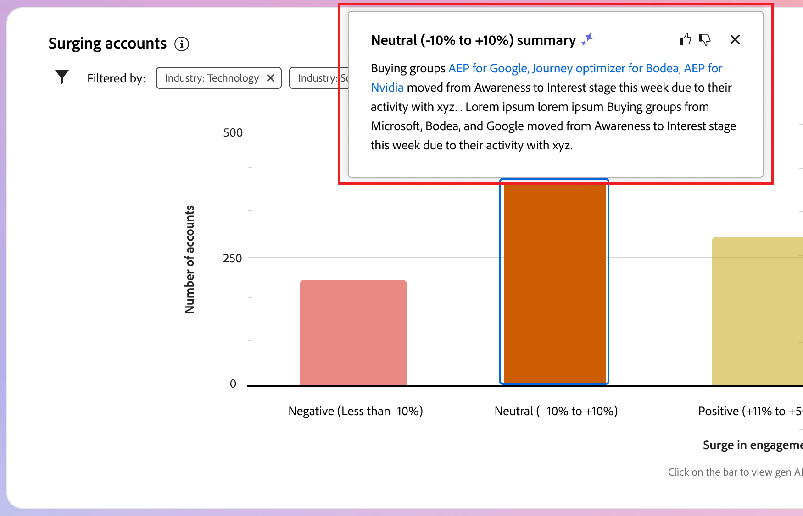

# Intelligentes Dashboard

Das intelligente Dashboard bietet eine umfassende Ansicht von Einkaufsgruppen- und Kontometriken, mit denen Sie Ihre Marketing-Maßnahmen effektiver überwachen und strategischer gestalten können.

Um auf das _Intelligente Dashboard_ zuzugreifen, wählen Sie **[!UICONTROL linken Navigationsbereich das]** Dashboard“ aus.

{width="800" zoomable="yes"}

Das intelligente Dashboard bietet außerdem Zugriff auf Konto- und Einkaufsgruppendetailseiten, die zwei Arten von Funktionen für generative KI enthalten:

* Zusammenfassungen für Konten und Einkaufsgruppen
* Absichtserkennung für Person, Einkaufsgruppe und Konto

{{intent-data-note}}

Um die Informationen und Erkenntnisse aus dem Intelligent Dashboard nutzen zu können, muss Ihre Journey Optimizer B2B edition-Instanz über die erforderlichen Elemente verfügen:

| Typ | Anforderung |
| ---- | ----------- |
| [Gruppen-Stadien kaufen](#buying-group-stages) | Einrichten von Einkaufsgruppenstufen **und** Hinzufügen zu erstellten Einkaufsgruppen. |
| [Einkaufsgruppen-Highlights](#buying-group-highlights) | Einrichten von Einkaufsgruppenstufen **und** Hinzufügen zu erstellten Einkaufsgruppen. |
| [Kontoaufschwung](#surging-accounts) | Eine oder mehrere veröffentlichte Journey oder **oder** erstellte Einkaufsgruppen. |
| [Account-Highlights](#account-highlights) | Eine oder mehrere veröffentlichte Journey oder **oder** erstellte Einkaufsgruppen. |
| [Kontaktabdeckung](#contact-coverage) | Eine oder mehrere erstellte Einkaufsgruppen (Etappen nicht erforderlich). |
| [Kontaktüberschneidung](#contact-overlap) | Eine oder mehrere erstellte Einkaufsgruppen (Etappen nicht erforderlich). |
| [Kontodetailseite](../accounts/account-details.md) | Eine oder mehrere veröffentlichte Journey. |
| [Seite mit Einkaufsgruppendetails](../buying-groups/buying-group-details.md) | Eine oder mehrere erstellte Einkaufsgruppen (Etappen nicht erforderlich). |

## Käufergruppenphasen {#buying-group-stages}

>[!CONTEXTUALHELP]
>id="ajo-b2b_intelligent_dashboard_buying_group_stages"
>title="Käufergruppenphasen"
>abstract="Dieses Diagramm bietet einen Überblick über den Fortschritt der Käufergruppen in verschiedenen Phasen, basierend auf den konfigurierten Übergangsregeln. Der erste Balken zeigt die Anzahl der Käufergruppen in einer bestimmten Phase am ersten Datum des ausgewählten Zeitrahmens im Vergleich zum letzten Datum des ausgewählten Zeitrahmens."

Das _[!UICONTROL Einkaufsgruppenstadien]_-Diagramm bietet einen Überblick über den Fortschritt der Käufe in verschiedenen Stadien ([&#x200B; auf der Grundlage von Übergangsregeln, die von einem Administrator eingerichtet &#x200B;](../buying-groups/buying-group-stages.md)).

>[!NOTE]
>
>Die Verfügbarkeit von Einkaufsgruppenphasen erfordert die Konfiguration der Einkaufsgruppenphasen. Unter [Kaufen von &#x200B;](../buying-groups/buying-group-stages.md)) finden Sie detaillierte Informationen zu den Phasen sowie dazu, wie Sie die Phasen für Käufergruppen definieren und aktivieren.

{width="800" zoomable="yes"}

Das Diagramm verwendet die Stadien der Einkaufsgruppe aus der zuletzt veröffentlichten Version des Modells der Einkaufsgruppenstadien . Für jede Bühne gibt es zwei Bars. Der erste Balken zeigt die Anzahl der Einkaufsgruppen am ersten Datum des ausgewählten Zeitraums an. Und die zweite (im Vergleich) ist die Anzahl der Einkaufsgruppen am letzten Datum des Zeitrahmens. Sie können den Mauszeiger über jede Leiste bewegen, um die Anzahl der Einkaufsgruppen in jedem Stadium anzuzeigen.

{width="400"}

### Generative KI-Zusammenfassung

Klicken Sie auf einen Balken, um eine Übersicht über die generative KI der Einkaufsgruppen in diesem Stadium für den ausgewählten Zeitraum anzuzeigen.

{width="500"}

Die generierte Zusammenfassung bietet einen Überblick über den Fortschritt der Einkaufsgruppe über verschiedene Stadien hinweg, basierend auf den konfigurierten Übergangsregeln.

### Zeitraum {#time-period-stages}

Verwenden Sie den Datumsfilter oben rechts, um den Datumsbereich für die Datenvisualisierungen zu ändern. Klicken Sie auf den Abwärtspfeil, um einen relativen Datumsbereich festzulegen oder benutzerdefinierte Start- und Enddaten festzulegen.

<!-- {width="300"} -->

### Attributfilter {#attribute-filter-stages}

Klicken Sie oben links auf _Filter_-Symbol  ), um die Datenanzeige mit einem der folgenden Attribute zu filtern:

* Interesse an der Lösung
* Konto
* Name der Phase

<!-- Add screen when the UI is available {width="500"} -->

## Käufergruppen-Highlights {#buying-group-highlights}

>[!CONTEXTUALHELP]
>id="ajo-b2b_intelligent_dashboard_buying_group_highlights_engagement"
>title="Die fünf Käufergruppen mit der stärksten Interaktion"
>abstract="Die am stärksten interagierenden Käufergruppen basierend auf ihrem normalisierten Interaktionswert."

>[!CONTEXTUALHELP]
>id="ajo-b2b_intelligent_dashboard_buying_group_highlights_velocity"
>title="Die fünf Käufergruppen mit der höchsten Geschwindigkeit"
>abstract="Käufergruppen basierend auf der Geschwindigkeit, mit der sie die Phasen durchlaufen."

>[!CONTEXTUALHELP]
>id="ajo-b2b_intelligent_dashboard_buying_group_highlights_stagnant"
>title="Die fünf am stärksten stagnierenden Käufergruppen"
>abstract="Stagnierende Käufergruppen, die trotz hoher Vollständigkeitsbewertung nicht die Phasen durchlaufen."

Der _[!UICONTROL Kaufgruppen-Highlights]_ ist in drei Zeilen unterteilt, um Informationen über die für Ihr Unternehmen interessanten Einkaufsgruppen anzuzeigen.

{width="800" zoomable="yes"}

* **Die fünf am häufigsten engagierten Einkaufsgruppen nach Interaktion** - In dieser Zeile werden die am häufigsten engagierten Einkaufsgruppen basierend auf ihrem normalisierten Interaktionswert angezeigt.
* **Die fünf häufigsten Einkaufsgruppen mit hoher Geschwindigkeit** - In dieser Zeile werden die wichtigsten Einkaufsgruppen basierend auf der Geschwindigkeit angezeigt, mit der sie die Kaufgruppenphasen durchlaufen.
* **Top 5 der stagnierenden Einkaufsgruppen** - Diese Zeile zeigt die am stärksten stagnierenden Einkaufsgruppen an, die trotz eines hohen Vollständigkeitswerts nicht die einzelnen Phasen durchlaufen.

Jede Karte enthält die folgenden Daten:

* **_Name der Einkaufsgruppe_**. Klicken Sie auf den Namen, um die Seite mit den Einkaufsgruppendetails zu öffnen.
* **_Kontoname_**. Klicken Sie auf den Namen, um die Seite mit den Kontodetails zu öffnen (Hyperlink zur Seite mit den Kontodetails).
* **_Aktuelles_** für die Einkaufsgruppe.
* **_Engagement score_** (normalisiert für alle Einkaufsgruppen). Wenn alle Einkaufsgruppen die gleiche Bestnote haben, wird die zuletzt aktualisierte Bewertung angezeigt.
* **_Vollständigkeit_** (Bereich 1-100). Wenn alle Einkaufsgruppen die gleiche Bestnote haben, wird die zuletzt aktualisierte Bewertung angezeigt.
* **_Kategorieabsicht_**. Klicken Sie _[!UICONTROL Details anzeigen]_, um die Absichtsdaten anzuzeigen:

  {width="500" zoomable="yes"}

   * Im Popup Details wird der Kategoriename mit Absichtsebene oben angezeigt.
   * Die Daten für jede Zeile sind in Spalten angeordnet: der Produktname, die Stärke der Produktzeit und die wichtigsten Schlüsselwörter nach der Stärke der Absicht.
   * Die Sortierreihenfolge für Kategorie, Produkt und Schlüsselwörter ist hoch bis niedrig. Wenn ein oder mehrere Typen dieselbe Intent-Stärke aufweisen, verwendet die Sortierung eine alphabetische Reihenfolge.

  {{intent-data-note}}

Klicken Sie oben rechts im Bedienfeld &quot;_-Highlights_ auf **[!UICONTROL Alle anzeigen]**, um zur Listenseite „Einkaufsgruppen“ zu navigieren.

### Attributfilter {#attribute-filter-bg-highlights}

Klicken Sie oben links auf _Filter_-Symbol  ), um die Datenanzeige mit einem der folgenden Attribute zu filtern:

* Lösungsinteresse
* Käufergruppe
* Konto

<!-- Add screen when the UI is available {width="500"} -->

### Zeitraum {#time-period-bg-highlights}

Verwenden Sie den Datumsfilter oben rechts, um den Datumsbereich für die Datenvisualisierungen zu ändern. Klicken Sie auf den Abwärtspfeil, um einen relativen Datumsbereich festzulegen oder benutzerdefinierte Start- und Enddaten festzulegen.

<!-- {width="300"} -->

## Konten mit Anstieg {#account-surge}

>[!CONTEXTUALHELP]
>id="ajo-b2b_intelligent_dashboard_account_surge"
>title="Konto-Anstieg"
>abstract="Konten mit signifikanter Änderung bei der Interaktionsdynamik innerhalb des ausgewählten Zeitrahmens."

Im Abschnitt _[!UICONTROL Steigende Konten]_ wird eine Visualisierung der Konten mit einer signifikanten Änderung der Interaktionsdynamik innerhalb des ausgewählten Zeitraums angezeigt.

>[!NOTE]
>
>Zu den Kontoaufstockungsdaten gehören nur Konten, die Journey Optimizer B2B edition über Account-Journey oder Einkaufsgruppen aufnimmt.

{width="800" zoomable="yes"}

Bewegen Sie den Mauszeiger über jede Leiste, um die Anzahl der Konten in jeder Kategorie anzuzeigen.

{width="400"}

Klicken Sie auf einen Balken, um eine Übersicht über die generative KI der Konten in der Kategorie für den ausgewählten Zeitraum anzuzeigen.

{width="500"}

### Attributfilter {#attribute-filter-acct-surge}

Klicken Sie oben links auf _Filter_-Symbol  ), um die Datenanzeige mit einem der folgenden Attribute zu filtern:

* Lösungsinteresse
* Branche
* Region

<!-- Add screen when the UI is available {width="500"} -->

### Zeitraum {#time-period-acct-surge}

Verwenden Sie den Datumsfilter oben rechts, um den Datumsbereich für die Datenvisualisierungen zu ändern. Klicken Sie auf den Abwärtspfeil, um einen relativen Datumsbereich festzulegen oder benutzerdefinierte Start- und Enddaten festzulegen.

<!-- {width="300"} -->

## Konto-Highlights {#account-highlights}

>[!CONTEXTUALHELP]
>id="ajo-b2b_intelligent_dashboard_account_highlights_surging"
>title="Konten mit Anstieg"
>abstract="Konten mit signifikanter Zunahme bei der Interaktionsdynamik im ausgewählten Zeitrahmen "

>[!CONTEXTUALHELP]
>id="ajo-b2b_intelligent_dashboard_account_highlights_at_risk"
>title="Risikokonten"
>abstract="Konten mit einer erheblichen Verringerung bei der Interaktionsdynamik innerhalb des ausgewählten Zeitrahmens."

Der _[!UICONTROL Konto-Highlights]_ ist in zwei Zeilen unterteilt, um Informationen über die Konten anzuzeigen, die für Ihr Unternehmen von Interesse sind.

>[!NOTE]
>
>Die Kontohervorhebungsdaten umfassen nur Konten, die von Journey Optimizer B2B edition über Account-Journey oder Einkaufsgruppen aufgenommen werden.

{width="800" zoomable="yes"}

* **Steigende Konten** - In dieser Zeile werden die Konten mit einer signifikanten Zunahme der Interaktionsdynamik im ausgewählten Zeitraum angezeigt.
* **Risikokonten**: In dieser Zeile werden die Konten mit einer signifikanten Abnahme der Interaktionsdynamik im ausgewählten Zeitraum angezeigt.

Jede Karte enthält die folgenden Daten:

* **_Kontoname_**. Klicken Sie auf den Namen, um die Kontodetailseite zu öffnen.
* **_Generative KI-Zusammenfassung_** des Kontos.
* **_Keyword Intent_**. Klicken Sie _[!UICONTROL Details anzeigen]_, um die Absichtsdaten anzuzeigen:

  {width="500" zoomable="yes"}

   * Im Popup Details wird der Kategoriename mit Absichtsebene oben angezeigt.
   * Die Daten für jede Zeile sind in Spalten angeordnet: der Produktname, die Stärke der Produktzeit und die wichtigsten Schlüsselwörter nach der Stärke der Absicht.
   * Die Sortierreihenfolge für Kategorie, Produkt und Schlüsselwörter ist hoch bis niedrig. Wenn ein oder mehrere Typen dieselbe Intent-Stärke aufweisen, verwendet die Sortierung eine alphabetische Reihenfolge.

  {{intent-data-note}}
<!-- 
At the top right of the _Buying group highlights_ panel, click **[!UICONTROL View All]** to navigate to the Buying groups list page. -->

### Attributfilter {#attribute-filter-acct-highlights}

Klicken Sie oben links auf _Filter_-Symbol  ), um die Datenanzeige mit einem der folgenden Attribute zu filtern:

* Lösungsinteresse
* Käufergruppe

<!-- Add screen when the UI is available {width="500"} -->

### Zeitraum {#time-period-acct-highlights}

Verwenden Sie den Datumsfilter oben rechts, um den Datumsbereich für die Datenvisualisierungen zu ändern. Klicken Sie auf den Abwärtspfeil, um einen relativen Datumsbereich festzulegen oder benutzerdefinierte Start- und Enddaten festzulegen.

<!-- {width="300"} -->

## Kontaktabdeckung {#contact-coverage}

>[!CONTEXTUALHELP]
>id="ajo-b2b_intelligent_dashboard_contact_coverage"
>title="Kontaktabdeckung"
>abstract="Zeigt die Anzahl der Kontakte mit einer bestimmten Rolle an, die einem Lösungsinteresse zugeordnet sind. Die Zuordnung von Rolle und Lösungsinteresse basiert auf der Käufergruppenvorlage."

Im Abschnitt _[!UICONTROL Kontaktabdeckung]_ wird die Anzahl der Kontakte mit einer bestimmten Rolle, die mit einem Lösungsinteresse verbunden ist, visuell dargestellt. Die Zuordnung von Rolle und Lösungsinteresse basiert auf der Käufergruppenvorlage.

>[!NOTE]
>
>Die Daten zur Kontaktabdeckung basieren auf den in der Journey Optimizer B2B edition-Instanz erstellten Einkaufsgruppen.

{width="800" zoomable="yes"}

Bewegen Sie den Mauszeiger über jede Zelle, um die Anzahl der Kontakte in der Rolle/dem Lösungsinteresse anzuzeigen.

{width="400"}

Klicken Sie auf eine Zelle, um detaillierte Informationen zu den Kontakten anzuzeigen, die für die Rolle/Lösung von Interesse sind.

{width="700" zoomable="yes"}

### Attributfilter {#attribute-filter-contact-coverage}

Klicken Sie oben links auf _Filter_-Symbol  ), um die Datenanzeige mit einem der folgenden Attribute zu filtern:

* Lösungsinteresse
* Konten

<!-- Add screen when the UI is available {width="500"} -->

## Kontaktüberschneidung {#contact-overlap}

>[!CONTEXTUALHELP]
>id="ajo-b2b_intelligent_dashboard_contact_overlap"
>title="Kontaktüberschneidung"
>abstract="Liste der Kontakte, die zu mehreren Käufergruppen gehören, weil sie mehreren Lösungsinteressen zugeordnet sind."

Im _[!UICONTROL Kontaktüberschneidung]_ wird eine Liste von Kontakten angezeigt, die zu mehr als einer Einkaufsgruppe gehören, da sie mit mehreren Lösungsinteressen verknüpft sind.

>[!NOTE]
>
>Die Daten zur Kontaktüberschneidung basieren auf den in der Journey Optimizer B2B edition-Instanz erstellten Einkaufsgruppen.

{width="800" zoomable="yes"}

Klicken Sie auf _Information_ (  ), um eine Tabelle mit den folgenden Details anzuzeigen:

* Name der Einkaufsgruppe (klicken Sie auf den Namen, um die Seite mit den Einkaufsgruppendetails zu öffnen)
* Rolle
* Lösungsinteresse
* Produktzweck
* Produkt

{width="600" zoomable="yes"}

### Attributfilter {#attribute-filter-contact-overage}

Klicken Sie oben links auf _Filter_-Symbol  ), um die Datenanzeige mit einem der folgenden Attribute zu filtern:

* Lösungsinteresse
* Rollen
* Konten

<!-- Add screen when the UI is available {width="500"} -->
