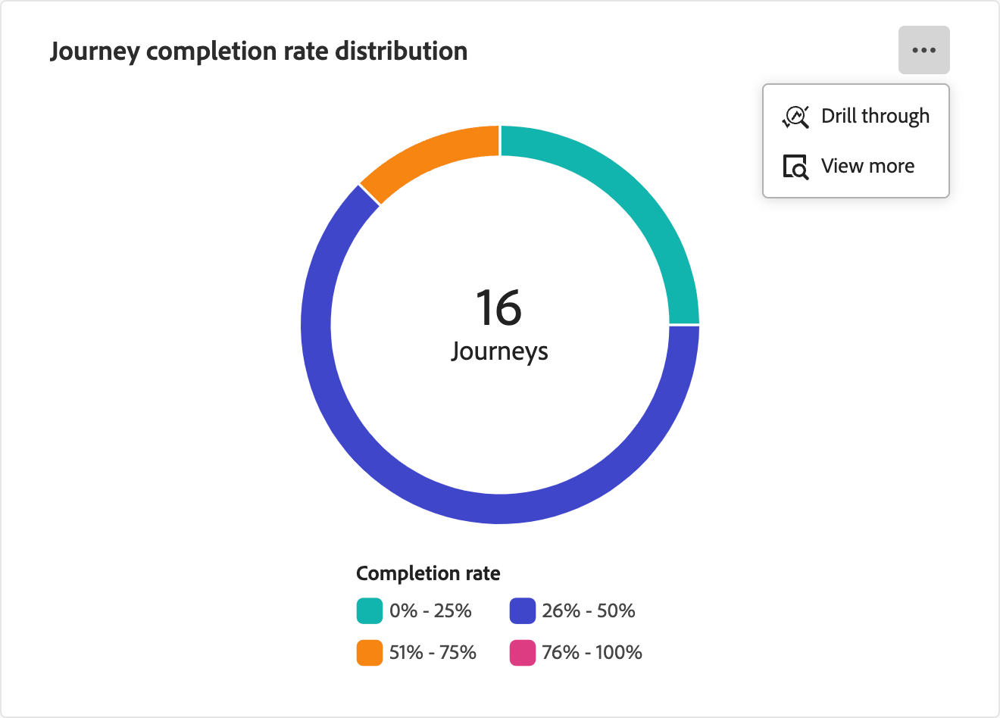

# Dashboard für Kontoübersicht-Journey

Dieses Dashboard bietet einen umfassenden Überblick über Ihre aktiven Account-Journey, in dem der Account-Fortschritt anhand von Kreis- und Balkendiagrammen detailliert dargestellt wird, die Abschlüsse und Interaktionsaktivitäten kategorisieren und quantifizieren. Es hilft Marketing-Experten, die Effektivität von E-Mail- und SMS-Kanälen durch wichtige Versand- und Interaktionsmetriken zu bewerten.

Diese Übersicht ist für veröffentlichte Account-Journey verfügbar und es dauert etwa vier Stunden, bis die Daten die Diagramme und Tabellen befüllen.

{width="700" zoomable="yes"}

## Verteilung der Journey-Abschlussrate

Dieses Diagramm veranschaulicht die Verteilung der Journey auf der Grundlage ihrer Abschlussrate und ist in vier verschiedene Score-Bänder unterteilt. Die zentrale Zahl gibt die Gesamtzahl der Journey und eine kurze Übersicht über den gesamten Fortschritt. Die segmentierten Farben geben den Anteil der Journey innerhalb jedes Score-Bereichs an, sodass Sie Abschlusstrends auf einen Blick beurteilen können.

Um detailliertere Informationen anzuzeigen, klicken Sie auf das Menüsymbol **…** oben rechts.

{width="500"}

## Journeys nach Interaktionstyp

Dieses Balkendiagramm zeigt die Verteilung der Journey auf der Grundlage des Interaktionstyps an und hilft Ihnen dabei zu ermitteln, welche Interaktionen in den Journey am häufigsten verwendet wurden. Jeder Balken stellt einen bestimmten Interaktionstyp dar, wobei seine Länge die Anzahl der Journey mit Aktivitäten dieses Typs angibt. Diese Visualisierung bietet ein klares und sofortiges Verständnis der Interaktionstrends in Ihren Account-Journey.

Um detailliertere Informationen anzuzeigen, klicken Sie auf das Menüsymbol **…** oben rechts.

{width="500"}

## Interagieren mit den Daten

Um mit den Daten zu interagieren, verwenden Sie das Menü **…** oben rechts in jedem Diagramm.

### [!UICONTROL Drill-Through]

Wählen Sie für das Kreisdiagramm **[!UICONTROL Drill-Through]** aus, um eine detaillierte Analyse der Daten durchzuführen.

{width="700" zoomable="yes"}

Sie können oben rechts auf das _Mehr_-Menü (**…**) klicken und **[!UICONTROL Mehr anzeigen]** wählen, um erweiterte Daten .

### [!UICONTROL Mehr anzeigen]

Wählen Sie **[!UICONTROL Mehr anzeigen]**, um erweiterte Daten und Einblicke anzuzeigen.

{width="700" zoomable="yes"}

Das angezeigte Popup enthält ein Diagramm und eine Tabelle, die die Aufschlüsselung der Journey-Daten anzeigt.

Um die Daten herunterzuladen, klicken **[!UICONTROL oben rechts in]** Datentabelle auf „CSV herunterladen“. Um zum Dashboard _Übersicht“_, klicken Sie auf **[!UICONTROL Schließen]**.
