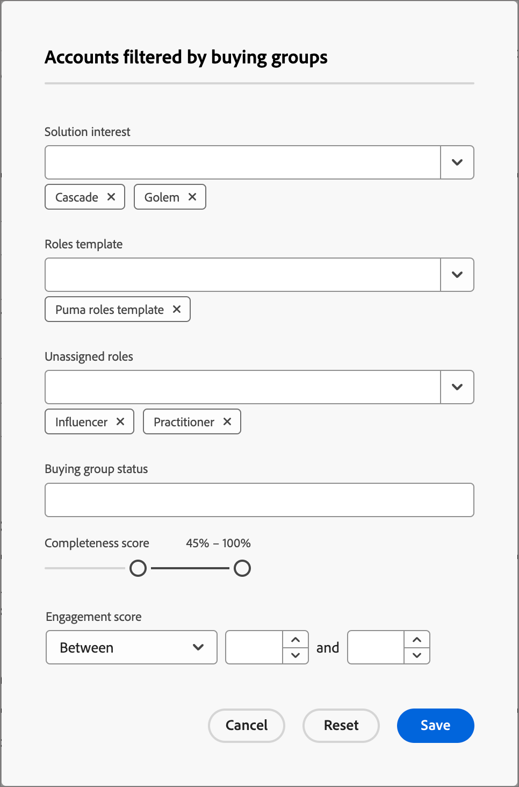

# LinkedIn-Konto-Matched Audiences

Die Journey Optimizer B2B Edition bietet die Möglichkeit, LinkedIn Ad-Zielgruppen über kontengerechte Zielgruppen zu generieren. Sie unterstützt Sie dabei, leere Rollen in Ihren Einkaufsgruppen auszufüllen. Durch Definition eines Satzes von Einkaufsgruppenfiltern können Sie eine mit LinkedIn übereinstimmende Zielgruppe beibehalten, um potenzielle Kunden auszuwählen, die mit Ihren Kundengruppenparametern übereinstimmen. Diese Funktion nutzt Experience Platform-Ziele , um einige Aspekte der Integration zu verwalten. Es gibt eine Grenze von zehn Datenflüssen.

Bevor Sie einen Datenfluss aus Journey Optimizer B2B Edition starten, müssen Sie über mindestens eine Instanz des Connectors [(Unternehmen) LinkedIn Matched Audience Destination Connector](https://experienceleague.adobe.com/en/docs/experience-platform/destinations/catalog/social/linkedin#connect) mit einem in Ihrer Experience Platform-Anwendung konfigurierten LinkedIn Campaign Manager-Konto verfügen.

## Konfigurieren einer neuen Verbindung mit einem LinkedIn-Konto {#linkedin-destination-setup}

>[!CONTEXTUALHELP]
>id="ajo-b2b_linkedin_destination_setup"
>title="Die Einrichtung eines LinkedIn-Ziels ist erforderlich"
>abstract="Senden Sie nach Einkaufsgruppen gefilterte Konten an ein Linkedin-Ziel, um mit potenziellen Mitgliedern von Einkaufsgruppen zu interagieren. Sie können bis zu 10 Datenflüsse für 10 verschiedene Gruppen gefilterter Konten erstellen. Um mit dieser Funktion zu beginnen, fügen Sie zuerst ein LinkedIn-Ziel hinzu."

1. Wechseln Sie in der linken Navigationsleiste unter Experience Platform zu **[!UICONTROL Verbindungen]** > **[!UICONTROL Ziele]** und wählen Sie die Registerkarte **[!UICONTROL Katalog]** aus.

1. Suchen Sie im Katalog den Connector **[!UICONTROL (Unternehmen) LinkedIn Matched Audience]** .

   >[!TIP]
   >
   >Sie können den Connector schnell finden, indem Sie `LinkedIn` in das Suchfeld eingeben.

1. Klicken Sie auf der Connector-Karte auf das Symbol _Mehr_ (**...**) und wählen Sie **[!UICONTROL Neues Ziel konfigurieren]**.

   {width="800" zoomable="yes"}

1. Wählen Sie **[!UICONTROL Neues Konto]** und klicken Sie auf **[!UICONTROL Mit Ziel verbinden]**.

   {width="500"}

1. Geben Sie Ihre LinkedIn-Anmeldeinformationen ein und melden Sie sich an.

   Nach der Authentifizierung ist das LinkedIn-Konto als Ziel im Experience Platform verbunden.

   {width="400"}

   >[!IMPORTANT]
   >
   >Geben Sie an dieser Stelle **nicht** die _[!UICONTROL Zieldetails]_ ein. Nur die Verbindung ist erforderlich.

## Aktualisieren der Kontodetails

Der Name und die Beschreibung des LinkedIn-Kontos sind für Gruppen in Journey Optimizer B2B Edition sichtbar. Es empfiehlt sich, diese Informationen zu aktualisieren, damit sie für Ihre Marketingexperten, die mit Einkaufsgruppen arbeiten, einfach zu identifizieren sind. Sie können die Kontodetails in der Benutzeroberfläche von Experience Platform oder Journey Optimizer B2B Edition ändern.

1. Wechseln Sie im linken Navigationsbereich zu **[!UICONTROL Verbindungen]** > **[!UICONTROL Ziele]** und wählen Sie die Registerkarte **[!UICONTROL Konten]** aus.

1. Klicken Sie für das neue Konto, das Sie erstellt haben, auf das Menü _Mehr_ (**...**) und wählen Sie **[!UICONTROL Details bearbeiten]**.

   {width="800" zoomable="yes"}

1. Aktualisieren Sie im Dialogfeld den Namen und die Beschreibung.

   {width="500"}

1. Klicken Sie auf **[!UICONTROL Speichern]**.

## Konto für Gruppen aktivieren

>[!NOTE]
>
>Wenn Sie bereits über zehn Datenflüsse verfügen, können Sie keinen weiteren erstellen. Wenn Sie die maximale Anzahl haben, löschen Sie eine in Experience Platform, bevor Sie eine neue in Journey Optimizer B2B Edition erstellen.

1. Wechseln Sie in Journey Optimizer B2B Edition im linken Navigationsbereich zu **[!UICONTROL Konten]** > **[!UICONTROL Gruppen kaufen]** .

1. Wählen Sie die Registerkarte **[!UICONTROL Durchsuchen]** aus.

1. Klicken Sie oben rechts auf &quot;**[!UICONTROL Activate to LinkedIn Destination]**&quot;.

   {width="800" zoomable="yes"}

1. Geben Sie dem Datenfluss einen beschreibenden Namen und eine Beschreibung (optional).

   Nach dem Speichern wird dem Namen, den Sie für den Datenfluss angeben, _AJOB2B_ vorangestellt, um die Identifizierung des Datenflusses in Experience Platform zu erleichtern.

1. Geben Sie die [Konto-ID Ihres LinkedIn Campaign Manager-Kontos](https://www.linkedin.com/help/lms/answer/a424270) ein.

   Ihre Konto-ID finden Sie anhand Ihres Kontonamens in der Benutzeroberfläche von Campaign Manager .

   {width="700" zoomable="yes"}

1. Klicken Sie auf **[!UICONTROL Auswählen von Einkaufsgruppenfiltern]** und definieren Sie die Parameter Ihrer Kontozielgruppe.

   >[!IMPORTANT]
   >
   >Derzeit können Filter nach der Aktivierung des Datenflusses nicht mehr bearbeitet werden. Überprüfen Sie Ihre Arbeit, bevor Sie den Datenfluss aktivieren.

   {width="400"}

   Für den **[!UICONTROL Interaktionswert]** ist der Operator `Between` inklusive, ebenso wie Prozentbereiche. Beispielsweise liegen 5.1 und 5 beide _zwischen_ 5 und 6.

   Leere Bedingungen werden wie `Is Any` behandelt.

   Klicken Sie auf **[!UICONTROL Speichern]** , um die angegebenen Filter hinzuzufügen.

1. Klicken Sie auf **[!UICONTROL LinkedIn-Ziel auswählen]** und wählen Sie das konfigurierte LinkedIn-Ziel aus, das Sie verwenden möchten.

   Bei Aktivierung erstellt diese Einstellung den Datenfluss mithilfe der Zielkonfiguration und eines entsprechenden virtuellen Segments.

1. Überprüfen Sie Ihre Einstellungen und klicken Sie oben rechts auf **[!UICONTROL Aktivieren]** .

   Klicken Sie erneut im Bestätigungsdialogfeld auf **[!UICONTROL Aktivieren]** .

   Ein Banner wird mit einem Link zu Ihrem Datenflussmenü in Experience Platform angezeigt, damit Sie den Datenflug-Datensatz überprüfen können.
