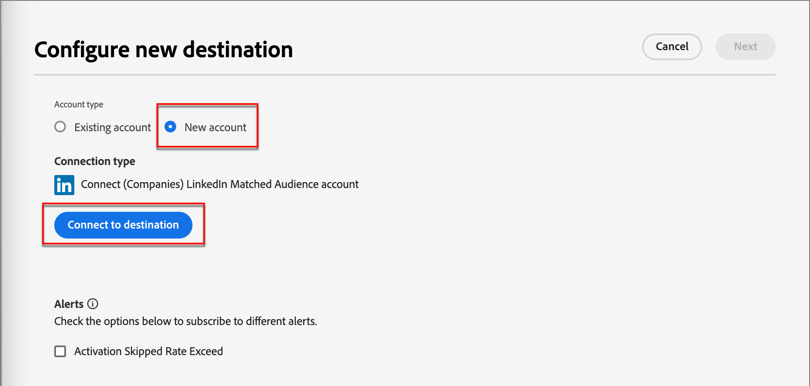

# LinkedIn Account Matched Audiences

Journey Optimizer B2B edition bietet die Möglichkeit, LinkedIn-Anzeigen-Zielgruppen über Zielgruppen mit Konto-Matched zu generieren, und wurde entwickelt, um Ihnen beim Ausfüllen leerer Rollen in Ihren Einkaufsgruppen zu helfen. Durch die Definition eines Satzes von Einkaufsgruppenfiltern können Sie eine LinkedIn Matched Audience verwalten, um Interessenten anzusprechen, die Ihren Einkaufsgruppenparametern entsprechen. Diese Funktion nutzt Experience Platform-Ziele, um einige Aspekte der Integration zu verwalten. Es gibt eine Beschränkung von zehn Datenflüssen.

Bevor Sie einen Datenfluss von Journey Optimizer B2B edition aus initiieren, müssen Sie mindestens eine Instanz des Zielkonnektors „LinkedIn-Zielgruppe ([)“ mit abgeglichenem Zielgruppen-Connector ](https://experienceleague.adobe.com/de/docs/experience-platform/destinations/catalog/social/linkedin#connect){target="_blank"}Firmen) mit einem in Ihrer Experience Platform-Anwendung konfigurierten LinkedIn-Kampagnenmanager-Konto haben.

## Konfigurieren einer neuen Verbindung mit einem LinkedIn-Konto {#linkedin-destination-setup}

>[!CONTEXTUALHELP]
>id="ajo-b2b_linkedin_destination_setup"
>title="Die Einrichtung eines LinkedIn-Ziels ist erforderlich"
>abstract="Senden Sie nach Einkaufsgruppen gefilterte Konten an ein Linkedin-Ziel, um mit potenziellen Mitgliedern von Einkaufsgruppen zu interagieren. Sie können bis zu 10 Datenflüsse für 10 verschiedene Gruppen gefilterter Konten erstellen. Um mit dieser Funktion zu beginnen, fügen Sie zuerst ein LinkedIn-Ziel hinzu."

1. Navigieren Sie in Experience Platform **[!UICONTROL Verbindungen]** > **[!UICONTROL Ziele]** im linken Navigationsbereich und wählen Sie die Registerkarte **[!UICONTROL Katalog]** aus.

1. Suchen Sie im Katalog den Connector **[!UICONTROL (Companies) LinkedIn Matched Audience]** .

   >[!TIP]
   >
   >Sie können den Connector schnell finden, indem Sie `LinkedIn` in das Suchfeld eingeben.

1. Klicken Sie auf der Connector-Karte auf das Symbol _Mehr_ (**…**) und wählen Sie **[!UICONTROL Neues Ziel konfigurieren]**.

   {width="800" zoomable="yes"}

1. Wählen Sie **[!UICONTROL Neues Konto]** und klicken Sie auf **[!UICONTROL Mit Ziel verbinden]**.

   {width="500"}

1. Geben Sie Ihre LinkedIn-Anmeldedaten ein und melden Sie sich an.

   Nach der Authentifizierung wird das LinkedIn-Konto als Ziel in Experience Platform verbunden.

   {width="400"}

   >[!IMPORTANT]
   >
   >Geben Sie an dieser **nicht** &quot;_[!UICONTROL &quot;]_. Es wird nur die Verbindung benötigt.

## Kontodetails aktualisieren

Der Name und die Beschreibung für das LinkedIn-Konto sind für Einkaufsgruppen in Journey Optimizer B2B edition sichtbar. Es empfiehlt sich, diese Informationen so zu aktualisieren, dass sie für Ihre Marketing-Fachleute, die mit Einkaufsgruppen arbeiten, leicht erkennbar sind. Sie können die Kontodetails in der Benutzeroberfläche von Experience Platform oder Journey Optimizer B2B edition ändern.

1. Navigieren Sie **[!UICONTROL linken Navigationsbereich zu]** > **[!UICONTROL Ziele]** und wählen Sie die Registerkarte **[!UICONTROL Konten]** aus.

1. Klicken Sie für das neu erstellte Konto auf das Menü _Mehr_ (**…**) und wählen Sie **[!UICONTROL Details bearbeiten]**.

   {width="800" zoomable="yes"}

1. Aktualisieren Sie im Dialogfeld den Namen und die Beschreibung.

   {width="500"}

1. Klicken Sie auf **[!UICONTROL Speichern]**.

## Konto für Einkaufsgruppen aktivieren

>[!NOTE]
>
>Wenn Sie bereits über zehn Datenflüsse verfügen, können Sie keinen weiteren erstellen. Wenn Sie den Maximalwert erreicht haben, löschen Sie einen in Experience Platform, bevor Sie einen neuen in Journey Optimizer B2B edition erstellen.

1. Navigieren Sie in Journey Optimizer B2B Edition in der linken Navigation zu **[!UICONTROL Konten]** > **[!UICONTROL Käufergruppen]**.

1. Wählen Sie die Registerkarte **[!UICONTROL Durchsuchen]** aus.

1. Klicken **[!UICONTROL oben rechts auf „Für LinkedIn]** Ziel aktivieren“.

   {width="800" zoomable="yes"}

1. Geben Sie dem Datenfluss einen beschreibenden Namen und eine Beschreibung (optional).

   Nach dem Speichern wird dem Namen, den Sie für den Datenfluss angeben, _AJOB2B) vorangestellt,_ die Identifizierung des Datenflusses in Experience Platform zu unterstützen.

1. Geben Sie die [Konto-ID Ihres LinkedIn-Kampagnen-Manager-Kontos](https://www.linkedin.com/help/lms/answer/a424270) ein.

   Ihre Konto-ID finden Sie anhand Ihres Kontonamens in der Benutzeroberfläche von Campaign Manager.

   {width="700" zoomable="yes"}

1. Klicken Sie **[!UICONTROL Einkaufsgruppenfilter auswählen]** und definieren Sie die Parameter Ihrer Konto-Audience.

   >[!IMPORTANT]
   >
   >Derzeit können Filter nicht mehr bearbeitet werden, nachdem der Datenfluss aktiviert wurde. Überprüfen Sie Ihre Arbeit, bevor Sie den Datenfluss aktivieren.

   {width="400"}

   Für die **[!UICONTROL Interaktionsbewertung]** ist der Operator `Between` ebenso inklusiv wie Prozentbereiche. Zum Beispiel liegen 5.1 und 5 beide _zwischen_ 5 und 6.

   Leere Bedingungen werden wie `Is Any` behandelt.

   Klicken Sie **[!UICONTROL Speichern]**, um die angegebenen Filter hinzuzufügen.

1. Klicken Sie **[!UICONTROL LinkedIn-Ziel auswählen]** und wählen Sie das konfigurierte LinkedIn-Ziel aus, das Sie verwenden möchten.

   Bei Aktivierung erstellt diese Einstellung den Datenfluss mithilfe der Zielkonfiguration und des entsprechenden virtuellen Segments.

1. Überprüfen Sie Ihre Einstellungen und klicken Sie oben **[!UICONTROL auf]**.

   Klicken **[!UICONTROL im Bestätigungsdialogfeld]** erneut auf „Aktivieren“.

   Ein Banner mit einem Link zum Menü Datenflüsse in Experience Platform wird angezeigt, damit Sie den Datenflussdatensatz überprüfen können.

## Orchestrieren von Paid Media-Interaktionen

Sie können mit Account-Mitgliedern über einen bezahlten Medienkanal wie LinkedIn Ad-Zielgruppen interagieren, um sie zu erwerben, zu pflegen und für den Verkauf zu qualifizieren. Verwenden Sie einen _Aktion ausführen_-Knoten auf einer Account-Journey, um die Interaktion mit wichtigen Mitgliedern eines Accounts über einen externen Kanal zu automatisieren, der für verschiedene Account-Mitglieder am besten geeignet ist.

>[!VIDEO](https://video.tv.adobe.com/v/3448681/?learn=on&captions=ger)