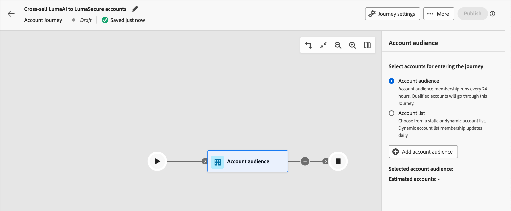

# Account Audience Journey Nodes

Der Zielgruppenknoten Konto gibt an, welche Konten in die Journey eintreten. Wenn Sie [Konto-Journey erstellen](./journey-overview.md#create-an-account-journey) beginnt die Journey immer mit einem Konto-Zielgruppenknoten, der die Eingabe definiert.

Verwenden Sie eine der folgenden Eingabeoptionen für diesen Journey-Knoten:

* **[Konto-Zielgruppe](../audiences/account-audience-overview.md)** - Die Konto-Zielgruppe stellt die grundlegende Zielgruppe dar, die mit dem Segmentierungs-Service von Experience Platform synchronisiert wird.
* **[Kontoliste](../accounts/account-lists.md)** - Die Kontoliste ist eine Sammlung benannter Konten, die Sie für die zielgerichtete Journey-Orchestrierung verwenden. Eine Kontenliste zielt auf benannte Konten ab, die definierte Kriterien verwenden, z. B. Branche, Standort oder Unternehmensgröße.

## Festlegen der Zielgruppe für den Konto-Zielgruppenknoten

1. Klicken Sie auf **[!UICONTROL Knoten]** Konto-Zielgruppe“. Diese Aktion zeigt die Knoteneigenschaften rechts an.

   {width="700" zoomable="yes"}

1. Eingabetyp für Konten auswählen, die auf die Journey zugreifen:

   * **[!UICONTROL Konto-Zielgruppe]**

     Wählen Sie die Option Konto-Zielgruppe . Klicken Sie dann auf **[!UICONTROL Konto-Zielgruppe hinzufügen]**.

     Wählen Sie _[!UICONTROL Dialogfeld]_ Zielgruppe hinzufügen“ ein zuvor erstelltes Zielgruppensegment aus. Klicken Sie dann auf **[!UICONTROL Zielgruppe hinzufügen]**.

     {width="700" zoomable="yes"}

   * **[!UICONTROL Kontoliste]**

     Wählen Sie die Option Kontoliste aus. Klicken Sie **[!UICONTROL Kontoliste hinzufügen]**.

     Wählen _[!UICONTROL im Dialogfeld]_ Live-Kontoliste auswählen“ eine veröffentlichte Kontoliste aus. Klicken Sie dann auf **[!UICONTROL Speichern]**.

     {width="700" zoomable="yes"}

     Weitere Informationen zum Erstellen und Veröffentlichen von Kontolisten finden Sie unter [Kontolisten](../accounts/account-lists.md).

## Erstellen eines Zielgruppensegments

1. Wählen Sie in der linken Navigation **[!UICONTROL Konten]** > **[!UICONTROL Zielgruppen]** aus.

1. Klicken **[!UICONTROL oben]** auf „Zielgruppe erstellen“.

   {width="800" zoomable="yes"}

1. Führen Sie die Schritte im [Handbuch zum Segmentierungs-Service](https://experienceleague.adobe.com/de/docs/experience-platform/segmentation/types/account-audiences){target="_blank"} aus.
