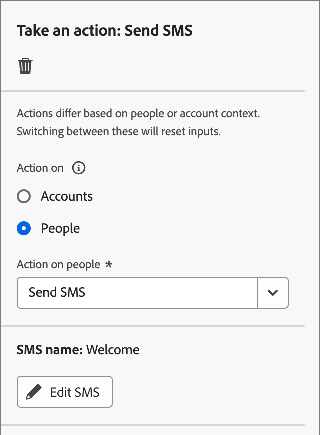

# Durchführen einer Aktion

Auf Ihrer Konto-Journey können Sie einen Knoten _[!UICONTROL Aktion ausführen]_ hinzufügen, um eine Aktion auszuführen, z. B. eine E-Mail senden, einen Punktewert ändern, einer Einkaufsgruppe zuweisen usw. Aktionen sind in der Regel das, was infolge eines Triggers geschehen soll, z. B. eines Ereignisses oder einer vorherigen Aktion.

{width="30"} [Übersichtsvideo ansehen](#overview-video)

## Kontoaktionen

Verwenden Sie eine Aktion für Konten, wenn Sie eine Änderung auf alle Personen anwenden möchten, die Teil von Konten im Knotenpfad sind.

### Aktionen und Einschränkungen {#account-action-constraints}

| Aktion | Begrenzungen |
| ------ | ----------- |
| [!UICONTROL Interessanter Moment des Kontos] | Typ (E-Mail, Meilenstein oder Web) Beschreibung (optional) |
| [!UICONTROL Für Ziel aktivieren] | Ziel auswählen |
| [!UICONTROL Konto zu (anderem) Journey hinzufügen] | Live-Konto-Journey auswählen |
| [!UICONTROL Zur Kontoliste hinzufügen] | Statische Live-Kontoliste auswählen |
| [!UICONTROL Konto von Journey entfernen] | Live-Konto-Journey auswählen |
| [!UICONTROL Aus der Kontenliste entfernen] | Live-Liste statischer Konten auswählen |
| [!UICONTROL Verkaufswarnung senden] | Lösungsinteresse auswählen  E-Mail senden an |
| [!UICONTROL Kontoprofil aktualisieren] | Attribut/  Wert auswählen |
| [!UICONTROL Phase der Einkaufsgruppe aktualisieren] | Lösungsinteresse auswählen Einkaufsgruppenstufe auswählen |
| [!UICONTROL Status der Einkaufsgruppe aktualisieren] | Lösungsinteresse/  auswählen (erforderlich, max. 50 Zeichen) |

>[!NOTE]
>
>Die _[!UICONTROL Account Change Data Value]_-Aktion wird für die Version 2025.10 nicht mehr unterstützt. Sie wird durch _[!UICONTROL Kontoprofil aktualisieren]_ für die [vereinfachte Architektur](../simplified-architecture.md) ersetzt 
>
>Ein Administrator kann die verfügbaren Attribute für das XDM Business-Konto konfigurieren, indem er die Felder in _[!UICONTROL XDM-Klassen]_ > _[!UICONTROL Standardklassen]_ aktualisiert. Weitere Informationen finden Sie unter [Standardklassen](../admin/xdm-field-management.md#standard-classes).

### Hinzufügen einer kontobasierten Aktion

1. Navigieren Sie zur Journey-Karte.

1. Klicken Sie auf das Pluszeichen ( **+** ) auf einem Pfad und wählen Sie **[!UICONTROL Aktion ausführen]**.

   {width="400"}

1. Wählen Sie in den Knoteneigenschaften auf der rechten Seite **[!UICONTROL Konten]** für die Aktion aus.

1. Wählen Sie eine Aktion aus der Liste aus und legen Sie beliebige Werte für die Aktion fest.

   {width="700" zoomable="yes"}

>[!BEGINSHADEBOX]

### Für ein LinkedIn-Ziel aktivieren

Verwenden Sie die Aktion _Für Ziel aktivieren_ für Konten, um Konten für Experience Platform-Ziele direkt von Ihrem Journey aus zu aktivieren. Diese Aktion ermöglicht es Ihnen, qualifizierte Konten (basierend auf Kaufgruppenfiltern, Interaktionswerten und anderen Kriterien) in übereinstimmende Zielgruppen in unterstützten Zielen zu übertragen. IT

Ab Version 2025.10 ist **_LinkedIn_** der erste unterstützte Zieltyp. Verwenden Sie die Aktion für ein LinkedIn-Ziel, um die Kampagnenausführung zu optimieren, indem Sie Übergaben an mehrere Systeme eliminieren und die Latenz reduzieren. Als Marketing-Experte können Sie beispielsweise automatisch Konten mit hohen Absichten für das Retargeting aktivieren, wenn wichtige Kaufrollen fehlen, oder inaktive Konten basierend auf Inaktivitätsfiltern erneut aktivieren.

Weitere Informationen zur Verwendung von mit dem Konto übereinstimmenden Zielgruppen für ein LinkedIn-Ziel finden Sie unter [Mit dem Konto übereinstimmende Zielgruppen](../data/linkedin-account-matched-audiences.md).

+++ Festlegen der Aktivierung von Konten für ein LinkedIn-Ziel

1. Wenn der Knoten _Aktion ausführen_ auf der Arbeitsfläche &quot;Journey&quot; ausgewählt ist, legen Sie **[!UICONTROL Aktion für Konten]** auf **[!UICONTROL Für Ziel aktivieren]** fest.

1. Klicken Sie **[!UICONTROL Ziel auswählen]**.

   {width="600" zoomable="yes"}

1. Wählen Sie im Dialogfeld das konfigurierte LinkedIn-Ziel aus und klicken Sie auf **[!UICONTROL Speichern]**.

{width="700" zoomable="yes"}

1. Geben Sie den **[!UICONTROL Zielgruppennamen]** ein, der zur Identifizierung der aktivierten Zielgruppe im Ziel verwendet wird.

   {width="550" zoomable="yes"}

+++

>[!ENDSHADEBOX]

## Personenaktionen

Verwenden Sie eine Aktion für Personen, wenn Sie eine Änderung auf alle Personen im Knotenpfad anwenden möchten. Dieser Knotentyp kann im Aufspaltungspfad nach Personen oder im Aufspaltungspfad nach Konten verwendet werden.

### Aktionen und Einschränkungen {#people-action-constraints}

| Kontext | Aktion | Begrenzungen |
| ------- | ------ | ----------- |
| [Journey Optimizer B2B](#journey-optimizer-b2b-actions) | [!UICONTROL Hinzufügen zur externen Kundenzielgruppe] | Externe Kundenzielgruppe auswählen |
| | [!UICONTROL Der Einkaufsgruppe zuweisen] | Lösungsinteresse auswählen Rolle auswählen |
| | [!UICONTROL Punktzahl ändern] | Score-Name Änderung des Score |
| | [!UICONTROL Interessanter Moment der Person] | type description |
| | [!UICONTROL Aus Einkaufsgruppe entfernen] | Lösungsinteresse auswählen |
| | [!UICONTROL E-Mail senden] | Neue E-Mail erstellen E-Mail aus Marketo Engage auswählen |
| | [!UICONTROL SMS senden] | SMS erstellen |
| | [!UICONTROL Personenprofil aktualisieren] | Personenattribut auswählen neuen Wert festlegen |
| [Marketo Engage](#marketo-engage-actions) | [!UICONTROL Zur Marketo Engage-Anfragekampagne hinzufügen] | Marketo Engage Workspace auswählen Kampagne anfordern auswählen |
| | [!UICONTROL Zur Marketo-Liste hinzufügen] | Namen der externen Marketo-Verbindung auswählen  Listenname |
| | [!UICONTROL Aus Marketo-Liste entfernen] | Namen der externen Marketo-Verbindung auswählen  Listenname |

>[!NOTE]
>
>Die Aktion _[!UICONTROL Ändern der Personenpartition in Marketo Engage]_ wird für die Version 2025.10 nicht mehr unterstützt und ist in der [vereinfachten Architektur](../simplified-architecture.md) für Journey Optimizer B2B edition nicht verfügbar. 
>
>Die Aktion _[!UICONTROL Datenwert ändern]_ für die Version 2025.10 wird nicht mehr unterstützt. Er wird in _[!UICONTROL vereinfachten Architektur durch &quot;]_ aktualisieren“ ersetzt.

### Hinzufügen einer personenbasierten Aktion

1. Navigieren Sie zur Journey-Karte.

1. Klicken Sie auf das Pluszeichen ( **+** ) auf einem Pfad und wählen Sie **[!UICONTROL Aktion ausführen]**.

1. Wählen Sie in den Knoteneigenschaften auf der rechten Seite **[!UICONTROL Personen]** für die Aktion aus.

1. Wählen Sie eine Aktion aus der Liste aus und legen Sie beliebige Werte für die Aktion fest.

{width="700" zoomable="yes"}

### Journey Optimizer B2B-Aktionen

Die personenbasierten Aktionen von Journey Optimizer B2B dienen der Verwaltung der Kommunikation über die konfigurierten Kanäle und der Kategorisierung von Personen in Ihren Einkaufsgruppen und Konten. Der Journey wendet die Aktion an, wenn ein qualifizierendes Konto mit Personenprofilen den Knoten erreicht.

+++[!UICONTROL Hinzufügen zur externen Kundenzielgruppe]

Verwenden Sie diese Aktion, um Personen zu einer externen Zielgruppe zu pushen, die über einen bezahlten Medienkanal aktiviert werden kann, um Mitglieder von Einkaufsgruppen weiter anzusprechen. Diese Aktion wird über Real-Time CDP B2B/P Edition ausgeführt.

>[!NOTE]
>
>Wenn ein qualifizierendes Konto mit Personenprofilen den Knoten _Zu externer Kundenzielgruppe hinzufügen_ in einer veröffentlichten Journey erreicht, kann es bis zu 48 Stunden dauern, bis diese Profile in der externen Zielgruppe ausgefüllt sind.

{width="300"}

Wenn Sie diese personenbasierte Aktion auswählen, können Sie eine neue externe Zielgruppe erstellen oder aus einer vorhandenen externen Zielgruppe auswählen. Bei bestehenden Zielgruppen können Sie aus externen Kundenzielgruppen wählen, die nur in Journey Optimizer B2B edition erstellt wurden. Wenn Sie eine Zielgruppe erstellen und für diese Journey-Aktion verwenden, stellen Sie sicher, dass Sie eine Verbindung mit dem Ziel herstellen. Weitere Informationen finden Sie unter [Erstellen einer neuen Zielverbindung](https://experienceleague.adobe.com/de/docs/experience-platform/destinations/ui/connect-destination){target="_blank"} und [Aktivierung - Übersicht](https://experienceleague.adobe.com/de/docs/experience-platform/destinations/ui/activate/activation-overview#activate-audiences-from-the-destinations-catalog){target="_blank"} in der Dokumentation zu Experience Platform.

{width="30"} [Videoübersicht über die Orchestrierung bezahlter Medien ansehen](../data/linkedin-account-matched-audiences.md#orchestrate-paid-media-engagement)

_So erstellen Sie eine externe Zielgruppe :_

1. Wählen Sie **[!UICONTROL Neu erstellen]**.

1. Klicken Sie **[!UICONTROL Externe Kundenzielgruppe erstellen]**.

1. Geben Sie **[!UICONTROL Name]** (erforderlich) und **[!UICONTROL Beschreibung]** (optional) für die neue externe Zielgruppe ein.

   {width="300"}

1. Klicken Sie auf **[!UICONTROL Erstellen]**.

   Das System erstellt die neue Zielgruppe und zeigt eine Bestätigungsmeldung an. Anschließend können Sie sie als vorhandene Zielgruppe für die Knotenaktion verwenden.

   >[!NOTE]
   >
   >Wenn eine neue externe Kundenzielgruppe aus Journey Optimizer B2B edition erstellt wird, wird sie mit einem Platzhalterdatensatz (`test@email.com`) vorkonfiguriert. Dieser Eintrag wird überschrieben, sobald das erste echte Profil der externen Audience von der Journey hinzugefügt wird.

_So verwenden Sie eine vorhandene Zielgruppe :_

1. Klicken Sie **[!UICONTROL Externe Kundenzielgruppe auswählen]**.

1. Wählen Sie im Dialogfeld die Zielgruppe aus, die Sie verwenden möchten.

   {width="700" zoomable="yes"}

1. Klicken Sie **[!UICONTROL Zielgruppe hinzufügen]**.

+++

+++[!UICONTROL Der Einkaufsgruppe zuweisen]

Verwenden Sie diese Aktion, um Personenprofile basierend auf einem ausgewählten [&#x200B; und einer ausgewählten Rolle &#x200B;](../buying-groups/buying-groups-overview.md) einer Kaufgruppe hinzuzufügen.

{width="300"}

+++

+++[!UICONTROL Punktzahl ändern]

Verwenden Sie diese Aktion, um die Punktzahl der Person in Marketo Engage zu ändern. [Weitere Informationen](https://experienceleague.adobe.com/de/docs/marketo-learn/tutorials/lead-and-data-management/lead-scoring-learn){target="_blank"}

{width="300"}

+++

+++[!UICONTROL Interessanter Moment der Person]

Verwenden Sie diese Aktion, um einen interessanten Moment für Personen zu protokollieren. Wählen Sie einen Typ aus (E-Mail, Meilenstein oder Web) und fügen Sie eine Beschreibung hinzu (optional).

{width="300"}

+++

+++[!UICONTROL Aus Einkaufsgruppe entfernen]

Verwenden Sie diese Aktion, um Personenprofile aus einer [Einkaufsgruppe“ &#x200B;](../buying-groups/buying-groups-overview.md) Grundlage eines ausgewählten Lösungsinteresses zu entfernen.

{width="300"}

+++

+++[!UICONTROL E-Mail senden]

Verwenden Sie diese Aktion, um eine E-Mail zu senden. Nachdem Sie [E-Mail erstellen](../content/add-email.md#add-an-email-to-your-journey) für den Knoten können Sie E-Mail-Nachrichten im E-Mail-Design-Bereich entwerfen, personalisieren und in der Vorschau anzeigen (siehe [E-Mail-Authoring](../content/email-authoring.md)). Sie können auch eine (E[Mail von Marketo Engage aus) &#x200B;](https://experienceleague.adobe.com/de/docs/marketo/using/product-docs/email-marketing/general/creating-an-email/create-an-email){target="_blank"}. Wählen Sie den Marketo Engage-Arbeitsbereich und dann die zu sendende E-Mail aus.

{width="300"}

+++

+++[!UICONTROL SMS senden]

Verwenden Sie diese Aktion, um eine SMS-Nachricht zu senden. Sie können SMS-Nachrichten im visuellen Design erstellen, personalisieren und in der Vorschau anzeigen (siehe [SMS-Authoring](../content/sms-authoring.md)).

{width="300"}

+++

+++[!UICONTROL Personenprofil aktualisieren]

Verwenden Sie diese Aktion, um den Wert eines „Personenprofilattributs[&#x200B; zu &#x200B;](../admin/field-mapping.md#xdm-business-person-attributes). Wählen Sie das Attribut aus und legen Sie dann den neuen Wert fest.

{width="300"}

>[!NOTE]
>
>Die _[!UICONTROL Personenprofil aktualisieren]_ ersetzt die Aktion _[!UICONTROL Datenwert ändern]_ in der [vereinfachten Architektur](../simplified-architecture.md). 
>
>Admins können die verfügbaren Attribute für das individuelle XDM-Profil konfigurieren, indem sie die Felder in _[!UICONTROL XDM-Klassen]_ > [!UICONTROL Standardklassen] aktualisieren. Weitere Informationen finden Sie unter [Standardklassen](../admin/xdm-field-management.md#standard-classes).

+++

### Marketo Engage-Aktionen

Die personenbasierten Marketo Engage-Aktionen sind so konzipiert, dass sie Ihre kontobasierte Marketing-Orchestrierung in Journey Optimizer B2B edition mit Ihren Lead-basierten Marketing-Maßnahmen in Marketo Engage koordinieren. Orchestrieren Sie mithilfe dieser Aktionen die Listenmitgliedschaft und fordern Sie Kampagnen an.

>[!NOTE]
>
>Die Marketo Engage-Aktionen erfordern eine konfigurierte Integration mit einer oder mehreren externen Marketo Engage-Instanzen. <!-- For detailed information about configuring these connections, see #. -->

Beispielsweise können Sie Kampagnen in Marketo Engage für Personen unterdrücken, die Teil von Einkaufsgruppen in Journey Optimizer B2B edition sind. In diesem Fall können Sie in Marketo Engage eine statische Liste speziell für die Lösungsinteressen erstellen. Verwenden Sie dann auf einem Aufspaltungspfad durch Kauf der Gruppe die Aktion _Zu Marketo-Liste hinzufügen_ von einem Journey-Knoten aus. Durch diese Aktion werden kaufende Gruppenmitglieder zu einer bestimmten statischen Liste in einer verbundenen Marketo Engage-Instanz hinzugefügt. Verwenden Sie dann die lösungsorientierte statische Liste für einen Smart-Listen-Filter in Marketo Engage.

+++[!UICONTROL Zur Marketo Engage-Anfragekampagne hinzufügen]

Verwenden Sie diese Aktion, um Personenprofile zu einer [Anfragekampagne](https://experienceleague.adobe.com/de/docs/marketo/using/product-docs/core-marketo-concepts/smart-campaigns/flow-actions/request-campaign){target="_blank"} in Marketo Engage hinzuzufügen.

Wählen Sie zunächst eine verbundene Marketo Engage-Instanz aus. Wählen Sie als Nächstes den Namen der Anfragekampagne aus.

{width="300"}

+++

+++[!UICONTROL Zur Marketo-Liste hinzufügen]

Mit dieser Aktion können Sie Personen zu einer [statischen Liste](https://experienceleague.adobe.com/de/docs/marketo/using/product-docs/core-marketo-concepts/smart-lists-and-static-lists/static-lists/understanding-static-lists){target="_blank"} in Marketo Engage hinzufügen.

Wählen Sie zunächst eine verbundene Marketo Engage-Instanz aus. Wählen Sie anschließend den Listennamen aus.

{width="300"}

+++

+++[!UICONTROL Aus Marketo-Liste entfernen]

Mit dieser Aktion können Sie Personen aus einer [statischen Liste](https://experienceleague.adobe.com/de/docs/marketo/using/product-docs/core-marketo-concepts/smart-lists-and-static-lists/static-lists/understanding-static-lists){target="_blank"} in Marketo Engage entfernen.

Wählen Sie zunächst eine verbundene Marketo Engage-Instanz aus. Wählen Sie anschließend den Listennamen aus.

{width="300"}

+++

## Übersichtsvideo

>[!VIDEO](https://video.tv.adobe.com/v/3443254/?captions=ger&learn=on)
