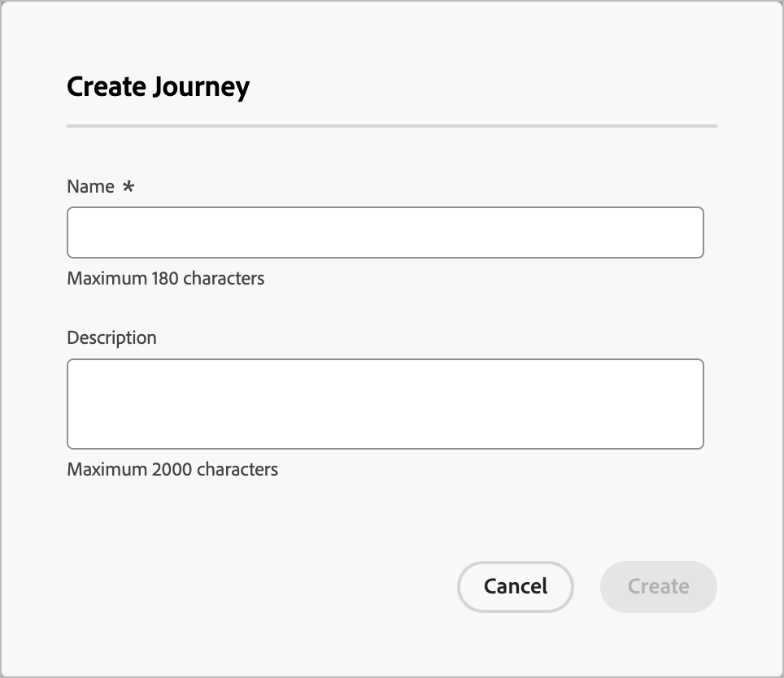
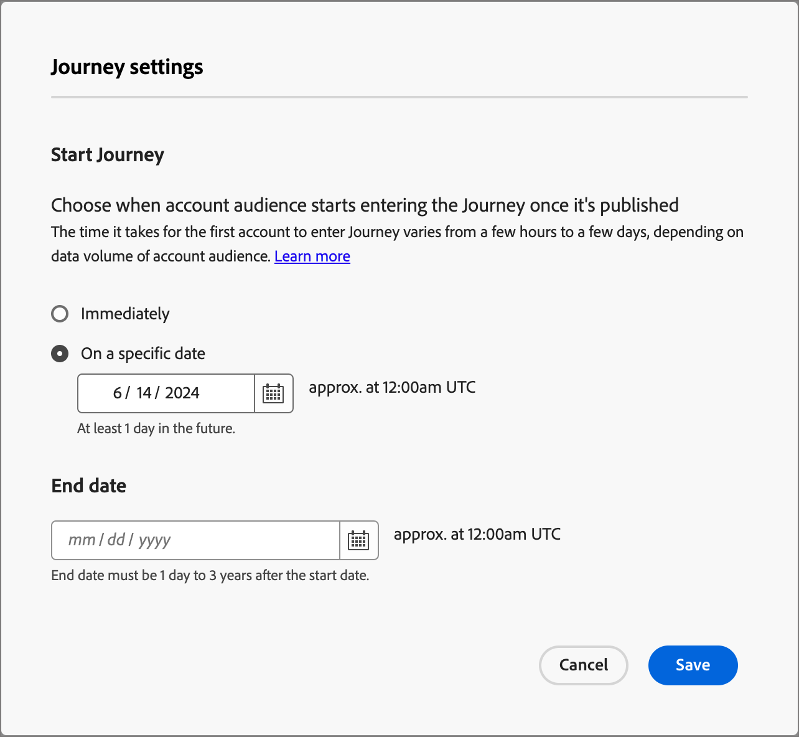

# Erstellen und Veröffentlichen einer Journey

Um mit einer Journey zu beginnen, erstellen Sie die Journey und erstellen Sie dann den Knoten- und Journey-Fluss in der Journey-Zuordnung.

{width="30"} [Übersichtsvideo ansehen](#overview-video)

## Erstellen einer Journey

Wählen Sie unter **[!UICONTROL Journey]** Verwaltung im linken Navigationsbereich den Journey-Typ aus, den Sie erstellen möchten:

* **[!UICONTROL Account Journey]**
* **[!UICONTROL Personen-Journey]** (Beta)

_So fügen Sie eine neue Journey hinzu :_

+++Konto-Journey

1. Klicken **[!UICONTROL oben rechts]** der Seite auf „Konto-Journey erstellen“.

1. Geben Sie im Dialogfeld einen eindeutigen **[!UICONTROL Namen“ (]**) und &quot;**[!UICONTROL &quot;]** optional) ein.

   {width="400"}

1. Klicken Sie auf **[!UICONTROL Erstellen]**.

+++

+++Personen-Journey (Beta)

1. Klicken **[!UICONTROL oben rechts]** der Seite auf &quot;Journey erstellen“.

1. Geben Sie im Dialogfeld einen eindeutigen **[!UICONTROL Namen“ (]**) und &quot;**[!UICONTROL &quot;]** optional) ein.

   {width="400"}

1. Klicken Sie auf **[!UICONTROL Erstellen]**.

+++

## Bausteine für das Journey-Design

Die _Journey-Zuordnung_ ist der zentrale Bereich im Journey-Arbeitsbereich. In diesem Bereich können Sie Journey-Knoten hinzufügen und konfigurieren. Klicken Sie auf einen Knoten, um seinen Eigenschaftenbereich rechts von der Arbeitsfläche zu öffnen und ihn entsprechend Ihrem Design festzulegen. Eine Journey beginnt immer mit einem Zielgruppenknoten, auf dem Sie die Eingabe für Ihren Journey definieren können:

* [Konto-Zielgruppenknoten](./account-audience-nodes.md)
* [Zielgruppenknoten Person](./person-audience-nodes.md)

Nachdem Sie eine Konto-Journey erstellt und die Zielgruppe hinzugefügt haben, entwerfen Sie die Journey mit -Knoten. Die Journey-Zuordnung bietet eine Arbeitsfläche, auf der Sie Ihre mehrstufigen B2B-Marketing-Anwendungsfälle mithilfe der folgenden Knotentypen erstellen können, um eine Account-Journey zu erstellen:

* [Durchführen einer Aktion](./action-nodes.md)
* [Auf ein Ereignis lauschen](./listen-for-event-nodes.md)
* [Pfade aufteilen](./split-merge-paths-nodes.md)
* [Pfade für aufgeteilte Varianten](./variant-split-paths-nodes.md)
* [Nächster bester Pfad](./next-best-path-node.md)
* [Warten](./wait-nodes.md)
* [Pfade zusammenführen](./split-merge-paths-nodes.md)

## Schutzmechanismen

Die folgenden Leitplanken sind vorhanden, damit Sie eine Journey erstellen können, ohne Fehler zu verursachen:

* _Löschen eines Knotens mit aufgeteiltem Pfad_: Zum Löschen eines Knotens müssen alle nachfolgenden Knoten in jedem Pfad gelöscht werden.
* _Löschen eines Zusammenführungsknotens_: Ein Zusammenführungsknoten kann nur gelöscht werden, wenn ein Pfad mit ihm verbunden ist. Um einen Zusammenführungsknoten zu löschen, lassen Sie nur einen Pfad ausgewählt.
* _Wechseln zwischen Konto und Personen_: Wenn Sie die Auswahl von Konten zu Personen ändern, werden alle nachfolgenden Knoten in jedem Pfad gelöscht.

## Knoten hinzufügen

1. Navigieren Sie zur Journey-Karte.

1. Klicken Sie auf das Pluszeichen ( **+** ) im Pfad und wählen Sie den Knotentyp aus.

1. Legen Sie die Knoteneigenschaften rechts fest.

## Löschen eines Knotens

1. Navigieren Sie zur Journey-Karte.

1. Klicken Sie in den Knoteneigenschaften auf der rechten Seite auf das Symbol _Löschen_ (  ).

1. Klicken Sie im Bestätigungsdialog auf **[!UICONTROL Löschen]**.

## Hinzufügen und Löschen eines Pfads

1. Navigieren Sie zur Journey-Karte.

1. Klicken Sie auf das Pluszeichen ( **+** ) auf dem Pfad und fügen Sie den [Pfadknoten aufteilen“ &#x200B;](./split-merge-paths-nodes.md#split-paths).

1. Klicken Sie in den Knoteneigenschaften auf der rechten Seite auf **[!UICONTROL Konto]**.

1. Um weitere Pfade hinzuzufügen, klicken Sie auf **[!UICONTROL Pfad hinzufügen]**.

   Bei jedem Pfad, der auf der Journey erstellt wird, wird eine neue Pfadkarte in den Eigenschaften angezeigt.

1. Navigieren Sie zu einem der Pfade auf der Journey und fügen Sie [action](./action-nodes.md) oder [event](./listen-for-event-nodes.md)-Knoten mithilfe des Pluszeichens zu diesem Pfad hinzu.

1. Wählen Sie den [Aufspaltungspfad](./split-merge-paths-nodes.md)-Knoten aus, um die Eigenschaften auf der rechten Seite zu öffnen.

   Die Pfade mit Knoten auf ihnen können nicht gelöscht werden.

1. Um diese Pfade zu löschen, müssen Sie zuerst alle Knoten in diesem Pfad löschen.

## Journey planen

Wenn Sie eine Journey veröffentlichen, kann diese sofort oder an einem geplanten Datum in der Zukunft gestartet werden. Das Enddatum kann maximal drei Jahre ab dem Startdatum betragen. Nach der Veröffentlichung einer Journey (_Live_-Status) können Sie das Enddatum der Journey, nicht aber das Startdatum aktualisieren.

1. Navigieren Sie zur Journey-Karte.

1. Planen Sie den Journey, indem Sie in der Kopfzeile auf **[!UICONTROL Journey]** Einstellungen&rbrace; klicken.

1. Legen Sie im Dialogfeld die Zeitplanoptionen fest:

   * Wählen Sie einen Zeitplantyp aus.

     Um die Journey zum Zeitpunkt der Veröffentlichung zu aktivieren, wählen Sie **[!UICONTROL Sofort]**.

     Um die Journey für ein Datum in der Zukunft zu aktivieren, wählen Sie **[!UICONTROL An einem bestimmten Datum]** und klicken Sie auf das _Kalender_-Symbol, um das Datum auszuwählen.

     Dialogfeld für {width="400" zoomable="no"}

   * Geben Sie das **[!UICONTROL Enddatum]** für die Journey an. Sie kann maximal drei Jahre vom Startdatum entfernt sein (dieses Feld ist für die Veröffentlichung erforderlich).

1. Klicken Sie auf **[!UICONTROL Speichern]**.

   Wenn Sie bereit sind, Ihren Journey zu veröffentlichen, können Sie diese Einstellungen überprüfen, wenn Sie auf &quot;_[!UICONTROL &quot;]_.

## Veröffentlichen einer Journey

Sie können eine Journey veröffentlichen, wenn keine Blocker-Fehler vorliegen. Nach der Veröffentlichung ändert sich der Journey-Status in _Live_. Wenn der Journey Fehler aufweist, ist die Schaltfläche _[!UICONTROL Veröffentlichen]_ mit folgenden Inhaltsinformationen abgeblendet: `Resolve errors before publishing`.

>[!NOTE]
>
>Nach der Veröffentlichung einer Account-Journey gibt es eine Verzögerung von bis zu 24 Stunden, bis qualifizierte Accounts die Journey betreten können.

1. Klicken Sie oben rechts in der Journey-Zuordnung auf **[!UICONTROL Veröffentlichen]**.

1. Legen Sie _[!UICONTROL Dialogfeld &quot;Journey-Einstellungen überprüfen]_ die Journey-Startoptionen fest.

   Wenn Sie die Journey-Einstellungen bereits festgelegt haben, um einen Zeitplan zu definieren, überprüfen Sie die Einstellungen.

   Wenn Sie die Journey-Aktivierung festlegen müssen, wählen Sie einen Zeitplantyp aus:

   * Um die Journey zum Zeitpunkt der Veröffentlichung zu aktivieren, wählen Sie **[!UICONTROL Sofort]**.

   * Um die Journey für ein Datum in der Zukunft zu aktivieren, wählen Sie **[!UICONTROL An einem bestimmten Datum]** und klicken Sie auf das _Kalender_-Symbol, um das Datum auszuwählen.

1. Geben Sie bei Bedarf das **[!UICONTROL Enddatum]** für die Journey an.

   Dialogfeld für {width="400" zoomable="no"}

   Sie kann maximal drei Jahre vom Startdatum entfernt sein (dieses Feld ist für die Veröffentlichung erforderlich).

1. Klicken Sie auf **[!UICONTROL Weiter]**.

1. Klicken Sie im Bestätigungsdialogfeld auf **[!UICONTROL Veröffentlichen]**.

## Übersichtsvideo

>[!VIDEO](https://video.tv.adobe.com/v/3443228/?captions=ger&learn=on)
