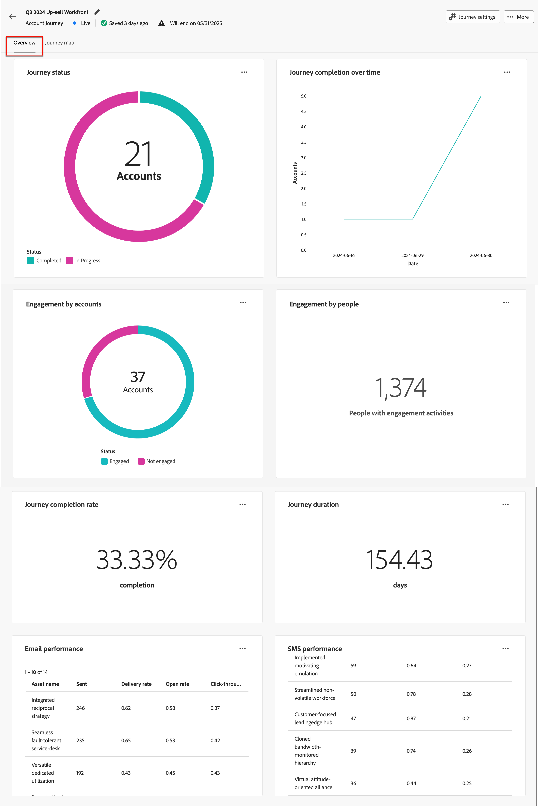

# Journey-Details

Wenn Sie auf den Namen für eine aktive Konto-Journey klicken, werden die Journey-Details angezeigt. Die Registerkarte _[!UICONTROL Überblick]_ enthält nützliche Informationen zum Journey, einschließlich der Zusammenfassungen der generativen KI.

Dieses Dashboard bietet einen umfassenden Überblick über eine ausgewählte Account-Journey, in dem der Account-Fortschritt anhand von Kreis- und Liniendiagrammen detailliert dargestellt wird, die Abschlüsse, laufende Aktivitäten und Abbrüche im Zeitverlauf kategorisieren und quantifizieren. Es hilft Marketing-Experten, die Effektivität von E-Mail- und SMS-Kanälen durch wichtige Versand- und Interaktionsmetriken zu bewerten.

Diese Übersicht ist für veröffentlichte Account-Journey verfügbar und es dauert etwa vier Stunden, bis die Daten die Diagramme und Tabellen befüllen.

{width="700" zoomable="yes"}

## Journey-Abschluss

Dieser Abschnitt enthält zwei Abschlussmetriken:

* **[!UICONTROL Journey-Status]** - Dieses Kreisdiagramm bietet eine Aufschlüsselung der Journey-Status, indem Konten in _Abgeschlossen_, _In Bearbeitung_ und _Abgebrochen_ kategorisiert werden. Jedes Segment ist am äußeren Rand des Diagramms mit entsprechenden Prozentsätzen und Kontonummern gekennzeichnet.
* **[!UICONTROL Abschluss des Journey im Zeitverlauf]** - Dieses Liniendiagramm verfolgt die Anzahl der Konten, die ihr Journey im Zeitverlauf abgeschlossen haben. Die horizontale Achse bildet die Zeitleiste ab, während die vertikale Achse die Konten quantifiziert, was eine einfache Ansicht der Abschlusstrends bietet.

## Journey-Interaktion

Dieser Abschnitt enthält zwei Abschlussmetriken:

* **[!UICONTROL Interaktion nach Konten]** - Dieses Kreisdiagramm segmentiert die Konten auf einer Journey in _Interagiert_ und _Nicht interagiert_ Kategorien. Die zentrale Zahl zeigt die Gesamtzahl an. Diese Visualisierung bietet einen Überblick über die gesamte Account-Interaktion.
* **Interaktion nach Personen** - Diese Visualisierung zeigt die Gesamtzahl der Personen an, die als _interagiert_ in einer Journey qualifiziert sind.

## Journey-Performance

Dieser Abschnitt enthält zwei wichtige Metriken:

* **[!UICONTROL Journey-Abschlussrate]** - Der Prozentsatz der Konten, die ihr Journey erfolgreich abgeschlossen haben.
* **[!UICONTROL Journey-Dauer]** - Die durchschnittliche Zeit, die Konten für das Abschließen ihrer Journey benötigen.

## E-Mail- und SMS-Leistung

Die Leistungstabellen bieten einen detaillierten Überblick über die Effektivität von E-Mail- und SMS-Kanälen. Jede Tabelle enthält Metriken wie Versandraten und Clickthrough-Raten, mit denen Sie die Auswirkungen jedes Kommunikations-Touchpoints bewerten können.

**[!UICONTROL E-Mail]** Leistung) Tabellenspalten:

* _[!UICONTROL Asset-]_: Name des Assets
* _[!UICONTROL Gesendet]_ - Anzahl der gesendeten E-Mails
* _[!UICONTROL Versandrate]_ - Anzahl der zugestellten E-Mails dividiert durch die gesendete Anzahl
* _[!UICONTROL Öffnungsrate]_ - Anzahl der geöffneten E-Mails dividiert durch die Anzahl der zugestellten Nachrichten
* _[!UICONTROL Klickrate]_ - Anzahl der angeklickten E-Mails dividiert durch die Anzahl der zugestellten Nachrichten

**[!UICONTROL SMS-Leistung]** Tabellenspalten:

* _[!UICONTROL Asset-]_: Name des Assets
* _[!UICONTROL Gesendet]_ - Anzahl der gesendeten SMS-Nachrichten
* _[!UICONTROL Versandrate]_ - Anzahl der zugestellten SMS-Nachrichten dividiert durch die Anzahl der gesendeten Nachrichten
* _[!UICONTROL Klickrate]_ - Anzahl der angeklickten SMS-Nachrichten dividiert durch die Anzahl der zugestellten Nachrichten
<!-- 
To generate a shareable PDF of your current view, click **[!UICONTROL Export]** at the top right of the page. -->

## Erweiterte Interaktion

Interagieren Sie weiter mit den Daten, indem Sie das Aktionssymbol (**…**) oben rechts in jedem Diagramm oder jeder Tabelle verwenden.

### Drill-Through

Wählen Sie für das ]__[!UICONTROL  Journey-Status **[!UICONTROL Diagramm „Drill-Through]**, um eine detaillierte Analyse der individuellen Kontostatus durchzuführen.

{width="600" zoomable="yes"}
<!--
The applied global filters are carried over to the view and displayed at the top. Click the _Filter_ icon at the top left to filter the data display by journey.-->

### Mehr anzeigen

Wählen Sie **[!UICONTROL Mehr anzeigen]**, um auf erweiterte Daten zuzugreifen. Das angezeigte Popup bietet eine Aufschlüsselung der Daten.

{width="600" zoomable="yes"}

Um die Daten herunterzuladen, klicken **[!UICONTROL oben rechts in]** Datentabelle auf „CSV herunterladen“. Um zum Dashboard _Übersicht“_, klicken Sie auf **[!UICONTROL Schließen]**.
