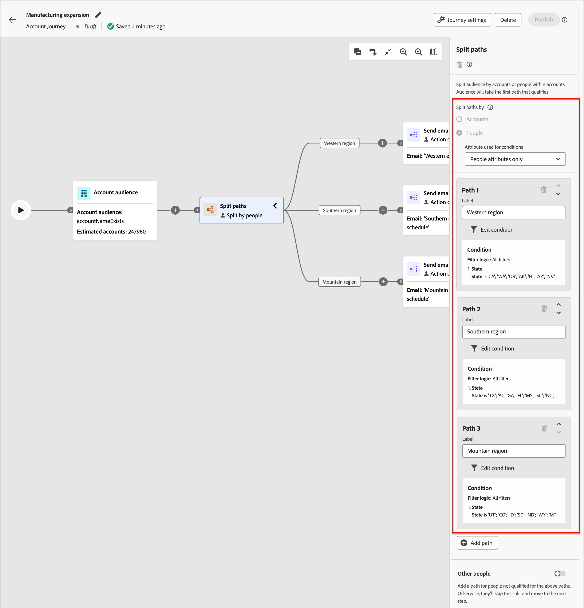

# Journey-Knoten des Kontos

Nachdem Sie [ein Konto-Journey](journey-overview.md#create-an-account-journey) und [die Audience hinzugefügt haben](journey-overview.md#add-the-account-audience-for-your-journey), erstellen Sie die Journey mithilfe von Knoten. Die Journey-Karte bietet eine Arbeitsfläche, auf der Sie Ihre mehrstufigen B2B-Marketing-Anwendungsfälle erstellen können.

Erstellen Sie Ihre Konto-Journey, indem Sie die verschiedenen Aktions-, Ereignis- und Orchestrierungsknoten als mehrstufiges, kanalübergreifendes Szenario kombinieren. Jeder Knoten einer Journey stellt einen Schritt entlang eines logischen Pfads dar. Verwenden Sie die folgenden Knotentypen, um eine Konto-Journey zu erstellen:

* [Konto-Zielgruppe](#account-audience-node)
* [Handeln](#take-an-action)
* [Suchen nach einem Ereignis](#listen-for-an-event)
* [Geteilte Pfade](#split-paths)
* [Warten](#wait)
* [Zusammenführungspfade](#merge-paths)

## Knoten &quot;Kontozielgruppe&quot;

Der Knoten [Zielgruppe des Kontos](journey-overview.md#add-the-account-audience-for-your-journey) definiert die Zielgruppe des Eingabedokuments (in Adobe Experience Platform erstellt und verwaltet) für die Journey. Dieser Knoten ist immer der erste Knoten und wird standardmäßig automatisch erstellt.

## Handeln

Führen Sie eine Aktion wie den Versand einer E-Mail, die Änderung eines Punktwerts, die Zuweisung zu einer Einkaufsgruppe usw. aus.

**Aktion für Konten**: Die Aktion wird auf alle Personen angewendet, die Teil der Konten auf diesem Pfad sind.

**Aktion für Personen**: Die Aktion wird auf alle Personen auf diesem Pfad angewendet. Eine Aktion für Personen kann innerhalb des Aufspaltungspfads von Personen verwendet oder durch Konten aufgeteilt werden.

### Aktionen und Einschränkungen {#action-nodes}

| Knotenkontext | Aktion | Begrenzungen |
| ------------ | ------ | ----------- |
| [„Personen“](#add-a-people-action) | Zu Liste hinzufügen | Marketo Engage workspace Listenname auswählen |
| | Zur Marketo Engage-Anforderungskampagne hinzufügen | Marketo Engage-Arbeitsbereich auswählen Auswahl der Anforderungskampagne |
| | Zuweisen zu einer Kaufgruppe | Lösungsinteresse auswählen Rolle auswählen |
| | Ändern der Personenpartition in Marketo Engage | Neue Partition |
| | Bewertung ändern | Score name change |
| | Person interessant Moment | Typ Beschreibung |
| | Entfernen aus der Gruppe &quot;Kaufen&quot; | Lösungsinteresse auswählen |
| | Aus Liste entfernen | Marketo Engage workspace Listenname auswählen |
| | E-Mail senden | Neue E-Mail erstellen E-Mail aus Marketo Engage auswählen |
| | SMS senden | SMS erstellen |
| [Konten](#add-an-account-action) | Datenwert für Kontoänderung | Attribut auswählen Neuer Wert |
| | Moment des Kontointeressens | Typ (E-Mail, Meilenstein oder Web) Beschreibung (optional) |
| | Konto zur (anderen) Journey hinzufügen | Live-Konto-Journey auswählen |
| | Konto aus Journey entfernen | Live-Konto-Journey auswählen |
| | Versandwarnung | Lösungsinteresse auswählen E-Mail an senden |
| | Aktualisieren des Status der Gruppe kaufen | Lösungsinteresse auswählen Status (erforderlich, max. 50 Zeichen) |

### Hinzufügen einer Kontoaktion

1. Navigieren Sie zum Journey-Editor.

1. Klicken Sie auf das Pluszeichen ( **+** ) auf einem Pfad und wählen Sie **[!UICONTROL Aktion durchführen]**.

   {width="400"}

1. Wählen Sie in den Knoteneigenschaften auf der rechten Seite **[!UICONTROL Konten]** für die Aktion.

1. Wählen Sie eine Aktion aus der Liste aus und legen Sie die Werte für die Aktion fest.

   {width="700" zoomable="yes"}

### Hinzufügen einer Personenaktion

1. Navigieren Sie zum Journey-Editor.

1. Klicken Sie auf das Pluszeichen ( **+** ) auf einem Pfad und wählen Sie **[!UICONTROL Aktion durchführen]**.

1. Wählen Sie in den Knoteneigenschaften auf der rechten Seite **[!UICONTROL Personen]** für die Aktion.

1. Wählen Sie eine Aktion aus der Liste aus und legen Sie die Werte für die Aktion fest.

{width="700" zoomable="yes"}

## Suchen nach einem Ereignis

Verschieben Sie Ihre Zielgruppe zum nächsten Schritt im Journey, wenn ein Ereignis auftritt.

* Sie können auch festlegen, wie lange die Journey auf dieses Ereignis wartet. Die Journey endet nach einer Zeitüberschreitung.
* Darüber hinaus können Sie weitere Knoten zu Ihrem Timeout-Pfad hinzufügen.

**Ereignisse in Konten verfolgen**: Wenn mindestens eine Person aus einem Konto ein Trigger ist, wechselt das Konto zum nächsten Schritt auf der Journey.

**Ereignisse für Personen überwachen**: Ereignisse für Personen können nur auf einen Kontopfad angewendet werden. Es ist nicht für eine Aufspaltung durch Personen-Knoten verfügbar.

### Ereignisse und Einschränkungen {#event-nodes}

| Knotenkontext | Veranstaltung | Begrenzungen |
| ------------ | ----- | ----------- |
| [„Personen“](#add-a-people-event) | Zugeordnet zur Einkaufsgruppe | Lösungsinteresse Zusätzliche Einschränkungen (optional): <ul><li>Role</li><li>Datum der Aktivität</li></ul> Timeout (optional) |
| | Klickt auf Link in E-Mail | E-Mail Zusätzliche Einschränkungen (optional): <ul><li>Link</li><li>Link-ID</li><li>Ist ein mobiles Gerät</li><li>Gerät</li><li>Plattform</li><li>Browser</li><li>Ist prädiktiv Inhalt</li><li>Ist Bot-Aktivität</li><li>Bot-Aktivitätsmuster</li><li>Browser</li><li>Datum der Aktivität</li><li>Min. Häufigkeit</li></ul> Timeout (optional) |
| | Klickt auf Link in SMS | E-Mail Zusätzliche Einschränkungen (optional):<ul><li>Link</li><li>Gerät</li><li>Plattform</li><li>Datum der Aktivität</li><li>Min. Häufigkeit</li></ul> Timeout (optional) |
| | Datenwertänderungen | Personenattribut Zusätzliche Einschränkungen (optional):<ul><li>Neuer Wert</li><li>Vorheriger Wert</li><li>Grund</li><li>Quelle</li><li>Datum der Aktivität</li><li>Min. Häufigkeit</li></ul> Timeout (optional) |
| | Öffnet E-Mail | E-Mail Zusätzliche Einschränkungen (optional): <ul><li>Link</li><li>Link-ID</li><li>Ist ein mobiles Gerät</li><li>Gerät</li><li>Plattform</li><li>Browser</li><li>Ist prädiktiv Inhalt</li><li>Ist Bot-Aktivität</li><li>Bot-Aktivitätsmuster</li><li>Browser</li><li>Datum der Aktivität</li><li>Min. Häufigkeit</li></ul> Timeout (optional) |
| | Aus der Kaufgruppe entfernt | Lösungsinteresse Aktivitätsdatum (optional) Zeitüberschreitung (optional) |
| | Bewertung wird geändert | Score name Zusätzliche Einschränkungen (optional):<ul><li>Ändern</li><li>Neue Bewertung</li><li>Dringlichkeit</li><li>Priorität</li><li>Relative Bewertung</li><li>Relative Dringlichkeit</li><li>Datum der Aktivität</li><li>Min. Häufigkeit</li></ul> Timeout (optional) |
| | SMS-Bounces | SMS-Nachricht Zusätzliche Einschränkungen (optional):<ul><li>Datum der Aktivität</li><li>Min. Anzahl der Male</li></ul> Timeout (optional) |
| [Konten](#add-an-account-event) | Konto hatte einen interessanten Moment | Typ (E-Mail, Meilenstein oder Web) Zusätzliche Einschränkungen (optional):<ul><li>Beschreibung</li><li>Quelle</li><li>Datum der Aktivität</li></ul>  Timeout (optional) |
| | Änderung des Kontodatenwerts | Attribut Zusätzliche Einschränkungen (optional):<ul><li>Neuer Wert</li><li>Vorheriger Wert</li><li>Datum der Aktivität</li></ul>  Timeout (optional) |
| | Änderung des Status der gekauften Gruppe | Lösungsinteresse Zusätzliche Einschränkungen (optional):<ul><li>Neuer Status</li><li>Vorheriger Status</li><li>Datum der Aktivität</li></ul>  Zeitüberschreitung (optional) |
| | Änderung der Vollständigkeitsbewertung | Lösungsinteresse Zusätzliche Einschränkungen (optional):<ul><li>Neue Bewertung</li><li>Vorheriger Wert</li><li>Datum der Aktivität</li></ul>  Zeitüberschreitung (optional) |
| | Änderung der Interaktionsbewertung | Lösungsinteresse Zusätzliche Einschränkungen (optional):<ul><li>Neue Bewertung</li><li>Vorheriger Wert</li><li>Datum der Aktivität</li></ul>  Zeitüberschreitung (optional) |

### Hinzufügen eines Kontoereignisses

1. Navigieren Sie zum Journey-Editor.

1. Klicken Sie auf das Pluszeichen ( **+** ) auf einem Pfad und wählen Sie **[!UICONTROL Nach einem Ereignis suchen]**.

1. Wählen Sie in den Knoteneigenschaften auf der rechten Seite **[!UICONTROL Konten]** für den Ereignistyp aus.

   {width="700" zoomable="yes"}

1. Wählen Sie ein Ereignis aus der Liste aus.

1. Klicken Sie auf **[!UICONTROL Ereignis bearbeiten]** und definieren Sie Details für das Ereignis.

### Hinzufügen eines Personenereignisses

1. Navigieren Sie zum Journey-Editor.

1. Klicken Sie auf das Pluszeichen ( **+** ) auf einem Pfad und wählen Sie **[!UICONTROL Nach einem Ereignis suchen]**.

1. Wählen Sie in den Knoteneigenschaften auf der rechten Seite **[!UICONTROL Personen]** für den Ereignistyp aus.

   {width="700" zoomable="yes"}

1. Wählen Sie ein Ereignis aus der Liste aus.

1. Klicken Sie auf **[!UICONTROL Ereignis bearbeiten]** und definieren Sie Details für das Ereignis.

### Timeout zu einem Ereignisknoten hinzufügen

Definieren Sie bei Bedarf die Zeitdauer, die die Journey auf das Ereignis wartet. Die Journey endet nach einer Zeitüberschreitung.

1. Aktivieren Sie den Timeout-Umschalter.

1. Wählen Sie die Dauer aus, für die die Journey auf das Eintreten eines Ereignisses wartet, bevor eine Zeitüberschreitung eintritt.

   Sie können den Pfad hier beenden oder einen anderen Handlungsweg wählen, indem Sie einen anderen Pfad festlegen.

1. Um einen neuen Pfad auf der Journey zu erstellen, in dem Sie Aktionen und Ereignisse hinzufügen können, die auf Konten angewendet werden, wenn das Ereignis nicht eintritt, aktivieren Sie das Kontrollkästchen **[!UICONTROL Pfad für Zeitüberschreitung festlegen]** .

   {width="700" zoomable="yes"}

## Geteilte Pfade

Aufspaltung der Audience anhand von Filterbedingungen.

>[!NOTE]
>
>Es werden maximal 25 Pfade unterstützt.

**Pfade nach Konten aufteilen**: Pfade, die nach Konten aufgeteilt sind, können sowohl Konto- als auch Personenaktionen und -ereignisse umfassen. Diese Pfade können weiter aufgeteilt werden.

_Wie funktioniert ein Aufspaltungspfad nach Kontoknoten?_

* Wenn Sie einen geteilten Pfad-Knoten hinzufügen und _Konto_ auswählen, enthält jeder hinzugefügte Pfad einen Endknoten, der jedem Edge Knoten hinzufügen kann.
* Es ist möglich, den Pfad wiederholt durch Konten aufzuteilen, z. B. auf verschachtelte Weise. Ein Aufspaltungspfad enthält eine Option, um den Standardpfad nicht hinzuzufügen.
* Wenn ein Konto/eine Person nicht für einen der Aufspaltungspfade qualifiziert ist, wird er im Journey nicht weitergeleitet.
* Diese Pfade können mithilfe eines Zusammenführungsknotens kombiniert werden.

{width="700" zoomable="yes"}

**Pfade nach Personen aufteilen**: Pfade, die durch Personen aufgeteilt sind und nur Aktionen für Personen umfassen können. Diese Pfade können nicht wieder geteilt und automatisch wieder verbunden werden.

_Wie funktioniert ein Aufspaltungspfad nach Personen-Knoten?_

* Geteilter Pfad nach Personenknoten sind gruppierte Knoten. Sie werden automatisch zusammengeführt, sodass alle Personen in der Zielgruppe zum nächsten Schritt übergehen können, ohne den Kontext der Konten zu verlieren, zu denen sie gehören.
* Aufspaltungspfad für Personen kann nicht verschachtelt werden. Sie können keinen Aufspaltungspfad für Personen hinzufügen, die sich in diesem gruppierten Knoten befinden.
* Aufspaltungspfad enthält eine Option, um keinen Standardpfad hinzuzufügen. Konten/Personen, die sich nicht qualifizieren, kommen nicht in der Journey voran.

{width="700" zoomable="yes"}

### Pfadbedingungen {#path-conditions}

| Knotenkontext | Pfadbedingungen | Beschreibung |
| ------------ | --------------- | ----------- |
| [„Personen“](#add-a-split-path-by-people-node) | [!UICONTROL Personenattribute] | Attribute aus dem Personenprofil, einschließlich: <ul><li>Stadt</li><li>Land</li><li>Geburtsdatum</li><li>E-Mail-Adresse</li><li>E-Mail-Adresse ungültig</li><li>E-Mail angehalten</li><li>Vorname</li><li>Abgeleitetes Bundesland/abgeleitete Region</li><li>Stellenbezeichnung</li><li>Last name</li><li>Mobiltelefonnummer</li><li>Telefonnummer</li><li>Postleitzahl</li><li>Land</li><li>Abbestellt</li><li>Grund für Abmeldung</li></ul> |
| | [!UICONTROL Aktivitätsverlauf] > [!UICONTROL E-Mail] | Mit der Journey verknüpfte E-Mail-Aktivitäten: <ul><li>[!UICONTROL Klick auf einen Link in E-Mail]</li><li>Geöffnete E-Mail</li><li>Bekam E-Mail zugestellt</li><li>Bekam E-Mail zugesendet</li></ul> Diese Bedingungen werden mithilfe einer zuvor auf der Journey ausgewählten E-Mail-Nachricht ausgewertet. |
| | [!UICONTROL Aktivitätsverlauf] > [!UICONTROL Datenwert geändert] | Bei einem ausgewählten Personenattribut ist eine Wertänderung aufgetreten. Zu diesen Änderungstypen gehören: <ul><li>Neuer Wert</li><li>Vorheriger Wert</li><li>Grund</li><li>Quelle</li><li>Datum der Aktivität</li><li>Min. Häufigkeit</li></ul> |
| | [!UICONTROL Aktivitätsverlauf] > [!UICONTROL hatte einen interessanten Moment] | Interessante Ereignisaktivität, die in der zugehörigen Marketo Engage-Instanz definiert ist. Zu den Einschränkungen gehören: ul><li>Meilenstein</li><li>E-Mail</li><li>Web</li></ul> |
| | [!UICONTROL Sonderfilter] > [!UICONTROL Mitglied der Gruppe &quot;Buying&quot;] | Die Person ist oder ist kein Mitglied einer Einkaufsgruppe, das anhand eines oder mehrerer der folgenden Kriterien bewertet wurde: <ul><li>Lösungsinteressen</li><li>Status der Gruppe kaufen</li><li>Vollständigkeitsbewertung</li><li>Engagement-Bewertung</li><li>Role</li></ul> |
| [Konten](#add-a-split-path-by-account-node) | Kontoattribute | Attribute aus dem Kontoprofil, einschließlich: <ul><li>Jahresumsatz</li><li>Stadt</li><li>Land</li><li>Mitarbeiterzahl</li><li>Branche</li><li>Name</li><li>SIC-Code</li><li>Land</li></ul> |
| | [!UICONTROL Sonderfilter] > [!UICONTROL hat Einkaufsgruppe] | Das Konto verfügt über Mitglieder von Einkaufsgruppen, die anhand eines oder mehrerer der folgenden Kriterien bewertet wurden: <ul><li>Lösungsinteressen</li><li>Status der Gruppe kaufen</li><li>Vollständigkeitsbewertung</li><li>Engagement-Bewertung</li></ul> |

### Aufspaltungspfad nach Konto-Knoten hinzufügen

1. Navigieren Sie zum Journey-Editor.

1. Klicken Sie auf das Pluszeichen ( **+** ) auf einem Pfad und wählen Sie **[!UICONTROL Geteilte Pfade]** aus.

   {width="300"}

1. Wählen Sie in den Knoteneigenschaften auf der rechten Seite **[!UICONTROL Konten]** für die Aufteilung aus.

1. Um eine Bedingung für _[!UICONTROL Pfad 1]_ zu definieren, klicken Sie auf **[!UICONTROL Bedingung anwenden]**.

   {width="500"}

1. Fügen Sie im Bedingungseditor einen oder mehrere Filter hinzu, um den Aufspaltungspfad zu definieren.

   * Ziehen Sie Filterattribute per Drag-and-Drop aus der linken Navigation und füllen Sie die Übereinstimmungsdefinition aus.

   * Passen Sie Ihre Bedingungen an, indem Sie oben die **[!UICONTROL Filterlogik]** anwenden. Sie können alle Attributbedingungen oder eine beliebige Bedingung erfüllen.

     {width="700" zoomable="yes"}

   * Klicken Sie auf **[!UICONTROL Fertig]**.

1. Um weitere Pfade hinzuzufügen, klicken Sie auf **[!UICONTROL Pfad hinzufügen]** und wiederholen Sie die vorherigen Schritte, um Bedingungen hinzuzufügen, die für diesen Pfad gelten.

   Sie können auch jeden Pfad anhand dieser Bedingungen beschriften oder die Standardbeschriftungen verwenden.

1. (Optional) Fügen Sie einen Standardpfad für Konten hinzu, die für die anderen Pfade nicht qualifiziert sind. Ist dies nicht der Fall, endet die Journey für diese Konten.

   {width="700" zoomable="yes"}

### Hinzufügen eines Aufspaltungspfads nach dem Knoten Personen

1. Navigieren Sie zum Journey-Editor.

1. Klicken Sie auf das Pluszeichen ( **+** ) auf einem Pfad und wählen Sie **[!UICONTROL Geteilte Pfade]** aus.

   {width="300"}

1. Wählen Sie in den Knoteneigenschaften auf der rechten Seite **[!UICONTROL Personen]** für die Aufteilung aus.

1. Um eine Bedingung für _[!UICONTROL Pfad 1]_ zu definieren, klicken Sie auf **[!UICONTROL Bedingung anwenden]**.

1. Fügen Sie im Bedingungseditor einen oder mehrere Filter hinzu, um den Aufspaltungspfad zu definieren.

   * Ziehen Sie Filterattribute per Drag-and-Drop aus der linken Navigation und füllen Sie die Übereinstimmungsdefinition aus.

   * Passen Sie Ihre Bedingungen an, indem Sie oben die **[!UICONTROL Filterlogik]** anwenden. Sie können alle Attributbedingungen oder eine beliebige Bedingung erfüllen.

   * Klicken Sie auf **[!UICONTROL Fertig]**.

1. Um weitere Pfade hinzuzufügen, klicken Sie auf **[!UICONTROL Pfad hinzufügen]** und wiederholen Sie die vorherigen Schritte, um Bedingungen hinzuzufügen, die für diesen Pfad gelten.

   Sie können auch jeden Pfad anhand dieser Bedingungen beschriften oder die Standardbeschriftungen verwenden.

1. Schließlich können Sie einen Standardpfad für Personen hinzufügen, die für die oben genannten Pfade nicht qualifiziert sind. Wenn nicht, endet die Journey für diese Personen

Wenn Sie Bedingungen für jeden Pfad definiert haben, um Ihre Zielgruppe auf der Personenebene zu teilen, können Sie Aktionen hinzufügen, die Sie für Personen durchführen möchten.

>[!NOTE]
>
>Wenn Sie die Zielgruppe nach Personen aufteilen, können Sie nur Aktionen für Personen hinzufügen.

## Warten

Warten Sie eine bestimmte Dauer, bevor Sie mit dem nächsten Schritt fortfahren.

1. Navigieren Sie zum Journey-Editor.

1. Klicken Sie auf das Pluszeichen ( **+** ) auf einem Pfad und wählen Sie **[!UICONTROL Warten]** aus.

1. Legen Sie in den Knoteneigenschaften auf der rechten Seite die **[!UICONTROL Dauer]** der Zeit fest, die gewartet werden soll, bevor der Journey zum nächsten Knoten im Pfad wechselt.

{width="700" zoomable="yes"}

## Zusammenführungspfade

Verschiedene Pfade in Ihrer Journey können mithilfe dieses Knotens zusammengeführt und entsperrt werden.

1. Navigieren Sie zum Journey-Editor.

1. Klicken Sie auf das Pluszeichen ( **+** ) auf einem Pfad und wählen Sie **[!UICONTROL Geteilte Pfade]** aus.

1. Klicken Sie auf den Knoten split , um seine Eigenschaften auf der rechten Seite zu öffnen.

1. Klicken Sie auf [!UICONTROL Pfad hinzufügen] , um drei Pfade zu erstellen.

1. Fügen Sie jedem Pfad eine Kombination aus Aktionen und Ereignissen hinzu.

1. Klicken Sie auf das Pluszeichen ( **+** ) für einen dieser Pfade und wählen Sie aus den angezeigten Optionen die Option **[!UICONTROL Zusammenführen]** aus.

   {width="400"}

1. Wählen Sie in den Eigenschaften des Zusammenführungsknotens die Pfade aus, die Sie zusammenführen möchten.

   {width="600" zoomable="yes"}

   An dieser Stelle werden die Pfade zusammengeführt, sodass Konten aus den ausgewählten Pfaden zu einem einzigen Pfad kombiniert werden, der auch weiterhin über die Journey weitergeführt werden kann.

1. Bei Bedarf können Sie die Zusammenführung von Pfaden aufheben, indem Sie zurück zu den Eigenschaften des Zusammenführungsknotens navigieren und das Kontrollkästchen für alle Pfade deaktivieren, die Sie entfernen möchten.
