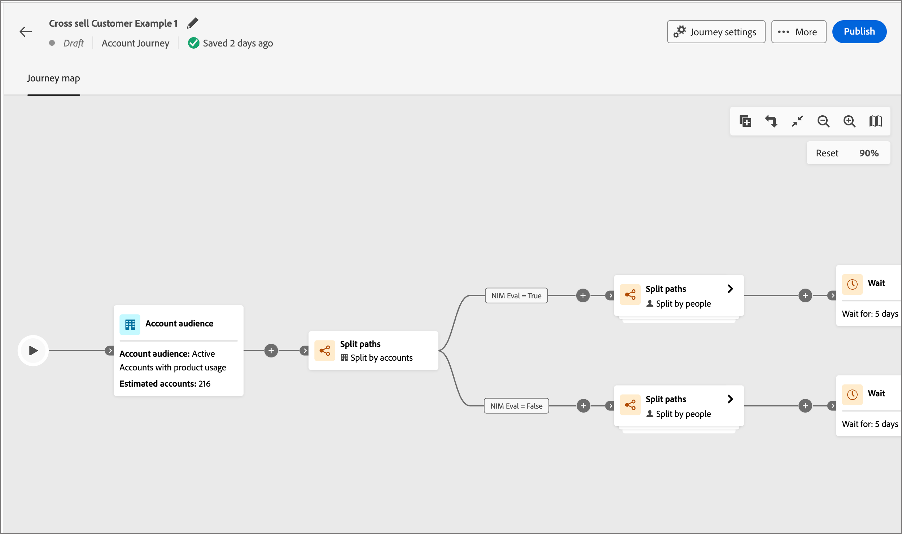
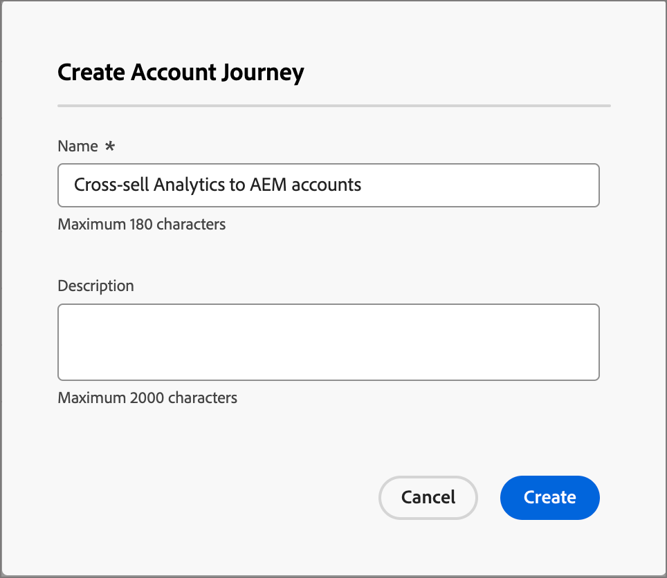

# Account-Journey

Definieren Sie eine umsatzbasierte Interaktion, die E-Mail, SMS und mehr innerhalb der Journey umfasst, um das eingehende Marketing für jedes Mitglied der Gruppe mit ausgehenden Verkaufsaktivitäten zu koordinieren.

## Zugriff auf und Durchsuchen von Konto-Journey

1. Klicken Sie auf Ihrer Adobe Experience Platform-Startseite auf Adobe Journey Optimizer B2B Edition.

1. Klicken Sie im linken Navigationsbereich auf **[!UICONTROL Journey des Kontos]**.

   {width="800" zoomable="yes"}

   Die angezeigte Journey-Seite enthält die folgenden Spalten:

   * [!UICONTROL Name] (klicken Sie auf den Namen, um die Konto-Journey zur Bearbeitung zu öffnen)
   * [!UICONTROL Status]
   * [!UICONTROL Beschreibung]
   * [!UICONTROL Erstellt von ]
   * [!UICONTROL Letzte Aktualisierung um ]
   * [!UICONTROL Letzte Aktualisierung durch ]
   * [!UICONTROL Veröffentlicht am]
   * [!UICONTROL Veröffentlicht von ]

Diese Tabelle enthält die Möglichkeit, nach Name und Erstellt von zu suchen. Die Sortierung ist derzeit nicht verfügbar.

Sie können die angezeigte Tabelle anpassen, indem Sie auf das Symbol _Spalten_ oben rechts klicken und die Kontrollkästchen auswählen oder deaktivieren.

{width="800" zoomable="yes"}

## Anatomie eines Journey-Kontos

Klicken Sie in der Liste _[!UICONTROL Journey des Kontos]_ auf den Namen (der als Link angezeigt wird), um die Details zu überprüfen, Änderungen vorzunehmen und Maßnahmen zu ergreifen.

{width="800" zoomable="yes"}

Der Editor-Header jeder Konto-Journey umfasst:

* Journey-Name
* Möglichkeit zur Bearbeitung des Namens (_Bearbeiten_ -Symbol)
* Status der Journey

Die folgenden Aktionen sind in der Kopfzeile verfügbar:

* **Publish** - Sie können eine Journey veröffentlichen, wenn keine Blockerfehler vorliegen. Bei der Veröffentlichung ändert sich der Journey-Status in _Live_. Wenn die Journey Fehler aufweist, ist die Schaltfläche mit den Inhaltsinformationen abgeblendet: `Resolve errors before publishing`.
* **Duplizieren** - Diese Aktion ähnelt einer Klonfunktion, die duplizierte Journey enthält jedoch keine Assets.
* **Für neue Einträge schließen** - Wenn Sie eine Journey schließen, setzen Konten, die sich derzeit im Journey befinden, ihren Pfad in der Journey fort und es kann kein weiterer Journey-Eintritt mehr erfolgen. Eine geschlossene Journey kann nicht neu gestartet werden. Sie können eine geschlossene Journey duplizieren.
* **Abbruch** - Wenn Sie eine Journey stoppen, stoppen Konten in der Journey sofort ihren Fortschritt und es kann kein weiterer Journey-Eintritt mehr stattfinden. Eine gestoppte Journey kann nicht neu gestartet werden. Wenn Sie neue Eintritte blockieren, ohne den Fortschritt von Personen zu stoppen, sollten Sie stattdessen die Journey schließen.
* **Löschen** - Durch diese Aktion wird die Journey dauerhaft gelöscht.

Der Status einer Journey ändert sich je nach den von Ihnen angewendeten Aktionen. Je nach Status einer Journey sind bestimmte Aktionen in der Kopfzeile nicht verfügbar.

| Status | Beschreibung | Verfügbare Aktionen |
| ------ | ----------- | ----------------- |
| _**Entwurf**_ | Eine nicht veröffentlichte Journey, die bearbeitbar ist. | <ul><li>Veröffentlichen</li><li>Doppelt </li><li>Löschen </li></ul> |
| _**Live**_ | Der Journey-Status ändert sich von &quot;Entwurf&quot;in &quot;Live&quot;, wenn eine Journey veröffentlicht wird. In diesem Status ist sie nicht mehr bearbeitbar. | <ul><li>Doppelt </li><li>Schließen an neue Einträge </li><li>Abbrechen </li></ul> |
| _**Geschlossen in neue Einträge**_ | Der Journey-Status ändert sich von _Live_ in _Geschlossen in neue Einträge_, wenn Sie in der oberen Navigationsleiste auf [!UICONTROL Für neue Einträge schließen] klicken. | <ul><li>Doppelt </li><li>Abbrechen </li></ul> |
| _**Aborted**_ | Der Journey-Status ändert sich von _Live_ oder _Geschlossen in neue Einträge_, wenn Sie eine Journey abbrechen. Eine abgebrochene Journey kann nicht neu gestartet werden. | <ul><li>Doppelt </li><li>Löschen </li></ul> |
| _**Abgeschlossen**_ | Wenn alle Konten in einer Journey die Journey abschließen, ändert sich der Status von Live oder Geschlossen in neue Einträge in Abgeschlossen . | <ul><li>Doppelt </li><li>Löschen </li></ul> |

## Erste Schritte mit einer Journey

Um mit einer Journey zu beginnen, erstellen Sie die Journey und erstellen Sie dann die Knoten und den Journey-Fluss im Journey-Editor.

### Journey erstellen

1. Klicken Sie im linken Navigationsbereich auf **[!UICONTROL Journey des Kontos]**.

1. Klicken Sie oben rechts auf der Seite auf **[!UICONTROL Konto-Journey erstellen]** .

1. Geben Sie im Dialogfeld einen eindeutigen **[!UICONTROL Namen]** (erforderlich) und **[!UICONTROL Beschreibung]** (optional) ein.

   {width="400"}

1. Klicken Sie auf **[!UICONTROL Erstellen]**.

### Hinzufügen der Zielgruppe des Kontos für Ihre Journey

Eine Konto-Journey beginnt immer mit &quot;Account Audience&quot;, wo Sie Ihrer Journey Eingaben hinzufügen können.

1. Klicken Sie auf den Knoten **[!UICONTROL Konto audience]** , um die Knoteneigenschaften auf der rechten Seite anzuzeigen.

   {width="700" zoomable="yes"}

1. Klicken Sie auf **[!UICONTROL Kontozielgruppe hinzufügen]**.

   Sie können ein zuvor ausgewähltes Zielgruppensegment auswählen, indem Sie auf _[!UICONTROL Zielgruppen hinzufügen]_ klicken.

1. Um ein neues Zielgruppensegment zu erstellen, wählen Sie im linken Navigationsbereich **[!UICONTROL Zielgruppen des Kontos]** aus.

1. Klicken Sie auf **[!UICONTROL Zielgruppe erstellen]** und befolgen Sie die Schritte, die im Handbuch [Segmentation Service](https://experienceleague.adobe.com/en/docs/experience-platform/segmentation/ui/account-audiences){target="_blank"} beschrieben sind.

### Bausteine eines Journey

Die Arbeitsfläche _Journey_ ist der zentrale Bereich im Journey-Designer. In diesem Bereich können Sie Journey-Knoten hinzufügen und konfigurieren. Klicken Sie auf einen Knoten, um seinen Eigenschaftenbereich rechts von der Arbeitsfläche zu öffnen und ihn entsprechend Ihrem Entwurf festzulegen.

Sie können Ihre Journey mit einem der folgenden Knotentypen erstellen:

* [Suchen nach einem Ereignis](journey-nodes.md#listen-for-an-event)
* [Handeln](journey-nodes.md#take-an-action)
* [Geteilte Pfade](journey-nodes.md#split-paths)
* [Warten](journey-nodes.md#wait)
* [Zusammenführungspfade](journey-nodes.md#merge-paths)

### Schutzschienen

Um Ihnen beim Erstellen einer Journey zu helfen, ohne dass Fehler auftreten, sind die folgenden Schutzleisten vorhanden:

* _Löschen eines geteilten Pfadknotens_: Sie können einen Knoten nicht löschen, ohne alle nachfolgenden Knoten in jedem Pfad zu löschen.
* _Löschen eines Zusammenführungsknotens_: Ein Zusammenführungsknoten kann nur gelöscht werden, wenn ein Pfad mit ihm verbunden ist. Behalten Sie zum Löschen eines Zusammenführungsknotens nur einen ausgewählten Pfad bei.
* _Zwischen Konto und Personen wechseln_: Sie können die Auswahl von Konten nicht in Personen ändern, ohne alle nachfolgenden Knoten in jedem Pfad zu löschen.

### Knoten hinzufügen

1. Navigieren Sie zum Journey-Editor.

1. Klicken Sie auf das Pluszeichen ( **+** ) auf dem Pfad und wählen Sie den Knotentyp aus.

1. Legen Sie die Knoteneigenschaften auf der rechten Seite fest.

### Knoten löschen

1. Navigieren Sie zum Journey-Editor.

1. Klicken Sie in den Knoteneigenschaften auf der rechten Seite auf das Symbol _Löschen_ (Papierkorb).

1. Klicken Sie im Konfigurationsdialogfeld auf **[!UICONTROL Löschen]**.

### Pfad hinzufügen und löschen

1. Navigieren Sie zum Journey-Editor.

1. Klicken Sie auf das Pluszeichen ( **+** ) im Pfad und fügen Sie den Knoten für den geteilten Pfad hinzu.

1. Wählen Sie in den Knoteneigenschaften auf der rechten Seite **[!UICONTROL Konto]** aus.

1. Um weitere Pfade hinzuzufügen, klicken Sie auf **[!UICONTROL Pfad hinzufügen]**.

   Bei jedem Pfad, der im Journey erstellt wird, wird in den Eigenschaften eine neue Pfadkarte angezeigt.

1. Navigieren Sie zu einem der Pfade im Journey und fügen Sie diesem Pfad mithilfe des Pluszeichens Aktions- oder Ereignisknoten hinzu.

1. Wählen Sie den Knoten &quot;split path&quot;, um die Eigenschaften auf der rechten Seite zu öffnen.

   Beachten Sie, dass die Pfade, auf denen sich Knoten befinden, nicht gelöscht werden können.

1. Um diese Pfade zu löschen, müssen Sie zunächst alle Knoten auf diesem Pfad löschen.

### Journey planen

Wenn Sie eine Journey veröffentlichen, kann sie sofort oder an einem geplanten zukünftigen Datum beginnen. Das Enddatum kann maximal drei Jahre ab dem Startdatum betragen. Nachdem eine Journey veröffentlicht wurde (_Live_ -Status), können Sie das Enddatum der Journey aktualisieren, jedoch nicht das Anfangsdatum.

1. Navigieren Sie zum Journey-Editor.

1. Planen Sie Ihre Journey, indem Sie in der Kopfzeile auf [!UICONTROL Journey-Einstellungen] klicken.

1. Legen Sie im Dialogfeld die Zeitplanoptionen fest:

   * Wählen Sie einen Planungstyp aus.

     Um das Journey zur Veröffentlichungszeit zu aktivieren, wählen Sie **[!UICONTROL Sofort]**.

     Um die Journey an einem späteren Datum zu aktivieren, wählen Sie &quot;**[!UICONTROL An einem bestimmten Datum]**&quot;und klicken Sie auf das Symbol _Kalender_&quot;, um das Datum auszuwählen.

     {width="400" zoomable="no"}

   * Geben Sie das **[!UICONTROL Enddatum]** für die Journey an. Es kann maximal drei Jahre ab dem Startdatum sein (dieses Feld ist erforderlich).

1. Klicken Sie auf **[!UICONTROL Speichern]**.

   Wenn Sie bereit sind, Ihre Journey zu veröffentlichen, können Sie diese Einstellungen überprüfen, wenn Sie auf _[!UICONTROL Publish]_ klicken.
