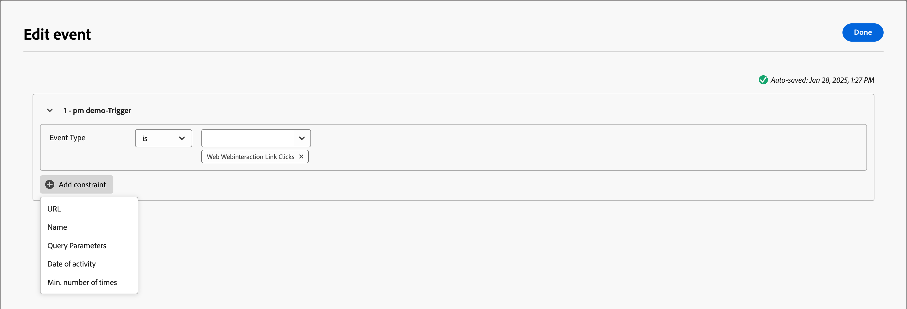

# Auf ein Ereignis lauschen

Fügen Sie den Knoten _Auf ein Ereignis_) hinzu, um Ihre Zielgruppe beim Eintreten eines Ereignisses mit dem nächsten Schritt auf der Konto-Journey fortzufahren.

{width="30"} [Übersichtsvideo ansehen](#overview-video)

>[!NOTE]
>
>Sie können diesen Knotentyp nicht auf dem Pfad „Aufspaltung nach Personen“ hinzufügen.

## Kontoereignisse

Lauschen Sie auf ein Ereignis, das auf dem Konto basiert, wenn Sie das Konto auf der Journey entsprechend den durch die Kontoaktivität ausgelösten Ereignissen vorwärts verschieben möchten.

### Ereignisse und Einschränkungen

| Ereignis | Begrenzungen |
| ----- | ----------- |
| Account hatte interessanten Moment | Typ (E-Mail, Meilenstein oder Web) Zusätzliche Einschränkungen (optional): <li>Beschreibung</li><li>Quelle</li><li>Datum der Aktivität</li>  Zeitüberschreitung (optional) |
| Änderung des Kontodatenwertes | Attribut Zusätzliche Einschränkungen (optional): <li>Neuer Wert</li><li>Vorheriger Wert</li><li>Datum der Aktivität</li>  Zeitüberschreitung (optional) |
| Veränderung in der Käufergruppenphase | Lösungsinteresse Zusätzliche Einschränkungen (optional): <li>Neue Phase</li><li>Vorheriges Stadium</li><li>Datum der Aktivität</li> -Timeout (optional) |
| Änderung des Käufergruppenstatus | Lösungsinteresse Zusätzliche Einschränkungen (optional): <li>Neuer Status</li><li>Vorheriger Status</li><li>Datum der Aktivität</li> -Timeout (optional) |
| Änderung der Vollständigkeitsbewertung | Lösungsinteresse Zusätzliche Einschränkungen (optional): <li>Neue Bewertung</li><li>Vorherige Bewertung</li><li>Datum der Aktivität</li> -Timeout (optional) |
| Änderung der Engagement-Bewertung | Lösungsinteresse Zusätzliche Einschränkungen (optional): <li>Neue Bewertung</li><li>Vorherige Bewertung</li><li>Datum der Aktivität</li> -Timeout (optional) |

### Hinzufügen eines Kontoereignisses

1. Navigieren Sie zur Journey-Karte.

1. Klicken Sie auf das Pluszeichen ( **+** ) in einem Pfad und wählen Sie **[!UICONTROL Auf ein Ereignis überwachen]**.

1. Wählen Sie in den Knoteneigenschaften auf der rechten Seite **[!UICONTROL Ereignistyp]** Konten“ aus.

   {width="700" zoomable="yes"}

1. Wählen Sie ein Ereignis aus der Liste aus.

1. Klicken Sie **[!UICONTROL Ereignis bearbeiten]** und definieren Sie Details für das Ereignis.

## Personenveranstaltungen

Lauschen Sie auf ein Ereignis, das auf Personen basiert, wenn Sie das Konto auf der Journey entsprechend den durch Personenaktivitäten ausgelösten Ereignissen vorwärts verschieben möchten.

### Ereignisse und Einschränkungen

| Eingabetyp | Ereignis | Begrenzungen |
| ---------- | ----- | ----------- |
| Journey Optimizer B2B | Zugewiesen an Käufergruppe | Lösungsinteresse  Zusätzliche Einschränkungen (optional): <li>Rolle</li><li>Datum der Aktivität</li> Zeitüberschreitung (optional) |
| | Klickt auf Link in E-Mail | E  Mail: Zusätzliche Einschränkungen (optional): <li>Link</li><li>Link-ID</li><li>Ist ein mobiles Gerät</li><li>Gerät</li><li>Plattform</li><li>Browser</li><li>Ist prädiktiv Inhalt</li><li>Ist Bot-Aktivität</li><li>Bot-Aktivitätsmuster</li><li>Browser</li><li>Datum der Aktivität</li><li>Min. Häufigkeit</li> Zeitüberschreitung (optional) |
| | Klickt auf Link in SMS | E  Mail: Zusätzliche Einschränkungen (optional): <li>Link</li><li>Gerät</li><li>Plattform</li><li>Datum der Aktivität</li><li>Min. Häufigkeit</li> Zeitüberschreitung (optional) |
| | Datenwertänderungen | Personenattribut  Zusätzliche Einschränkungen (optional): <li>Neuer Wert</li><li>Vorheriger Wert</li><li>Grund</li><li>Quelle</li><li>Datum der Aktivität</li><li>Min. Häufigkeit</li> Zeitüberschreitung (optional) |
| | Öffnet die E-Mail | E  Mail: Zusätzliche Einschränkungen (optional): <li>Link</li><li>Link-ID</li><li>Ist ein mobiles Gerät</li><li>Gerät</li><li>Plattform</li><li>Browser</li><li>Ist prädiktiv Inhalt</li><li>Ist Bot-Aktivität</li><li>Bot-Aktivitätsmuster</li><li>Browser</li><li>Datum der Aktivität</li><li>Min. Häufigkeit</li> Zeitüberschreitung (optional) |
| | Aus der Käufergruppe entfernt | Lösungsinteresse Datum der Aktivität (optional) Zeitüberschreitung (optional) |
| | Bewertung wird geändert | Score-  : Zusätzliche Einschränkungen (optional):<li>Ändern</li><li>Neue Bewertung</li><li>Dringlichkeit</li><li>Priorität</li><li>Relative Bewertung</li><li>Relative Dringlichkeit</li><li>Datum der Aktivität</li><li>Min. Häufigkeit</li> Zeitüberschreitung (optional) |
| | SMS-Bounces | SMS-  : Zusätzliche Einschränkungen (optional): <li>Datum der Aktivität</li><li>Min. Anzahl</li> Zeitüberschreitung (optional) |
| Marketo Engage | Besucht Web-Seite | Webseite   Wählen Sie eine oder mehrere passende Marketo Engage-Seiten aus.   Zusätzliche Einschränkungen (optional): <li>Querystring</li><li>Client-IP-Adresse</li><li>Referrer</li><li>Benutzeragent</li><li>Suchmaschine</li><li>Suchabfrage</li><li>Token</li><li>Browser</li><li>Plattform</li><li>Gerät</li><li>Datum der Aktivität</li> |
| | Füllt Formular aus | Formular   Wählen Sie ein oder mehrere passende Marketo Engage-Formulare aus.    Zusätzliche Einschränkungen (optional): <li>Datum der Aktivität</li><li>Querystring</li><li>Client-IP-Adresse</li><li>Referrer</li><li>Benutzeragent</li><li>Plattform</li><li>Gerät</li> Zeitüberschreitung (optional) |
| Adobe Experience Platform | Ereignisdefinition | Ereignistyp   Zusätzliche Einschränkungen (optional): <li>Felder</li>  Zusätzliche Einschränkungen (nicht unterstützt): <li>Datum der Aktivität</li><li>Min. Häufigkeit</li> -Timeout (optional) |

### Personen-Ereignis hinzufügen

1. Navigieren Sie zur Journey-Karte.

1. Klicken Sie auf das Pluszeichen ( **+** ) in einem Pfad und wählen Sie **[!UICONTROL Auf ein Ereignis überwachen]**.

1. Wählen Sie in den Knoteneigenschaften auf der rechten Seite **[!UICONTROL Ereignistyp]** Personen“ aus.

   {width="700" zoomable="yes"}

1. Wählen Sie ein Ereignis aus der Liste aus.

1. Klicken Sie **[!UICONTROL Ereignis bearbeiten]** und definieren Sie Details für das Ereignis.

### Marketo Engage-Ereignis überwachen

Wenn Sie Web-Seiten in Ihrer verbundenen Marketo Engage-Instanz erstellt haben, können Sie ein Ereignis auf der Grundlage eines Besuchs/Nichtbesuchs von Marketo Engage-Web-Seiten sowie von Marketo Engage-Formularen, die nicht ausgefüllt wurden/waren, als Trigger verwenden.

1. Wählen Sie in **[!UICONTROL Journey-Map einen]** Auf ein Ereignis überwachen“ aus.

1. Wählen Sie in den Knoteneigenschaften auf der rechten Seite **[!UICONTROL Ereignistyp]** Personen“ aus.

1. Klicken Sie auf den Pfeil für die **[!UICONTROL Personen auswählen]** und scrollen Sie im Menü zum Abschnitt **[!UICONTROL Marketo Engage]**.

1. Wählen Sie einen Marktaktivitätstyp aus:

   * **[!UICONTROL Besuche auf Web-Seiten]**.
   * **[!UICONTROL Formular ausfüllen]**

   {width="700" zoomable="yes"}

1. Klicken Sie **[!UICONTROL Ereignis bearbeiten]** und definieren Sie eine oder mehrere Web-Seiten, die abgeglichen werden sollen, sowie alle zusätzlichen Einschränkungen für das Ereignis.

   * (Erforderlich) Definieren Sie im Dialogfeld _[!UICONTROL Ereignis bearbeiten]_ die **[!UICONTROL Webseite]** oder füllen Sie die Formulareinschränkung aus. Verwenden Sie **[!UICONTROL is]** (Standard), um auf einer oder mehreren ausgewählten Seiten oder Formularen eine Übereinstimmung zu finden. Verwenden Sie **[!UICONTROL ist nicht]** um bei allen Seitenbesuchen/Formularen eine Übereinstimmung mit dem Ausschluss einer oder mehrerer ausgewählter Seiten/Formulare herzustellen. Oder verwenden Sie **[!UICONTROL ist beliebig]**, um bei jedem Besuch auf einer Marketo Engage-Web-Seite oder bei jedem ausgefüllten Formular eine Übereinstimmung herzustellen.

   * (Optional) Klicken Sie auf **[!UICONTROL Begrenzung hinzufügen]** und wählen Sie das Feld aus, das Sie für die Begrenzung verwenden möchten. Legen Sie den Operator und den Wert für das Feld fest.

     {width="700" zoomable="yes"}

     Sie können diese Aktion wiederholen, um bei Bedarf zusätzliche Feldeinschränkungen einzuschließen.

   * Klicken Sie nach Definition der Einschränkungen auf **[!UICONTROL Fertig]**.

1. Legen Sie bei Bedarf die Option **[!UICONTROL Timeout]** fest, um den Zeitraum zu begrenzen, für den das Ereignis überwacht werden soll (siehe [Hinzufügen einer Zeitüberschreitung zu einem Ereignisknoten](#add-a-timeout-to-an-event-node)).

1. Fügen Sie in der Journey-Zuordnung den nächsten Knoten hinzu, der ausgeführt werden soll, wenn das Ereignis eintritt.

### Überwachen eines Erlebnisereignisses

Admins können Adobe Experience Platform (AEP)-basierte Ereignisdefinitionen konfigurieren, mit denen Marketing-Experten Account-Journey erstellen können, die auf [AEP Experience Events](https://experienceleague.adobe.com/en/docs/experience-platform/xdm/classes/experienceevent){target="_blank"} reagieren. Die Verwendung von AEP-Erlebnisereignissen in Account Journey erfolgt in zwei Schritten:

1. [Erstellen und Veröffentlichen einer AEP-](../admin/configure-aep-events.md).

2. Fügen Sie auf einer Konto-Journey den Knoten _Auf ein Ereignis_) hinzu und wählen Sie eine Experience Platform-Ereignisdefinition für ein personenbasiertes Ereignis aus.

{width="30"} [Videoüberblick ansehen](../admin/configure-aep-events.md#overview-video)

_So fügen Sie ein Erlebnisereignis in Ihren Journey ein:_

1. Wählen Sie in **[!UICONTROL Journey-Map einen]** Auf ein Ereignis überwachen“ aus.

1. Wählen Sie in den Knoteneigenschaften auf der rechten Seite **[!UICONTROL Ereignistyp]** Personen“ aus.

1. Klicken Sie auf den Pfeil für die **[!UICONTROL Personen auswählen]** und scrollen Sie im Menü zum Abschnitt **[!UICONTROL Adobe Experience Platform]**.

   {width="700" zoomable="yes"}

1. Wählen Sie das Ereignis aus.

   Der Ereignistyp wird in den Knotendetails als leer angezeigt.

   {width="400" zoomable="yes"}

1. Klicken Sie **[!UICONTROL Ereignis bearbeiten]** und definieren Sie die Ereignistypen und alle zusätzlichen Einschränkungen für das Ereignis.

   * (Erforderlich) Definieren Sie im _[!UICONTROL Ereignis bearbeiten]_ den Ereignistyp. Sie können den Standardoperator **[!UICONTROL is]** verwenden, um einen oder mehrere ausgewählte Ereignistypen abzugleichen. Sie können auch den Operator **[!UICONTROL ist nicht]** verwenden, um für alle Ereignistypen einen Abgleich durchzuführen, wobei ein oder mehrere ausgewählte Ereignistypen ausgeschlossen sind.

   * (Optional) Klicken Sie auf **[!UICONTROL Begrenzung hinzufügen]** und wählen Sie das Feld aus, das Sie für die Begrenzung verwenden möchten. Legen Sie den Operator und den Wert für das Feld fest.

     {width="700" zoomable="yes"}

     >[!NOTE]
     >
     >Die Einschränkungen für _Datum der Aktivität_ und _Mindestanzahl von_) werden nicht unterstützt.

     Sie können diese Aktion wiederholen, um bei Bedarf zusätzliche Feldeinschränkungen einzuschließen.

   * Klicken Sie nach Definition der Einschränkungen auf **[!UICONTROL Fertig]**.

1. Legen Sie bei Bedarf die Option **[!UICONTROL Timeout]** fest, um den Zeitraum zu begrenzen, für den das Ereignis überwacht werden soll (siehe [Hinzufügen einer Zeitüberschreitung zu einem Ereignisknoten](#add-a-timeout-to-an-event-node)).

1. Fügen Sie in der Journey-Zuordnung den nächsten Knoten hinzu, der ausgeführt werden soll, wenn das Ereignis eintritt.

1. Schließen Sie die verbleibenden Knoten für Ihren Journey ab und [ Sie ihn ](./journey-overview.md).

   Wenn die Journey live (veröffentlicht) ist und den Knoten _Auf ein Ereignis warten_ erreicht, beginnt sie mit dem Lauschen auf AEP Experience Events.

## Hinzufügen einer maximalen Wartezeit zu einem Ereignisknoten

Legen Sie bei Bedarf fest, wie lange die Journey auf das Ereignis warten soll. Der Journey endet nach einer Zeitüberschreitung, es sei denn, Sie definieren einen Zeitüberschreitungspfad, über den Sie weitere Knoten hinzufügen können.

1. Aktivieren Sie die Option **[!UICONTROL Zeitüberschreitung]** .

1. Wählen Sie die Dauer aus, für die der Journey auf ein Ereignis wartet, bevor eine Zeitüberschreitung eintritt.

   Sie können den Pfad hier beenden oder eine andere Vorgehensweise wählen, indem Sie einen anderen Pfad festlegen.

1. Um einen neuen Pfad auf der Journey zu erstellen, in dem Sie Aktionen und Ereignisse hinzufügen können, die für Konten gelten, wenn das Ereignis nicht eintritt, aktivieren Sie das Kontrollkästchen **[!UICONTROL Zeitüberschreitungspfad festlegen]**.

   {width="700" zoomable="yes"}

## Übersichtsvideo

>[!VIDEO](https://video.tv.adobe.com/v/3443219/?learn=on)
