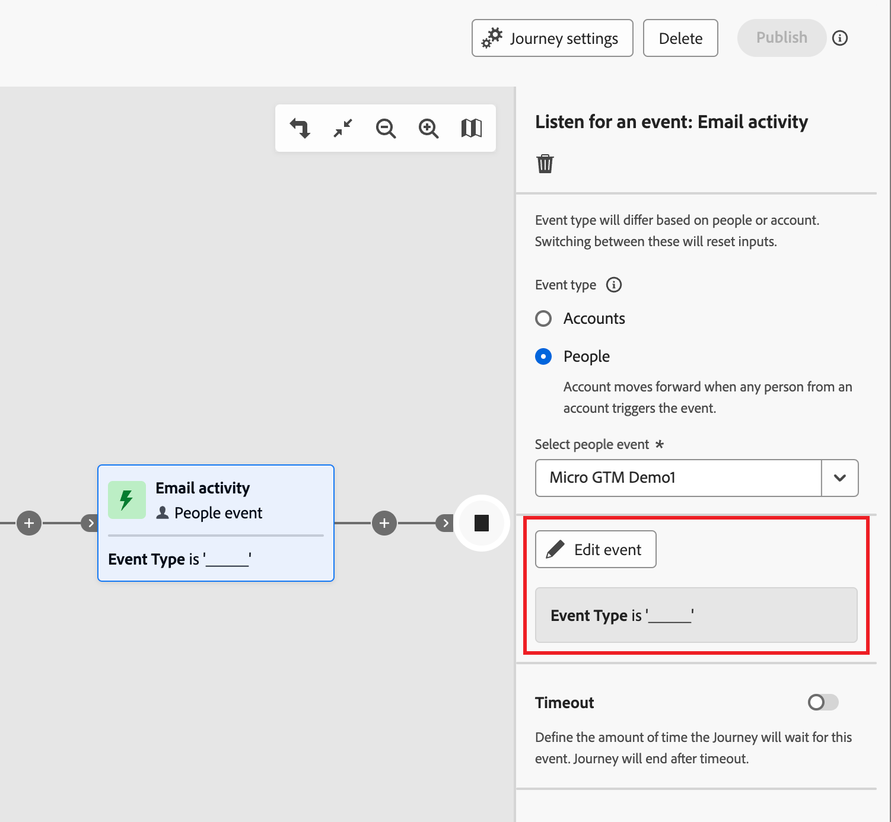

# Auf ein Ereignis lauschen

Fügen Sie den Knoten _Auf ein Ereignis_) hinzu, um Ihre Zielgruppe beim Eintreten eines Ereignisses mit dem nächsten Schritt auf der Konto-Journey fortzufahren.

{width=„30“, vertical-align=„Middle“} [Video mit einer Übersicht ansehen](#overview-video)

>[!NOTE]
>
>Sie können diesen Knotentyp nicht auf dem Pfad „Aufspaltung nach Personen“ hinzufügen.

## Kontoereignisse

Lauschen Sie auf ein Ereignis, das auf dem Konto basiert, wenn Sie das Konto auf der Journey entsprechend den durch die Kontoaktivität ausgelösten Ereignissen vorwärts verschieben möchten.

### Ereignisse und Einschränkungen

| Ereignis | Begrenzungen |
| ----- | ----------- |
| [!UICONTROL Account hatte interessanten Moment] | Typ (E-Mail, Meilenstein oder Web) Zusätzliche Einschränkungen (optional): <li>Beschreibung</li><li>Quelle</li><li>Datum der Aktivität</li>  Zeitüberschreitung (optional) |
| [!UICONTROL Änderung des Kontodatenwerts] | Attribut Zusätzliche Einschränkungen (optional): <li>Neuer Wert</li><li>Vorheriger Wert</li><li>Datum der Aktivität</li>  Zeitüberschreitung (optional) |
| [!UICONTROL Änderung in der Einkaufsgruppenphase] | Lösungsinteresse Zusätzliche Einschränkungen (optional): <li>Neue Phase</li><li>Vorheriges Stadium</li><li>Datum der Aktivität</li> -Timeout (optional) |
| [!UICONTROL Änderung des Status der Einkaufsgruppe] | Lösungsinteresse Zusätzliche Einschränkungen (optional): <li>Neuer Status</li><li>Vorheriger Status</li><li>Datum der Aktivität</li> -Timeout (optional) |
| [!UICONTROL Änderung des Vollständigkeitswerts] | Lösungsinteresse Zusätzliche Einschränkungen (optional): <li>Neue Bewertung</li><li>Vorherige Bewertung</li><li>Datum der Aktivität</li> -Timeout (optional) |
| [!UICONTROL Änderung des Interaktionswerts] | Lösungsinteresse Zusätzliche Einschränkungen (optional): <li>Neue Bewertung</li><li>Vorherige Bewertung</li><li>Datum der Aktivität</li> -Timeout (optional) |

### Hinzufügen eines Kontoereignisses

1. Navigieren Sie zur Journey-Karte.

1. Klicken Sie auf das Pluszeichen ( **+** ) in einem Pfad und wählen Sie **[!UICONTROL Auf ein Ereignis überwachen]**.

1. Wählen Sie in den Knoteneigenschaften auf der rechten Seite **[!UICONTROL Ereignistyp]** Konten“ aus.

   {width="700" zoomable="yes"}

1. Wählen Sie ein Ereignis aus der Liste aus.

1. Klicken Sie **[!UICONTROL Ereignis bearbeiten]** und definieren Sie Details für das Ereignis.

## Personenveranstaltungen

Lauschen Sie auf ein Ereignis, das auf Personen basiert, wenn Sie das Konto auf der Journey entsprechend den durch Personenaktivitäten ausgelösten Ereignissen vorwärts verschieben möchten. Sie können Ereignisse auch nach Personenattributen filtern.

### Ereignisse und Einschränkungen

| Eingabetyp | Ereignis | Begrenzungen |
| ---------- | ----- | ----------- |
| Journey Optimizer B2B | [!UICONTROL Der Einkaufsgruppe zugewiesen] | Lösungsinteresse  Zusätzliche Einschränkungen (optional): <li>Rolle</li><li>Datum der Aktivität</li> Zeitüberschreitung (optional) |
| | [!UICONTROL Klicks auf Link in E-Mail] | E  Mail: Zusätzliche Einschränkungen (optional): <li>Link</li><li>Link-ID</li><li>Ist ein mobiles Gerät</li><li>Gerät</li><li>Plattform</li><li>Browser</li><li>Ist prädiktiv Inhalt</li><li>Ist Bot-Aktivität</li><li>Bot-Aktivitätsmuster</li><li>Browser</li><li>Datum der Aktivität</li><li>Min. Häufigkeit</li> Zeitüberschreitung (optional) |
| | [!UICONTROL Klicks-Link in SMS] | E  Mail: Zusätzliche Einschränkungen (optional): <li>Link</li><li>Gerät</li><li>Plattform</li><li>Datum der Aktivität</li><li>Min. Häufigkeit</li> Zeitüberschreitung (optional) |
| | [!UICONTROL Änderungen des Datenwerts] | Personenattribut  Zusätzliche Einschränkungen (optional): <li>Neuer Wert</li><li>Vorheriger Wert</li><li>Grund</li><li>Quelle</li><li>Datum der Aktivität</li><li>Min. Häufigkeit</li> Zeitüberschreitung (optional) |
| | [!UICONTROL Öffnet E-Mail] | E  Mail: Zusätzliche Einschränkungen (optional): <li>Link</li><li>Link-ID</li><li>Ist ein mobiles Gerät</li><li>Gerät</li><li>Plattform</li><li>Browser</li><li>Ist prädiktiv Inhalt</li><li>Ist Bot-Aktivität</li><li>Bot-Aktivitätsmuster</li><li>Browser</li><li>Datum der Aktivität</li><li>Min. Häufigkeit</li> Zeitüberschreitung (optional) |
| | [!UICONTROL Aus Einkaufsgruppe entfernt] | Lösungsinteresse Datum der Aktivität (optional) Zeitüberschreitung (optional) |
| | [!UICONTROL Wert wurde geändert] | Score-  : Zusätzliche Einschränkungen (optional):<li>Ändern</li><li>Neue Bewertung</li><li>Dringlichkeit</li><li>Priorität</li><li>Relative Bewertung</li><li>Relative Dringlichkeit</li><li>Datum der Aktivität</li><li>Min. Häufigkeit</li> Zeitüberschreitung (optional) |
| | [!UICONTROL SMS-Bounces] | SMS-  : Zusätzliche Einschränkungen (optional): <li>Datum der Aktivität</li><li>Min. Anzahl</li> Zeitüberschreitung (optional) |
| Marketo Engage | [!UICONTROL Besuche auf Web-Seiten] | Webseite   Wählen Sie eine oder mehrere passende Marketo Engage-Seiten aus.   Zusätzliche Einschränkungen (optional): <li>Querystring</li><li>Client-IP-Adresse</li><li>Referrer</li><li>Benutzeragent</li><li>Suchmaschine</li><li>Suchabfrage</li><li>Token</li><li>Browser</li><li>Plattform</li><li>Gerät</li><li>Datum der Aktivität</li> |
| | [!UICONTROL Formular ausfüllen] | Formular   Wählen Sie ein oder mehrere passende Marketo Engage-Formulare aus.   Zusätzliche Einschränkungen (optional): <li>Datum der Aktivität</li><li>Querystring</li><li>Client-IP-Adresse</li><li>Referrer</li><li>Benutzeragent</li><li>Plattform</li><li>Gerät</li> Zeitüberschreitung (optional) |
| Adobe Experience Platform | [!UICONTROL Ereignisdefinition] | Ereignistyp   Zusätzliche Einschränkungen (optional): <li>Felder</li>  Zusätzliche Einschränkungen (nicht unterstützt): <li>Datum der Aktivität</li><li>Min. Häufigkeit</li> -Timeout (optional) |

### Filter für Personenereignisse

| Filter | Beschreibung |
| ------------ | ----------- |
| [!UICONTROL Aktivitätsverlauf] > [!UICONTROL E-Mail] | E-Mail-Aktivitäten basierend auf Bedingungen, die mithilfe einer oder mehrerer ausgewählter E-Mail-Nachrichten von zuvor im Journey ausgewertet werden: <li>[!UICONTROL Link in E-Mail angeklickt] <li>Hat E-Mail geöffnet <li>Wurde per E-Mail zugestellt <li>Wurde per E-Mail <!--  **[!UICONTROL Switch to inactivity filter]** - Use this option to filter based on lack of activity (a person did not have the email activity).--> gesendet |
| [!UICONTROL Aktivitätsverlauf] > [!UICONTROL SMS-Nachricht] | SMS-Aktivitäten basierend auf Bedingungen, die mithilfe einer oder mehrerer ausgewählter SMS-Nachrichten aus einer früheren Journey ausgewertet werden: <li>[!UICONTROL Link in SMS angeklickt] <li>[!UICONTROL SMS gebounct] <!--   **[!UICONTROL Switch to inactivity filter]** - Use this option to filter based on lack of activity (a person did not have the SMS activity). --> |
| [!UICONTROL Aktivitätsverlauf] > [!UICONTROL Datenwert geändert] | Für ein ausgewähltes Personenattribut wurde ein Wert geändert. Zu diesen Änderungstypen gehören: <li>Neuer Wert<li>Vorheriger Wert<li>Grund<li>Quelle<li>Datum der Aktivität<li>Min. Anzahl der <!--   **[!UICONTROL Switch to inactivity filter]** - Use this option to filter based on lack of activity (a person did not have a data value change). --> |
| [!UICONTROL Aktivitätsverlauf] > [!UICONTROL Hatte einen interessanten Moment] | Interessante Momentaktivität, die in der zugehörigen Marketo Engage-Instanz definiert ist. Zu den Einschränkungen gehören: <li>Meilenstein<li>E-Mail<li><!--  **[!UICONTROL Switch to inactivity filter]** - Use this option to filter based on lack of activity (a person did not have an interesting moment).--> |
| [!UICONTROL Aktivitätsverlauf] > [!UICONTROL Besuchte Web-Seite] | Web-Seitenaktivität, die für eine oder mehrere Web-Seiten von der zugehörigen Marketo Engage-Instanz verwaltet wird. Zu den Einschränkungen gehören: <li>Webseite (erforderlich)<li>Datum der Aktivität<li>Client-IP-Adresse <li>Querystring <li>Referrer <li>Benutzeragent <li>Suchmaschine <li>Suchabfrage <li>Personalisierte URL <li>Token <li>Browser <li>Plattform <li>Gerät <li>Min. Anzahl der <!--  **[!UICONTROL Switch to inactivity filter]** - Use this option to filter based on lack of activity (a person did not visit the web page). --> |
| [!UICONTROL Personenattribute] | Attribute aus dem Personenprofil, einschließlich: <li>Stadt <li>Land <li>Geburtsdatum <li>E-Mail-Adresse <li>E-Mail-Adresse ungültig <li>E-Mail angehalten <li>Vorname <li>Abgeleitetes Bundesland/abgeleitete Region<li>Stellenbezeichnung <li>Last name <li>Mobiltelefonnummer <li>Engagement-Score einer Person <li>Telefonnummer <li>Postleitzahl <li>Land <li>Abbestellt <li>Grund für Abmeldung |
| [!UICONTROL Sonderfilter] > [!UICONTROL Mitglied der Einkaufsgruppe] | Die Person ist oder ist kein Kauf-Gruppenmitglied, das anhand eines oder mehrerer der folgenden Kriterien bewertet wird: <li>Interesse an der Lösung</li><li>Einkaufsgruppenstatus</li><li>Vollständigkeitsindex</li><li>Interaktionsbewertung</li><li>Rolle</li> |
| [!UICONTROL Spezialfilter] > [!UICONTROL Mitglied der Liste] | Die Person ist oder ist nicht Mitglied in einer oder mehreren Marketo Engage-Listen. |
| [!UICONTROL Spezialfilter] > [!UICONTROL Mitglied des Programms] | Die Person ist oder ist nicht Mitglied in einem oder mehreren Marketo Engage-Programmen. |

### Personen-Ereignis hinzufügen

1. Navigieren Sie zur Journey-Karte.

1. Klicken Sie auf das Pluszeichen ( **+** ) in einem Pfad und wählen Sie **[!UICONTROL Auf ein Ereignis überwachen]**.

1. Wählen Sie in den Knoteneigenschaften auf der rechten Seite **[!UICONTROL Ereignistyp]** Personen“ aus.

   {width="700" zoomable="yes"}

1. Wählen Sie ein Ereignis aus der Liste aus.

1. Klicken Sie **[!UICONTROL Ereignis bearbeiten]** und definieren Sie Details für das Ereignis.

### Überwachen eines Marketo Engage-Ereignisses

Wenn Sie Web-Seiten in Ihrer verbundenen Marketo Engage-Instanz haben, können Sie ein Ereignis auf der Grundlage eines Triggers/Kein Besuch dieser Web-Seiten sowie von Marketo Engage-Formularen, die nicht ausgefüllt wurden/waren, erstellen.

1. Wählen Sie in **[!UICONTROL Journey-Map einen]** Auf ein Ereignis überwachen“ aus.

1. Wählen Sie in den Knoteneigenschaften auf der rechten Seite **[!UICONTROL Ereignistyp]** Personen“ aus.

1. Klicken Sie auf den Pfeil für die **[!UICONTROL Personen auswählen]** und scrollen Sie im Menü zum Abschnitt **[!UICONTROL Marketo Engage]**.

1. Wählen Sie einen Marktaktivitätstyp aus:

   * **[!UICONTROL Besuche auf Web-Seiten]**.
   * **[!UICONTROL Formular ausfüllen]**

   {width="700" zoomable="yes"}

1. Klicken Sie **[!UICONTROL Ereignis bearbeiten]** und definieren Sie eine oder mehrere Web-Seiten, die abgeglichen werden sollen, sowie alle zusätzlichen Einschränkungen für das Ereignis.

   * (Erforderlich) Definieren Sie im Dialogfeld _[!UICONTROL Ereignis bearbeiten]_ die Einschränkung **[!UICONTROL Webseite]** oder **[!UICONTROL Formular ausfüllen]**. Verwenden Sie **[!UICONTROL is]** (Standard), um auf einer oder mehreren ausgewählten Seiten oder Formularen eine Übereinstimmung zu finden. Verwenden Sie **[!UICONTROL ist nicht]** um bei allen Seitenbesuchen/Formularen eine Übereinstimmung mit dem Ausschluss einer oder mehrerer ausgewählter Seiten/Formulare herzustellen. Oder verwenden Sie den Operator **[!UICONTROL is any]**, um ihn bei jedem Besuch auf einer Marketo Engage-Web-Seite oder bei jedem ausgefüllten Formular abzugleichen.

   * (Optional) Klicken Sie auf **[!UICONTROL Begrenzung hinzufügen]** und wählen Sie das Feld aus, das Sie für die Begrenzung verwenden möchten. Legen Sie den Operator und den Wert für das Feld fest.

     {width="700" zoomable="yes"}

     Sie können diese Aktion wiederholen, um bei Bedarf zusätzliche Feldeinschränkungen einzuschließen.

   * Wählen Sie bei Bedarf die Registerkarte **[!UICONTROL Filter]** aus, um [Filter für das Ereignis hinzuzufügen](#add-a-filter-to-the-people-event).

   * Wenn die Einschränkungen und Filter definiert sind, klicken Sie auf **[!UICONTROL Fertig]**.

1. Legen Sie bei Bedarf die Option **[!UICONTROL Timeout]** fest, um den Zeitraum zu begrenzen, für den das Ereignis überwacht werden soll (siehe [Hinzufügen einer Zeitüberschreitung zu einem Ereignisknoten](#add-a-timeout-to-an-event-node)).

1. Fügen Sie in der Journey-Zuordnung den nächsten Knoten hinzu, der ausgeführt werden soll, wenn das Ereignis eintritt.

### Überwachen eines Erlebnisereignisses

Admins können [Adobe Experience Platform (AEP) Experience Events](https://experienceleague.adobe.com/en/docs/experience-platform/xdm/classes/experienceevent){target="_blank"} auswählen, mit denen Marketing-Experten Journey erstellen können, die nahezu in Echtzeit auf die Ereignisse reagieren. Die Verwendung von Erlebnisereignissen in Journey ist ein zweistufiger Prozess:

1. Ein Administrator [wählt die Ereignistypen und -felder aus](../admin/configure-aep-events.md#select-an-event) um sie in Journey verfügbar zu machen.

2. Fügen Sie auf einer Journey den _Auf ein Ereignis_ lauschen“ hinzu und wählen Sie einen Experience Platform-Ereignistyp für ein personenbasiertes Ereignis aus.

<!--
{width="30", vertical-align="middle"} [Watch the video overview](../admin/configure-aep-events.md#overview-video) -->

_So fügen Sie ein Erlebnisereignis in Ihren Journey ein :_

1. Wählen Sie in **[!UICONTROL Journey-Map einen]** Auf ein Ereignis überwachen“ aus.

1. Wählen Sie in den Knoteneigenschaften auf der rechten Seite **[!UICONTROL Ereignistyp]** Personen“ aus.

1. Klicken Sie auf den Pfeil für die **[!UICONTROL Personen auswählen]** und scrollen Sie im Menü zum Abschnitt **[!UICONTROL Adobe Experience Platform]**.

   {width="700" zoomable="yes"}

1. Wählen Sie das Ereignis aus.

   Der Ereignistyp wird in den Knotendetails als leer angezeigt.

   {width="400" zoomable="yes"}

1. Klicken Sie **[!UICONTROL Ereignis bearbeiten]** und definieren Sie eine oder mehrere Einschränkungen für das Ereignis.

   Die verfügbaren Einschränkungen werden als verwaltete Felder für die Ereigniskonfiguration definiert.

   * Klicken Sie **[!UICONTROL Begrenzung hinzufügen]** und wählen Sie das Feld aus, das Sie für die Begrenzung verwenden möchten.

   * Schließen Sie die Bedingung für die Einschränkung ab.

     Sie können den Standardoperator **[!UICONTROL is]** verwenden, um einen oder mehrere Feldwerte abzugleichen. Sie können auch den Operator **[!UICONTROL isNot]** verwenden, um für alle Werte einen Abgleich durchzuführen, wobei ein oder mehrere angegebene Werte ausgeschlossen sind.

     {width="700" zoomable="yes"}

   * Wählen Sie bei Bedarf die Registerkarte **[!UICONTROL Filter]** aus, um [Filter für das Ereignis hinzuzufügen](#add-a-filter-to-the-people-event).

   * (Optional) Klicken Sie auf **[!UICONTROL Begrenzung hinzufügen]** und wiederholen Sie diese Schritte, um bei Bedarf zusätzliche Feldeinschränkungen einzuschließen.

   * Wenn die Einschränkungen und Filter definiert sind, klicken Sie auf **[!UICONTROL Fertig]**.

1. Legen Sie bei Bedarf die Option **[!UICONTROL Timeout]** fest, um den Zeitraum zu begrenzen, für den das Ereignis überwacht werden soll (siehe [Hinzufügen einer Zeitüberschreitung zu einem Ereignisknoten](#add-a-timeout-to-an-event-node)).

1. Fügen Sie in der Journey-Zuordnung den nächsten Knoten hinzu, der ausgeführt werden soll, wenn das Ereignis eintritt.

1. Schließen Sie die verbleibenden Knoten für Ihren Journey ab und [ Sie ihn ](./journey-overview.md).

   Wenn die Journey live (veröffentlicht) ist und den Knoten _Auf ein Ereignis warten_ erreicht, beginnt sie mit dem Lauschen auf AEP Experience Events.

### Hinzufügen von Filtern zum Personen -Ereignis

1. Nachdem Sie das Ereignis definiert haben, wählen Sie die Registerkarte **[!UICONTROL Filter]** im Dialogfeld _[!UICONTROL Ereignis bearbeiten]_ aus.

   {width="700" zoomable="yes"}

1. Fügen Sie einen oder mehrere Filter hinzu, um die Personen für das Ereignis anzusprechen.

   * Ziehen Sie einen der [Personenfilter](#people-event-filters) aus dem linken Navigationsbereich und füllen Sie die Übereinstimmungsdefinition aus.

     >[!NOTE]
     >
     >Wenn Sie benutzerdefinierte Personenfelder im Konto-Zielgruppenschema in Experience Platform definiert haben, sind diese Felder auch unter **[!UICONTROL Attribute]** verfügbar und können als Personenattribute in Filtern verwendet werden.

   * Passen Sie Ihre Filterung durch Anwendung der **[!UICONTROL Filterlogik]** oben an. Sie wählen, ob alle Filter oder nur ein beliebiger Filter übereinstimmen sollen.

     {width="700" zoomable="yes"}

   * Klicken Sie auf **[!UICONTROL Fertig]**.

## Hinzufügen einer maximalen Wartezeit zu einem Ereignisknoten

Legen Sie bei Bedarf fest, wie lange die Journey auf das Ereignis warten soll. Der Journey endet nach einer Zeitüberschreitung, es sei denn, Sie definieren einen Zeitüberschreitungspfad, über den Sie weitere Knoten hinzufügen können.

1. Aktivieren Sie die Option **[!UICONTROL Zeitüberschreitung]** .

1. Wählen Sie die Dauer aus, für die der Journey auf ein Ereignis wartet, bevor eine Zeitüberschreitung eintritt.

   Sie können den Pfad hier beenden oder eine andere Vorgehensweise wählen, indem Sie einen anderen Pfad festlegen.

1. Um einen neuen Pfad auf der Journey zu erstellen, in dem Sie Aktionen und Ereignisse hinzufügen können, die für Konten gelten, wenn das Ereignis nicht eintritt, aktivieren Sie das Kontrollkästchen **[!UICONTROL Zeitüberschreitungspfad festlegen]**.

   {width="700" zoomable="yes"}

<!-- ## Overview video

>[!VIDEO](https://video.tv.adobe.com/v/3443219/?learn=on) -->
