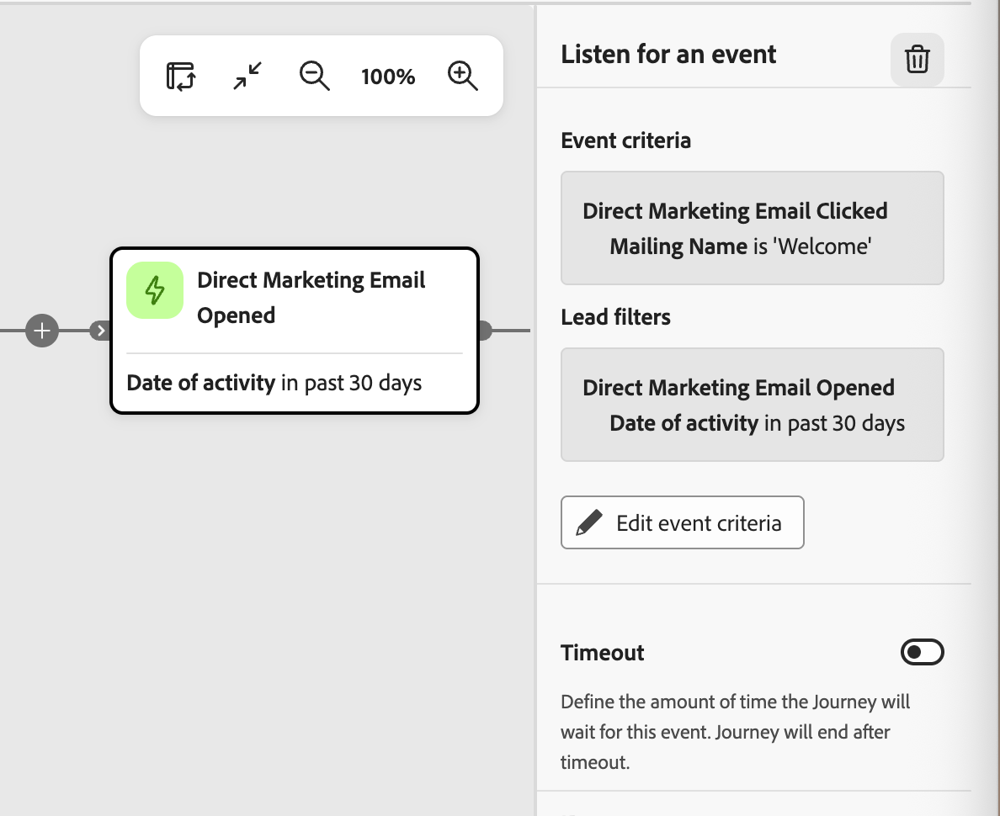

# Auf ein Ereignis lauschen

Um die Zielgruppe in Ihrem [Journey in den nächsten Schritt zu &#x200B;](./journeys-overview.md), wenn ein Ereignis eintritt, fügen Sie den Knoten _Auf ein Ereignis_ hinzu. Je nach Journey-Typ können Sie diesen Knoten verwenden, um den nächsten Trigger auf der Journey entsprechend den Personen- oder Kontoereignissen festzulegen.

<!--
{width="30", vertical-align="middle"} [Watch the overview video](#overview-video)
-->

## Konto-Journeys {#account-journeys}

>[!NOTE]
>
>Bei einer Konto-Journey können Sie den Knotentyp _[!UICONTROL Auf ein Ereignis]_) nicht auf einem Aufspaltungspfad nach Personen hinzufügen.

1. Öffnen Sie die Arbeitsfläche der Konto-Journey.

1. Klicken Sie auf das Pluszeichen ( **+** ) in einem Pfad und wählen Sie **[!UICONTROL Auf ein Ereignis überwachen]**.

   {width="400"}

1. Verwenden Sie in den Knoteneigenschaften auf der rechten Seite den Selektor _Ereignistyp_, um zwischen **[!UICONTROL Konten]** und **[!UICONTROL Personen]** auszuwählen.

1. Wählen Sie ein Ereignis aus der Liste aus.

   * Wählen Sie für _Ereignistyp_ Personen[&#x200B; den Ereignistyp „Personen](#people-events) aus, den Sie für den Trigger verwenden möchten.

     {width="500" zoomable="yes"}

   * Wählen Sie für _Ereignistyp_ Konten“ den [Kontoereignis](#account-events), den Sie für den Trigger verwenden möchten.

     {width="500" zoomable="yes"}

1. Klicken Sie **[!UICONTROL Ereignis bearbeiten]** und definieren Sie Details für das Ereignis.

   Definieren Sie je nach ausgewähltem Ereignistyp und Ereignis die passenden Kriterien für das Ereignis.

   * [Personenveranstaltungen](#people-events)
   * [Kontoereignisse](#account-events)

   Sie können auch [Filter](#filters-people-event) für das Ereignis einbeziehen.

1. Klicken Sie auf **[!UICONTROL Fertig]**.

   Die Ereignis- und Filterdefinitionen werden im Knoten und in den Knoteneigenschaften angezeigt.

   {width="500"}

### Personen-Events für Account-Journey {#people-events}

Auf einer Account-Journey können Sie Personen entsprechend einem Ereignis überwachen, wenn Sie das Konto auf der Journey entsprechend den Ereignissen vorverlegen möchten, die durch die Aktivität Personen ausgelöst wurden. Sie können Ereignisse auch nach Ereignisverlauf und Personenattributen filtern.

>[!TIP]
>
>Erlebnisereignisse können auftreten _bevor Personen die Journey_ (z. B. ein vorheriger E-Mail-Klick oder eine Web-Interaktion). Um Personen basierend auf diesen Ereignissen zu routen, verwenden Sie den [!UICONTROL Ereignisverlauf] Filter in einem [Pfade nach Personen](./split-merge-paths-nodes.md#experience-event-history-filtering)-Knoten.

#### Journey Optimizer B2B-Ereignisse {#events-account-people}

| Ereignis | Begrenzungen |
| ----- | ----------- |
| [!UICONTROL Der Einkaufsgruppe zugewiesen] | Lösungsinteresse (erforderlich)  Zusätzliche Einschränkungen (optional): <li>Rolle</li><li>Datum der Aktivität</li> Zeitüberschreitung (optional) |
| [!UICONTROL Änderungen des Personenprofils] | Attribut (erforderlich) Datum der Aktivität (optional) Neuer Wert (optional) Vorheriger Wert (optional) Grund (optional) Source (optional) |
| [!UICONTROL Aus Einkaufsgruppe entfernt] | Interesse an der Lösung (erforderlich Datum der Aktivität (optional) Zeitüberschreitung (optional) |

1. Legen Sie den erforderlichen Wert fest, der mit dem Ereignis übereinstimmt.

   Legen Sie bei Bedarf den -Operator für die Auswertung fest.

1. Klicken Sie für jede optionale Begrenzung, die Sie für die Ereignisübereinstimmung einbeziehen möchten, auf **[!UICONTROL Begrenzung hinzufügen]** und wählen Sie eine Begrenzung in der Liste aus.

   {width="700" zoomable="yes"}

1. (Optional) Wählen Sie die Registerkarte **[!UICONTROL Filter]** aus, um [Filter für das Ereignis hinzuzufügen](#filters-people-event).

1. Klicken Sie auf **[!UICONTROL Fertig]**.

#### Erlebnisereignisse {#experience-events-account-people}

>[!PREREQUISITES]
>
>Administratoren konfigurieren [Adobe Experience Platform (AEP) Experience Events](https://experienceleague.adobe.com/en/docs/experience-platform/xdm/classes/experienceevent){target="_blank"}, mit denen Marketing-Experten Account- und Personen-Journey erstellen können, die nahezu in Echtzeit auf Ereignisse reagieren.
>
>Um Erlebnisereignisse für Journey-Benutzer verfügbar zu machen, muss zunächst ein Produktadministrator [die Ereignistypen und -felder von Interesse hinzufügen](../admin/configure-aep-events.md#add-an-event) in [!DNL Journey Optimizer B2B Edition].

1. Klicken Sie **[!UICONTROL Begrenzung hinzufügen]** und wählen Sie das Feld aus, das Sie für die Begrenzung verwenden möchten.

   Die verfügbaren Einschränkungen werden als verwaltete Felder für die Ereigniskonfiguration definiert.

1. Schließen Sie die Bedingung für die Einschränkung ab.

   Sie können den Standardoperator **[!UICONTROL is]** verwenden, um einen oder mehrere Feldwerte abzugleichen. Sie können auch den Operator **[!UICONTROL isNot]** verwenden, um für alle Werte einen Abgleich durchzuführen, wobei ein oder mehrere angegebene Werte ausgeschlossen sind.

   {width="700" zoomable="yes"}

1. (Optional) Wählen Sie die Registerkarte **[!UICONTROL Filter]** aus, um [Filter für das Ereignis hinzuzufügen](#filters-people-event).

1. Klicken Sie auf **[!UICONTROL Fertig]**.

### Kontoereignisse {#account-events}

Auf einer Account-Journey können Sie für ein Account-basiertes Ereignis überwachen, wenn Sie das Account-Konto entsprechend den durch die Account-Aktivität ausgelösten Ereignissen auf der Journey weiterleiten möchten.

| Ereignis | Begrenzungen |
| ----- | ----------- |
| [!UICONTROL Account hatte interessanten Moment] | Typ (E-Mail, Meilenstein oder Web) Zusätzliche Einschränkungen (optional): <li>Beschreibung</li><li>Quelle</li><li>Datum der Aktivität</li>  Zeitüberschreitung (optional) |
| [!UICONTROL Änderung des Kontodatenwerts] | Attribut Zusätzliche Einschränkungen (optional): <li>Neuer Wert</li><li>Vorheriger Wert</li><li>Datum der Aktivität</li>  Zeitüberschreitung (optional) |
| [!UICONTROL Änderung in der Einkaufsgruppenphase] | Lösungsinteresse Zusätzliche Einschränkungen (optional): <li>Neue Phase</li><li>Vorheriges Stadium</li><li>Datum der Aktivität</li> -Timeout (optional) |
| [!UICONTROL Änderung des Status der Einkaufsgruppe] | Lösungsinteresse Zusätzliche Einschränkungen (optional): <li>Neuer Status</li><li>Vorheriger Status</li><li>Datum der Aktivität</li> -Timeout (optional) |
| [!UICONTROL Änderung des Vollständigkeitswerts] | Lösungsinteresse Zusätzliche Einschränkungen (optional): <li>Neue Bewertung</li><li>Vorherige Bewertung</li><li>Datum der Aktivität</li> -Timeout (optional) |
| [!UICONTROL Änderung des Interaktionswerts] | Lösungsinteresse Zusätzliche Einschränkungen (optional): <li>Neue Bewertung</li><li>Vorherige Bewertung</li><li>Datum der Aktivität</li> -Timeout (optional) |

1. Legen Sie die erforderliche Begrenzung fest, die mit dem Ereignis übereinstimmt.

1. Klicken Sie für jede optionale Begrenzung, die Sie für die Ereignisübereinstimmung einbeziehen möchten, auf **[!UICONTROL Begrenzung hinzufügen]** und wählen Sie das Feld aus.

   {width="700" zoomable="yes"}

   Legen Sie den Operator und den Wert für die Auswertung fest.

1. Klicken Sie auf **[!UICONTROL Fertig]**.

<!--

Removed from AJO B2B people events 

| [!UICONTROL Clicks link in email] | Email  Additional constraints (optional): <li>Link</li><li>Link ID</li><li>Is mobile device</li><li>Device</li><li>Platform</li><li>Browser</li><li>Is predictive content</li><li>Is bot activity</li><li>Bot activity pattern</li><li>Browser</li><li>Date of activity</li><li>Min. number of times</li> Timeout (optional) |
| [!UICONTROL Clicks link in SMS] | Email  Additional constraints (optional): <li>Link</li><li>Device</li><li>Platform</li><li>Date of activity</li><li>Min. number of times</li> Timeout (optional) |
| [!UICONTROL Data value changes] | Person attribute  Additional constraints (optional): <li>New value</li><li>Previous value</li><li>Reason</li><li>Source</li><li>Date of activity</li><li>Min. number of times</li> Timeout (optional) |
| [!UICONTROL Opens email] | Email  Additional constraints (optional): <li>Link</li><li>Link ID</li><li>Is mobile device</li><li>Device</li><li>Platform</li><li>Browser</li><li>Is predictive content</li><li>Is bot activity</li><li>Bot activity pattern</li><li>Browser</li><li>Date of activity</li><li>Min. number of times</li> Timeout (optional) |
| [!UICONTROL Score is changed] | Score name  Additional constraints (optional):<li>Change</li><li>New score</li><li>Urgency</li><li>Priority</li><li>Relative score</li><li>Relative urgency</li><li>Date of activity</li><li>Min. number of times</li> Timeout (optional) |
| [!UICONTROL SMS Bounces]| SMS message  Additional constraints (optional): <li>Date of activity</li><li>Min number of times</li> Timeout (optional) |

### Listen for a Marketo Engage event {#listen-for-marketo-engage-event}

| Marketo Engage | [!UICONTROL Visits Web Page] | Web page   Select one or more Marketo Engage pages to match.   Additional constraints (optional): <li>Querystring</li><li>Client IP address</li><li>Referrer</li><li>User Agent</li><li>Search engine</li><li>Search query</li><li>Token</li><li>Browser</li><li>Platform</li><li>Device</li><li>Date of activity</li> |
| | [!UICONTROL Fills out form] | Form   Select one or more Marketo Engage forms to match.   Additional constraints (optional): <li>Date of activity</li><li>Querystring</li><li>Client IP address</li><li>Referrer</li><li>User agent</li><li>Platform</li><li>Device</li> Timeout (optional) |
| Adobe Experience Platform | [!UICONTROL Event definition] | Event type   Additional constraints (optional): <li>Fields</li>  Additional constraints (not supported): <li>Date of activity</li><li>Min. number of times</li>  Timeout (optional) |

If you have web pages in your connected Marketo Engage instance, you can trigger an event based on a visit/no visit to these web pages, as well as Marketo Engage forms that were/were not filled. 

1. Use the **[!UICONTROL Select people event]** selector and scroll the menu to the **[!UICONTROL Marketo Engage]** section.

1. Select a Marketo Engage activity type:

   * **[!UICONTROL Visits Web Page]**.
   * **[!UICONTROL Fills Out Form]**

   {width="700" zoomable="yes"}

1. Click **[!UICONTROL Edit event]** and define one or more web pages to match and any additional constraints for the event.

   * (Required) In the _[!UICONTROL Edit event]_ dialog, define the **[!UICONTROL Web page]** or **[!UICONTROL Fills out form]** constraint. Use **[!UICONTROL is]** (default) to match on one or more selected pages or forms. Use **[!UICONTROL is not]** to match on all page visits/forms with the exclusion of one or more selected pages/forms. Or, use the **[!UICONTROL is any]** operator to match on any Marketo Engage web page visit or filled form.

   * (Optional) Click **[!UICONTROL Add constraint]** and choose the field that you want to use for the constraint. Set the operator and the value for the field.

     {width="700" zoomable="yes"}

     To include additional field constraints as needed, repeat this action.

   * If needed, select the **[!UICONTROL Filters]** tab to [add filters for the event](#add-a-filter-to-the-people-event).

   * When the constraints and filters are defined, click **[!UICONTROL Done]**.

1. If needed, set the **[!UICONTROL Timeout]** option to limit the time period to listen for the event (see [Add a timeout to an event node](#add-a-timeout-to-an-event-node)). 

1. In the journey canvas, add the next node to execute when the event occurs.

-->

## Personen-Journey {#person-journeys}

1. Öffnen Sie die Arbeitsfläche des Personen-Journey.

1. Klicken Sie auf das Pluszeichen ( **+** ) in einem Pfad und wählen Sie **[!UICONTROL Auf ein Ereignis überwachen]**.

   {width="350"}

1. Klicken Sie in den Knoteneigenschaften auf der rechten Seite **[!UICONTROL Ereigniskriterien hinzufügen]**.

   {width="450"}

1. Fügen Sie ein -Ereignis hinzu und legen Sie die Einschränkungen fest, die Sie für den Trigger abgleichen möchten.

   Sie können [Erlebnisereignisse](#experience-events-person) und [Profiländerungen von Personen](#person-profile-changes) verwenden, um den Ereignis-Trigger zu definieren.

   Ziehen Sie den Ereignis -Trigger per Drag-and-Drop in den Builder-Bereich und legen Sie die Definition fest. Klicken Sie **[!UICONTROL Begrenzung hinzufügen]** für jede Begrenzung, die Sie zum Verfeinern der Ereignisübereinstimmung verwenden möchten.

   Sie können mehrere Ereignisse hinzufügen, die übereinstimmen. Das erste Qualifizierungsereignis bringt das Personenprofil auf der Journey voran.

1. (Optional) Wählen Sie die Registerkarte **[!UICONTROL Filter]** aus, um [Filter für das Ereignis hinzuzufügen](#filters-people-event).

1. Klicken Sie auf **[!UICONTROL Fertig]**.

   Die Ereignis- und Filterdefinitionen werden im Knoten und in den Knoteneigenschaften angezeigt.

   {width="450"}

### Erlebnisereignisse für Personen-Journey {#experience-events-person}

>[!PREREQUISITES]
>
>Administratoren konfigurieren [Adobe Experience Platform (AEP) Experience Events](https://experienceleague.adobe.com/en/docs/experience-platform/xdm/classes/experienceevent){target="_blank"}, mit denen Marketing-Experten Account- und Personen-Journey erstellen können, die nahezu in Echtzeit auf Ereignisse reagieren.
>
>Um Erlebnisereignisse für Journey-Benutzer verfügbar zu machen, muss zunächst ein Produktadministrator [die Ereignistypen und -felder von Interesse hinzufügen](../admin/configure-aep-events.md#add-an-event) in [!DNL Journey Optimizer B2B Edition].

Sie können Erlebnisereignisse verwenden, um den Trigger in den Journey des Benutzers im Dialogfeld _[!UICONTROL Ereignis bearbeiten]_ auszuführen.

1. Erweitern Sie **[!UICONTROL Sapphire AEP Events]** in der Liste _[!UICONTROL Trigger]_ auf der linken Seite.

1. Ziehen Sie das Erlebnisereignis per Drag-and-Drop in den Bereich des Ereignis-Matching-Builders.

   Sie können das Feld _Suche_ verwenden, um nach einem Keyword im Ereignisnamen zu filtern, z. B. `email`.

1. Klicken Sie **[!UICONTROL Begrenzung hinzufügen]** und wählen Sie das Feld aus, das Sie zum Verfeinern der Ereignisübereinstimmung verwenden möchten.

   Die verfügbaren Einschränkungen werden als verwaltete Felder für die Ereigniskonfiguration definiert.

   {width="700" zoomable="yes"}

1. Stellen Sie den Operator und die Werte ein, die für das Ereignisfeld übereinstimmen sollen.

1. (Optional) Fügen Sie ein weiteres Erlebnisereignis oder eine [Personenprofiländerung“ &#x200B;](#person-profile-changes).

   Beim Hinzufügen mehrerer passender Ereignisse. Das erste Qualifizierungsereignis bringt das Personenprofil auf der Journey voran.

1. (Optional) Wählen Sie die Registerkarte **[!UICONTROL Filter]** aus, um [Filter für das Ereignis hinzuzufügen](#filters-people-event).

1. Klicken Sie auf **[!UICONTROL Fertig]**.

### Personenprofiländerungen {#person-profile-changes}

Sie können eine Änderung der B2B-Personenprofilattribute verwenden, um den Trigger in den Journey des Benutzers im Dialogfeld _[!UICONTROL Ereignis bearbeiten]_ zu ändern.

1. **&#x200B; Ziehen Sie &#x200B;** [!UICONTROL Personenprofiländerung] aus der Liste _[!UICONTROL Trigger]_ in den Bereich des Ereignisabgleichs-Builders.

1. Klicken Sie **[!UICONTROL Einschränkung hinzufügen]** und wählen Sie die Attributänderung aus, die Sie für den Ereignis-Trigger verwenden möchten.

   Legen Sie den Feldwert für die Änderung fest, für die Sie eine Übereinstimmung suchen.

   {width="700" zoomable="yes"}

1. (Optional) Fügen Sie ein weiteres _Personenprofiländerung_ -Attribut hinzu, das Sie als Ereignis-Trigger oder [Erlebnisereignis“ &#x200B;](#experience-events-person) möchten.

   Beim Hinzufügen mehrerer passender Ereignisse. Das erste Qualifizierungsereignis bringt das Personenprofil auf der Journey voran.

1. (Optional) Wählen Sie die Registerkarte **[!UICONTROL Filter]** aus, um [Filter für das Ereignis hinzuzufügen](#filters-people-event).

1. Klicken Sie auf **[!UICONTROL Fertig]**.

## Filter für Ereignisse {#filters-people-event}

Wenn Sie ein [Personenereignis auf einer Konto-Journey](#people-events) oder ein [Ereignis auf einer Personen-Journey](#person-journeys) definieren, können Sie Filter einbeziehen, um übereinstimmende Trigger von Ereignissen auf der Grundlage verschiedener Kriterien zu begrenzen:

| Filter | Beschreibung |
| ------------ | ----------- |
| [!UICONTROL Ereignisverlauf] | Erlebnisereignisse, die von einem Administrator konfiguriert wurden. Siehe _[Auswählen von Erlebnisereignissen und Feldern](../admin/configure-aep-events.md)_. |
| [!UICONTROL Personenattribute] | Attribute aus dem B2B-Personenprofil, einschließlich: <li>Stadt <li>Land <li>Geburtsdatum <li>E-Mail-Adresse <li>E-Mail-Adresse ungültig <li>E-Mail angehalten <li>Vorname <li>Abgeleitetes Bundesland/abgeleitete Region<li>Stellenbezeichnung <li>Last name <li>Mobiltelefonnummer <li>Personeninteraktionsbewertung <li>Telefonnummer <li>Postleitzahl <li>Bundesland <li>Abbestellt <li>Grund für Abmeldung |
| [!UICONTROL Personenattribute] | (Nur Personen-Journeys) Attributwert |
| [!UICONTROL Sonderfilter] > [!UICONTROL Mitglied der Einkaufsgruppe] | Die Person ist oder ist kein Kauf-Gruppenmitglied, das anhand eines oder mehrerer der folgenden Kriterien bewertet wird: <li>Interesse an der Lösung</li><li>Einkaufsgruppenstatus</li><li>Vollständigkeitsindex</li><li>Interaktionsbewertung</li><li>wird entfernt</li><li>Rolle</li> |

<!--
| [!UICONTROL Special filters] > [!UICONTROL Member of List] | The person is or is not a member of one or more Marketo Engage lists. |
| [!UICONTROL Special filters] > [!UICONTROL Member of Program] | The person is or is not a member of one or more Marketo Engage programs. |
-->

1. Nachdem Sie den Ereignis-Trigger definiert haben, wählen Sie die Registerkarte **[!UICONTROL Filter]** im Dialogfeld _[!UICONTROL Ereignis bearbeiten]_ aus.

   {width="700" zoomable="yes"}

1. Um Übereinstimmungen für das Ereignis zu filtern, fügen Sie ein oder mehrere Filterkriterien hinzu.

   * Ziehen Sie einen beliebigen Filter aus dem linken Navigationsbereich und füllen Sie die Übereinstimmungsdefinition aus.

     >[!NOTE]
     >
     >Wenn Sie benutzerdefinierte Personenfelder im Konto-Zielgruppenschema in Experience Platform definiert haben, sind diese Felder auch unter **[!UICONTROL Attribute]** verfügbar und können als Personenattribute in Filtern verwendet werden.

   * Verfeinern Sie Ihre Filterung, indem Sie oben **[!UICONTROL die]** Filterlogik“ anwenden. Sie können festlegen, dass alle Filter oder beliebige Filter übereinstimmen.

     {width="600" zoomable="yes"}

1. Wenn die Ereignis- und Filterdefinitionen abgeschlossen sind, klicken Sie auf **[!UICONTROL Fertig]**.

## Hinzufügen einer maximalen Wartezeit zu einem Ereignisknoten {#timeouts}

Legen Sie bei Bedarf fest, wie lange die Journey auf das Ereignis warten soll. Der Journey endet nach einer Zeitüberschreitung, es sei denn, Sie definieren einen Zeitüberschreitungspfad, über den Sie weitere Knoten hinzufügen können.

Aktivieren Sie die Option **[!UICONTROL Timeout]** in den Knoteneigenschaften, um eine maximale Wartezeit für den Knoten _Lauschen auf Ereignis_ anzugeben.

1. Wählen Sie bei aktivierten Optionen den _Typ_ und geben Sie die Parameter für die Zeitüberschreitung an:

   * **[!UICONTROL Dauer]** - Verwenden Sie diesen Typ, um einen Zeitraum für den Ereignis-Trigger anzugeben. Wenn das Ereignis innerhalb dieses Zeitraums nicht Trigger, wird die Person oder das Konto nicht auf der Journey fortgesetzt.

     Wählen Sie die Dauer aus, für die der Journey auf ein Ereignis wartet, bevor eine Zeitüberschreitung eintritt. Geben Sie die Anzahl der Minuten, Stunden, Tage, Wochen oder Monate an.

     {width="500" zoomable="yes"}

     Wenn der Zeitraum an einem bestimmten Wochentag enden soll, aktivieren Sie die Option **[!UICONTROL Muss enden am]**. **[!UICONTROL Beliebiger Tag]** ist standardmäßig ausgewählt, wobei alle Tage ausgewählt sind. Deaktivieren Sie das Kontrollkästchen und wählen Sie dann einen oder mehrere Tage für ein Enddatum aus. Wählen Sie dann **Zeit** und **[!UICONTROL Zeitzone]** aus.

     {width="300"}

   * **[!UICONTROL date]** - Verwenden Sie diesen Typ, um ein Ablaufdatum für den Knoten festzulegen. Wenn das Ereignis nicht zum angegebenen Zeitpunkt Trigger, wird die Person oder das Konto nicht auf der Journey fortgesetzt.

     Klicken Sie auf _Kalender_, um Datum und Uhrzeit für die Zeitüberschreitung festzulegen.

     {width="500" zoomable="yes"}

1. Definieren Sie den Zeitüberschreitungspfad.

   Die Option **[!UICONTROL Zeitüberschreitungspfad festlegen]** ist standardmäßig ausgewählt. Sie können diesen Pfad verwenden, um festzulegen, was passiert, wenn beim Überwachungsereignisknoten eine Zeitüberschreitung auftritt. Sie können alternative Aktionen und Ereignisse hinzufügen, die für Personenprofile gelten, wenn das Ereignis nicht eintritt.

   {width="600" zoomable="yes"}

   Wenn Sie den Pfad nicht definieren möchten, können Sie das Kontrollkästchen _[!UICONTROL Zeitüberschreitungspfad festlegen]_ deaktivieren.

<!--
 ## Overview video

>[!VIDEO](https://video.tv.adobe.com/v/3443219/?learn=on) 
-->
