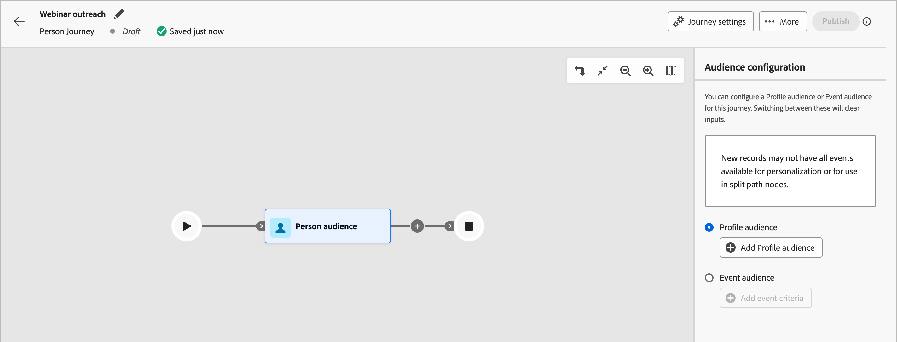

# Personen-Zielgruppen-Journey-Knoten

Der _Personen-Zielgruppe_-Knoten gibt an, welche Personenprofile in die Journey eintreten. Wenn Sie [Personen-Journey erstellen](./create-publish-journey.md#create-a-journey) beginnt die Journey immer mit einem Personen-Zielgruppenknoten, der die Eingabe definiert. Der Zielgruppenknoten Person kann einen von zwei Zielgruppen-Eingabetypen aufweisen: CDP-Segmente oder ereignisbasierte Zugehörigkeit. Segmentbasierte und ereignisbasierte Zielgruppendefinitionen können nicht kombiniert werden.

Verwenden Sie eine der folgenden Eingabeoptionen für den Knoten „Zielgruppen-Journey für Personen“:

* **Profilzielgruppe** - Verwenden Sie in einer CDP definierte Segmentzielgruppen. Alle Profile, die sich für die Zielgruppe qualifizieren, werden der Journey als Mitglieder hinzugefügt. Neu für das Segment qualifizierte Profile werden während der täglichen (Profil[Aufnahme) -Aufgaben &#x200B;](#profile-ingestion) Journey hinzugefügt. Wenn sich ein Profil nicht mehr für das Segment qualifiziert, wird es **_nicht_** von der Journey entfernt.

* **Ereigniszielgruppe** - Verwenden Sie qualifizierende Ereignisse, um die Zielgruppe zu definieren. Diese Ereignisse werden in der Knotenkonfiguration definiert und müssen [XDM-Ereignisse verwenden, die in den Administrationseinstellungen konfiguriert sind](../admin/configure-aep-events.md). Bis zu 10 Ereignisse werden für die ereignisbasierte Zielgruppenzugehörigkeit unterstützt. Ein Profil qualifiziert sich sofort für das Journey, nachdem das erste passende Ereignis eintritt, das sein Profil eingeht.

  >[!NOTE]
  >
  >Ereignisse können nicht mit Profilattributen kombiniert werden, um Zielgruppendefinitionen einzugrenzen. Verbesserungen in Bezug auf diese Einschränkung sind für zukünftige Versionen geplant.

## Profilaufnahme

In Journey Optimizer B2B edition synchronisiert eine Aufgabe zur nächtlichen Zielgruppenaufnahme Profile mit Experience Platform. Ereignisbasierte Personenprofile können Journey-Profile qualifizieren, die nicht zu einer von Journey Optimizer B2B edition verwendeten Zielgruppe gehören. Diese sind jedoch veraltet, es sei denn, sie treten einer Zielgruppe bei, die von einer Person auf Journey, Account-Journey oder einer Einkaufsgruppe verwendet wird. Wenn ein Profil aufgenommen und später zu einer Zielgruppe hinzugefügt wird, wird eine Profilzuordnung durchgeführt und das Profil bleibt mit Experience Platform synchronisiert. Verbesserungen an dieser Profildaten-Synchronisierung sind für zukünftige Versionen geplant.

Bei einem neu erstellten Profil, das von einer ereignisbasierten Personen-Journey aufgenommen wurde, fehlen zum Zeitpunkt der Aufnahme möglicherweise die aktualisierten Profilinformationen. Wenn beispielsweise ein Profil durch ein Formularausfüllereignis erstellt wird, werden die übermittelten Daten möglicherweise nicht mit dem Profil synchronisiert, wenn die Journey sie aufnimmt. Das Ergebnis könnten unvollständige Daten für die Personalisierung sein (z. B. in E-Mail-Inhalten). Verbesserungen an dieser Profilereignisdaten-Synchronisierung sind für zukünftige Versionen geplant.

Ereignisbasierte Personenprofile, die noch anonym sind/keine E-Mail-Adressen aufweisen und nur ECIDs enthalten, können durch Journey von Personen qualifiziert werden. Dies tritt am häufigsten auf, wenn Sie über eine Qualifizierungslogik für Web-Seitenaktivitäten verfügen. Eine zu breite ereignisbasierte Zielgruppenlogik könnte dazu führen, dass die Instanz die Profilbegrenzung von 40 Millionen erreicht, wenn zu viele Profile qualifiziert sind. Um dieses Szenario zu verhindern, begrenzen Sie den möglichen Umfang Ihrer Audience.

>[!IMPORTANT]
>
>Während des aktuellen Beta-Programms ist die ideale Verwendung von Personen-Journey, um nur Profile zu qualifizieren, an die Sie auch in Account-Journeys und Einkaufsgruppendefinitionen denken. Dadurch wird sichergestellt, dass ein vollständiges Profil mit Experience Platform synchronisiert bleibt.

## Festlegen der Zielgruppe für den Zielgruppenknoten „Person“

1. Klicken Sie auf **[!UICONTROL Knoten]** Zielgruppe“.

   Diese Aktion zeigt die Knoteneigenschaften rechts an.

   {width="700" zoomable="yes"}

1. Wählen Sie den Eingabetyp für Personen, die die Journey betreten:

   * **[!UICONTROL Profil-Zielgruppe]**

     Wählen Sie die Option _[!UICONTROL Profil-Zielgruppe]_ aus. Klicken Sie dann auf **[!UICONTROL Profil-Audience hinzufügen]**.

     Wählen Sie _[!UICONTROL Dialogfeld]_ Zielgruppe hinzufügen“ ein zuvor erstelltes Zielgruppensegment aus. Klicken Sie dann auf **[!UICONTROL Zielgruppe hinzufügen]**.

     {width="700" zoomable="yes"}

   * **[!UICONTROL Ereigniszielgruppe]**

     Wählen Sie die Option _[!UICONTROL Ereigniszielgruppe]_ aus. Klicken Sie dann auf **[!UICONTROL Ereigniskriterien hinzufügen]**.

     Fügen Sie _[!UICONTROL Dialogfeld Ereigniskriterien bearbeiten]_ ein oder mehrere Ereignisse hinzu, die Sie für die Qualifizierung von Zielgruppenmitgliedern verwenden möchten. Klicken Sie für jedes Ereignis, das Sie hinzufügen, auf **[!UICONTROL Begrenzung hinzufügen]**, um ein Ereignisattribut für eine Übereinstimmung auszuwählen. Legen Sie die Auswertung fest, die Sie für eine Übereinstimmung verwenden möchten. Sie können dem Ereignis mehrere Einschränkungen hinzufügen.

     {width="700" zoomable="yes"}

     Wenn die Ereigniskriterien definiert sind, klicken Sie auf **[!UICONTROL Speichern]**.

     Weitere Informationen zur Konfiguration für Journey-unterstützte Ereignisse finden Sie unter [Verwalten von Erlebnisereignissen](../admin/configure-aep-events.md#manage-experience-events).
