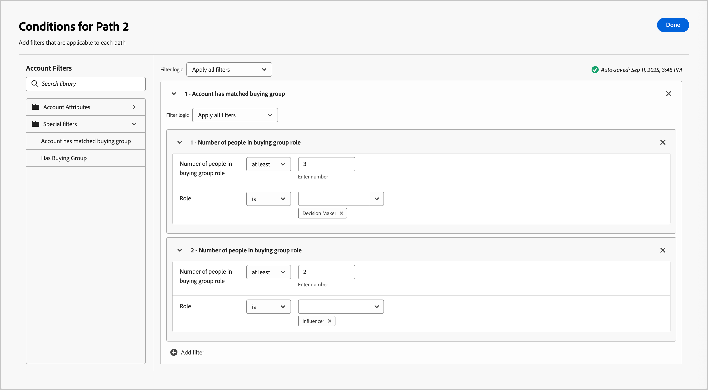
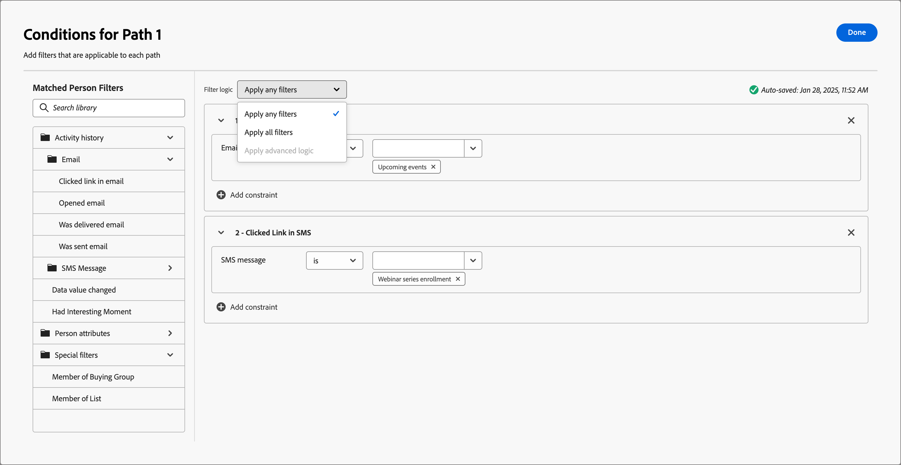

# Aufteilen und Zusammenführen von Pfaden

Verwenden Sie Split- und Merge-Path-Knoten, um Personen oder Konten gemäß den von Ihnen definierten Bedingungen zu segmentieren. Erstellen Sie Pfade für die Audience- oder Kontenliste gemäß den Bedingungen, definieren Sie jeden Pfad mit Aktions- und Ereignisknoten für das Segment, kombinieren Sie dann die Pfade und setzen Sie das Journey fort.

{width="30"} [Übersichtsvideo ansehen](#overview-video)

Ein Knoten _Pfade aufteilen_ definiert einen oder mehrere segmentierte Pfade, die entweder auf **_- oder Personenfiltern_**. Eine Aufspaltung, die auf einem Personenfilter basiert, wird automatisch mit einem Zusammenführungspfade -Knoten geschlossen, damit alle Personen mit dem nächsten Schritt fortfahren können, ohne ihren Kontokontext zu verlieren.

>[!NOTE]
>
>Es werden maximal 25 Pfade unterstützt.

## Pfade nach Konten aufteilen

(Nur Konto-Journey)

Pfade, die nach Konten aufgeteilt sind, können sowohl Konto- als auch Personenaktionen und -ereignisse enthalten. Diese Pfade können weiter aufgeteilt werden.

_**Wie funktioniert ein aufgeteilter Pfad nach Kontenknoten**_

* Jeder Pfad, den Sie hinzufügen, enthält einen Endknoten mit der Möglichkeit, Knoten zu jedem Edge hinzuzufügen.
* Aufspaltung nach Kontoknoten kann verschachtelt werden (Sie können den Pfad wiederholt nach Konten aufteilen).
* Die Auswertung jedes Pfads erfolgt von oben nach unten. Wenn ein Konto für den ersten und zweiten Pfad übereinstimmt, wird es nur entlang des ersten Pfads fortgesetzt.
* Zwei oder mehr Pfade können mithilfe eines Zusammenführungsknotens kombiniert werden.
* Der Knoten unterstützt die Definition eines Pfads _[!UICONTROL Andere Konten]_, in dem Sie Aktionen oder Ereignisse für Konten hinzufügen können, die nicht mit einem der definierten Segmente/Pfade übereinstimmen.

{width="700" zoomable="yes"}

### Pfadbedingungen des Kontos

| Pfadbedingungen | Beschreibung |
| --------------- | ----------- |
| Kontoattribute | Attribute aus dem Kontoprofil, einschließlich: <li>Jahresumsatz <li>Stadt <li>Land <li>Mitarbeiterzahl <li>Branche <li>Name <li>SIC-Code <li>Land <li>Hat `<relational schema>` (siehe [Benutzerdefinierte Datenfilterung](#custom-data-filtering)) |
| [!UICONTROL Sonderfilter] > [!UICONTROL Konto hat eine passende Einkaufsgruppe] | Dem Konto ist mindestens eine Einkaufsgruppe zugeordnet. Sie kann für eine passende Einkaufsgruppe anhand einer oder mehrerer der folgenden Einschränkungen bewertet werden: <li>Interesse an der Lösung <li>Einkaufsgruppenphase <li>Einkaufsgruppenstatus <li>Interaktionsbewertung <li>Vollständigkeitsindex <li> Anzahl der Personen in Käufergruppenrolle |
| [!UICONTROL Sonderfilter] > [!UICONTROL Hat Einkaufsgruppe] | Das Konto hat keine Mitglieder von Einkaufsgruppen. Sie kann auch anhand eines oder mehrerer der folgenden Kriterien bewertet werden: <li>Interesse an der Lösung <li>Einkaufsgruppenphase <li>Einkaufsgruppenstatus <li>Interaktionsbewertung <li>Vollständigkeitsindex |

>[!NOTE]
>
>Der _[!UICONTROL Hat Einkaufsgruppe]_-Filter ist für künftige Einstellung markiert. Verwenden Sie für neue Journey den Filter _[!UICONTROL Account has matches buying group]_, der alle gleichen Einschränkungen enthält.

### Fügen Sie einen aufgeteilten Pfad nach Kontenknoten hinzu

1. Navigieren Sie zur Journey-Karte.

1. Klicken Sie auf das Pluszeichen ( **+** ) auf einem Pfad und wählen Sie **[!UICONTROL Pfade aufteilen]**.

   {width="300" zoomable="no"}

1. Wählen Sie in den Knoteneigenschaften auf der rechten Seite **[!UICONTROL Konten]** für die Aufspaltung aus.

1. Um eine Bedingung zu definieren, die für _[!UICONTROL Pfad 1]_ gilt, klicken Sie auf **[!UICONTROL Bedingung anwenden]**.

   {width="500" zoomable="yes"}

1. Fügen Sie im Bedingungseditor einen oder mehrere Filter hinzu, um den Aufspaltungspfad zu definieren.

   * Ziehen Sie Filterattribute per Drag-and-Drop aus dem linken Navigationsbereich und füllen Sie die Übereinstimmungsdefinition aus.

   * Passen Sie Ihre Bedingungen durch Anwendung der **[!UICONTROL Filterlogik]** oben an. Sie wählen, ob alle Filter oder nur ein beliebiger Filter übereinstimmen sollen.

     {width="700" zoomable="yes"}

   * Klicken Sie auf **[!UICONTROL Fertig]**.

1. Um weitere Pfade hinzuzufügen, klicken Sie auf **[!UICONTROL Pfad hinzufügen]** und wiederholen Sie die vorherigen Schritte, um die für diesen Pfad geltenden Bedingungen hinzuzufügen.

   Sie können auch jeden Pfad anhand dieser Bedingungen beschriften oder die Standardbeschriftungen verwenden.

1. Ordnen Sie die Pfade bei Bedarf entsprechend der Priorität neu an, die Sie für die Aufspaltung festlegen möchten.

   Die Pfadfilterung wird in der Reihenfolge von oben nach unten bewertet. Jedes Konto fährt auf dem ersten Pfad fort, der übereinstimmt.

   Klicken Sie auf die Pfeile nach oben und unten oben rechts auf jeder Pfadkarte, um sie in der Liste der Pfade nach oben oder unten zu verschieben.

   {width="500" zoomable="yes"}

1. Aktivieren Sie die Option **[!UICONTROL Andere Konten]**, um den Standardpfad für Konten zu definieren, die nicht mit den definierten Segmenten/Pfaden übereinstimmen.

   Wenn diese Option nicht aktiviert ist, endet das Journey für Konten, die nicht mit einem definierten Segment/Pfad innerhalb der Aufspaltung übereinstimmen.

### Gruppenfilter für Konten kaufen {#buying-group-filtering-accounts}

Sie können einen Pfad für Konten definieren, die mit Einkaufsgruppen verknüpft sind, und den Pfad mithilfe von Einkaufsgruppenkriterien filtern. Verwenden Sie den Filter **[!UICONTROL Konto hat abgeglichene Einkaufsgruppe]** um das Pfadsegment mithilfe einer abgeglichenen Einkaufsgruppe zu definieren. Dieser Filter enthält auch die Option, Konten anhand der Anzahl der zugewiesenen Rollen innerhalb einer abgeglichenen Einkaufsgruppe zu identifizieren.

Beispielsweise können Sie die Bereitschaft für eine Einkaufsgruppe anhand der Tiefe (Anzahl der Personen) bewerten, die sie in verschiedenen Rollen hat, z. B. drei Entscheidungsträger und zwei Influencer. Legen Sie in diesem Fall die Bedingung fest, um Konten mit mindestens drei (3) Entscheidungsträgern und zwei (2) Einflussnehmern in einer abgeglichenen Einkaufsgruppe anzusprechen:

1. Klicken Sie **[!UICONTROL Filter hinzufügen]** und wählen Sie den Filter **[!UICONTROL Anzahl der Personen in der]** aus.

   {width="700" zoomable="yes"}

1. Definieren Sie den ersten Rollenparameter.

   * Legen Sie die Anzahl der Personen fest, die eine Auswertung `at least`, wobei der Wert `3` lautet.
   * Legen Sie die Rollenbewertung auf `is` fest und wählen Sie `Decision Maker` aus der Liste der Rollen aus.

1. Wiederholen Sie Schritt 1, um einen weiteren Einkaufsgruppen-Rollenparameter hinzuzufügen.

1. Definieren Sie den zweiten Rollenparameter.

   * Legen Sie die Anzahl der Personen fest, die eine Auswertung `at least`, wobei der Wert `2` lautet.
   * Legen Sie die Rollenbewertung auf `is` fest und wählen Sie `Influencer` aus der Liste der Rollen aus.

   {width="700" zoomable="yes"}

1. Klicken Sie **[!UICONTROL Fertig]**, wenn alle Bedingungen für den Pfad definiert sind.

Für die identifizierten Konten können Sie dann einen Aktionsknoten im Pfad hinzufügen, um den Status der Einkaufsgruppe oder des Stadiums zu aktualisieren oder eine E-Mail mit einer Verkaufswarnung zu senden.

### Benutzerdefinierte Datenfilterung

[!BADGE Beta]{type=Informative url="/help/user/admin/engagement-score-weighting.md" tooltip="Verfügbar als Beta-Funktion in der vereinfachten Architektur"}

Sie können relationale Schemata (modellbasierte Klassen) verwenden, um Pfade nach Konto aufzuteilen. Die benutzerdefinierten Objekte werden in _relationalen Schemata_ definiert und ein Produktadministrator kann [relationale Schemafelder konfigurieren](../admin/xdm-field-management.md#relational-schemas) in [!DNL Journey Optimizer B2B Edition]. Die ausgewählten Schemafelder sind im Bedingungseditor zur Verwendung im Aufspaltungspfad nach Kontoknoten verfügbar.

{width="700" zoomable="yes"}

<!-- SPHR-23746

Note: These are currently going under Account Attributes folder, which is a bug (SPHR-21734). This will move to Special filters when resolved (January release).

This will also be available for split paths by people (under special filters) for the M 1.5 GA release.
-->

## Pfade nach Personen aufteilen

Pfade, die nach Personen aufgeteilt sind, können nur Personenaktionen enthalten. Diese Pfade können nicht erneut aufgeteilt und automatisch wieder verbunden werden.

_**Wie funktioniert ein aufgeteilter Pfad nach Personenknoten**_

* Die Funktion „Aufspaltung nach Personen _Knoten funktioniert in einer Kombination aus_ und Zusammenführung. Die Pfade der Aufspaltung werden automatisch zusammengeführt, sodass alle Personen mit dem nächsten Schritt fortfahren können, ohne ihren Kontokontext zu verlieren.
* Nach Personen aufgeteilte Knoten können nicht verschachtelt werden (Sie können keinen aufgeteilten Pfad für Personen auf einem Pfad hinzufügen, der sich in diesem gruppierten Knoten befindet).
* Die Auswertung jedes Pfads erfolgt von oben nach unten. Wenn eine Person für den ersten und zweiten Pfad eine Übereinstimmung findet, fährt sie nur entlang des ersten Pfads fort.
* Der Knoten unterstützt die Verwendung von _Konto-Personen-Beziehungen_ mit denen Sie Personen nach ihrer Rolle filtern können (z. B. Auftragnehmer oder Vollzeit-Mitarbeiter), wie in der Beziehung definiert.
* Der Knoten unterstützt die Definition eines Pfads _[!UICONTROL Andere Personen]_, in dem Sie Aktionen oder Ereignisse für Personen hinzufügen können, die nicht mit einem der definierten Segmente/Pfade übereinstimmen.

{width="700" zoomable="yes"}

### Personenpfadfilter

| Filter | Beschreibung |
| ------------ | ----------- |
| [!UICONTROL Aktivitätsverlauf] > [!UICONTROL E-Mail] | E-Mail-Aktivitäten basierend auf Bedingungen, die mithilfe einer oder mehrerer ausgewählter E-Mail-Nachrichten von zuvor im Journey ausgewertet werden: <li>[!UICONTROL Link in E-Mail angeklickt] <li>Hat E-Mail geöffnet <li>Bekam E-Mail zugestellt <li>Wurde per E **[!UICONTROL Mail gesendet (Zum Inaktivitätsfilter wechseln ]**- Verwenden Sie diese Option, um nach fehlender Aktivität zu filtern (eine Person hatte die E-Mail-Aktivität nicht). |
| [!UICONTROL Aktivitätsverlauf] > [!UICONTROL SMS-Nachricht] | SMS-Aktivitäten basierend auf Bedingungen, die mithilfe einer oder mehrerer ausgewählter SMS-Nachrichten aus einer früheren Journey ausgewertet werden: <li>[!UICONTROL Link in SMS angeklickt] <li>[!UICONTROL SMS gebounct]  **[!UICONTROL Zum Inaktivitätsfilter wechseln ]**- Verwenden Sie diese Option, um nach fehlender Aktivität zu filtern (eine Person hatte die SMS-Aktivität nicht). |
| [!UICONTROL Aktivitätsverlauf] > [!UICONTROL Datenwert geändert] | Für ein ausgewähltes Personenattribut wurde ein Wert geändert. Zu diesen Änderungstypen gehören: <li>Neuer Wert<li>Vorheriger Wert<li>Grund<li>Quelle<li>Datum der Aktivität<li>Min. Anzahl der Fälle  **[!UICONTROL Zum Inaktivitätsfilter wechseln ]**- Verwenden Sie diese Option, um bei fehlender Aktivität zu filtern (eine Person hatte keine Datenwertänderung). |
| [!UICONTROL Aktivitätsverlauf] > [!UICONTROL Hatte einen interessanten Moment] | Interessante Momentaktivität, die in der zugehörigen [!DNL Marketo Engage] definiert ist. Zu den Einschränkungen gehören: <li>Meilenstein<li>E-Mail<li>Web  **[!UICONTROL Zum Inaktivitätsfilter wechseln ]**- Verwenden Sie diese Option, um nach fehlender Aktivität zu filtern (eine Person hatte keinen interessanten Moment). |
| [!UICONTROL Aktivitätsverlauf] > [!UICONTROL Besuchte Web-Seite] | Web-Seitenaktivität, die für eine oder mehrere Web-Seiten verwendet wird, die von der zugehörigen [!DNL Marketo Engage] verwaltet werden. Zu den Einschränkungen gehören: <li>Webseite (erforderlich)<li>Datum der Aktivität<li>Client-IP-Adresse <li>Querystring <li>Referrer <li>Benutzeragent <li>Suchmaschine <li>Suchabfrage <li>Personalisierte URL <li>Token <li>Browser <li>Plattform <li>Gerät <li>Min. Anzahl der Fälle  **[!UICONTROL Wechseln zum Inaktivitätsfilter ]**- Verwenden Sie diese Option, um nach fehlender Aktivität zu filtern (eine Person hat die Web-Seite nicht besucht). |
| [!UICONTROL Personenattribute] | Attribute aus dem Personenprofil, einschließlich: <li>Stadt <li>Land <li>Geburtsdatum <li>E-Mail-Adresse <li>E-Mail-Adresse ungültig <li>E-Mail angehalten <li>Vorname <li>Abgeleitetes Bundesland/abgeleitete Region<li>Stellenbezeichnung <li>Last name <li>Mobiltelefonnummer <li>Engagement-Score einer Person <li>Telefonnummer <li>Postleitzahl <li>Land <li>Abbestellt <li>Grund für Abmeldung |
| [!UICONTROL Sonderfilter] > [!UICONTROL Mitglied der Einkaufsgruppe] | Die Person ist oder ist kein Kauf-Gruppenmitglied, das anhand eines oder mehrerer der folgenden Kriterien bewertet wird: <li>Interesse an der Lösung</li><li>Einkaufsgruppenstatus</li><li>Vollständigkeitsindex</li><li>Interaktionsbewertung</li><li>Rolle</li> |
| [!UICONTROL Spezialfilter] > [!UICONTROL Mitglied der Liste] | Die Person ist oder ist nicht Mitglied in einer oder mehreren [!DNL Marketo Engage]. |
| [!UICONTROL Spezialfilter] > [!UICONTROL Mitglied des Programms] | Die Person ist oder ist nicht Mitglied in einem oder mehreren [!DNL Marketo Engage]. |

### Pfadbedingungen für Konto-Person

| Pfadbedingungen | Beschreibung |
| --------------- | ----------- |
| [!UICONTROL Rolle im Konto] | Der Person wird eine Rolle im Konto zugewiesen oder ihr wird keine Rolle zugewiesen. Optionale Einschränkungen: <li>Rollenname |

### Fügen Sie einen Pfad für die Aufspaltung nach Personenknoten hinzu

>[!NOTE]
>
>Wenn Sie Pfade nach Personen aufteilen, wird _Knoten „Aufspaltungspfade schließen_ automatisch eingefügt, um die Aufspaltung zu beenden. Bei einem Pfad, der nach Personen aufgeteilt ist, ist nur _Aktion ausführen_ auf Personenknoten zulässig.

1. Navigieren Sie zur Journey-Karte.

1. Klicken Sie auf das Pluszeichen ( **+** ) auf einem Pfad und wählen Sie **[!UICONTROL Pfade aufteilen]**.

   {width="300" zoomable="no"}

1. Wählen Sie in den Knoteneigenschaften auf der rechten Seite **[!UICONTROL Personen]** für die Teilung aus.

1. (Nur Konto-Journey **[!UICONTROL Legen Sie die (für Bedingungen verwendeten Attribute]**.

   * Wählen Sie **[!UICONTROL Nur Personenattribute]** aus, um Bedingungen im Zusammenhang mit dem Personenprofil zu verwenden.
   * Wählen Sie **[!UICONTROL Nur Konto-Personen-Attribute]** aus, um Bedingungen im Zusammenhang mit der Rollenmitgliedschaft der Person in einem Konto zu verwenden.

1. Um eine Bedingung zu definieren, die für _[!UICONTROL Pfad 1]_ gilt, klicken Sie auf **[!UICONTROL Bedingung anwenden]**.

1. Fügen Sie im Bedingungseditor einen oder mehrere Filter hinzu, um den Aufspaltungspfad zu definieren.

   * Ziehen Sie einen beliebigen Personenfilter aus dem linken Navigationsbereich und füllen Sie die Definition der Übereinstimmung aus.

     >[!NOTE]
     >
     >Wenn Sie benutzerdefinierte Personenfelder im Konto-Zielgruppenschema in Experience Platform definiert haben, sind diese Felder auch verfügbar, um als Personenattribute in Bedingungen zu verwenden.

   * Passen Sie Ihre Bedingungen durch Anwendung der **[!UICONTROL Filterlogik]** oben an. Sie wählen, ob alle Attributbedingungen oder eine beliebige Bedingung erfüllt werden sollen.

     {width="700" zoomable="yes"}

   * Klicken Sie auf **[!UICONTROL Fertig]**.

1. Um weitere Pfade hinzuzufügen, klicken Sie auf **[!UICONTROL Pfad hinzufügen]** und wiederholen Sie die vorherigen Schritte, um die für diesen Pfad geltenden Bedingungen hinzuzufügen.

   Sie können auch jeden Pfad anhand dieser Bedingungen beschriften oder die Standardbeschriftungen verwenden.

1. Ordnen Sie die Pfade bei Bedarf entsprechend der Priorität neu an, die Sie für die Aufspaltung festlegen möchten.

   Die Pfadfilterung wird in der Reihenfolge von oben nach unten bewertet. Jede Person fährt auf dem ersten Pfad fort, der übereinstimmt.

   Klicken Sie auf die Pfeile nach oben und unten oben rechts auf jeder Pfadkarte, um sie in der Liste der Pfade nach oben oder unten zu verschieben.

   {width="500" zoomable="yes"}

1. Aktivieren Sie die Option **[!UICONTROL Andere Personen]**, um einen Standardpfad für Personen hinzuzufügen, die den definierten Pfaden nicht entsprechen.

   Wenn diese Option nicht aktiviert ist, bewegen sich Personen, die mit keinem definierten Segment/Pfad übereinstimmen, an der Teilung vorbei und fahren mit dem nächsten Schritt auf der Journey fort.

   Wenn Sie für jeden Pfad zur Aufteilung Ihrer Zielgruppe auf Personenebene Bedingungen definiert haben, können Sie Aktionen hinzufügen, die Sie für Personen durchführen möchten.

### Aktivitätsfilterung

Für einen aufgeteilten Pfad nach Personen können Sie einen Pfad entsprechend der Aktivität der Person definieren, die mit Folgendem zusammenhängt:

* E-Mail-Nachrichten von früher im Journey
* SMS-Nachrichten von früher im Journey
* Änderung des Datenwerts im Personenprofil
* Ein interessanter Moment (in [!DNL Marketo Engage] verfolgt), der mit einer E-Mail, Web-Seite oder einem Meilenstein verbunden ist
* Besuch einer Web-Seite (verfolgt in [!DNL Marketo Engage])

>[!BEGINSHADEBOX „Inaktivitätsfilterung“]

Für jeden Filter _[!UICONTROL Aktivitätsverlauf]_ können Sie die Option **[!UICONTROL Zu Inaktivitätsfilter wechseln]** aktivieren. Diese Option ändert den Filter in eine Auswertung für eine Abwesenheit dieses Aktivitätstyps. Fügen Sie beispielsweise den Filter _[!UICONTROL E-Mail]_ > _[!UICONTROL Geöffnete E-Mail]_ hinzu, um einen Pfad für Personen zu erstellen, _**eine E-Mail von früher auf der Journey geöffnet**_ (nicht geöffnet). Aktivieren Sie die Option Inaktivität und geben Sie die E-Mail-Adresse an. Es empfiehlt sich, bei der Definition eines Zeitraums für _[!UICONTROL Inaktivität die]_ „Datum der Aktivität“ zu verwenden.

{width="700" zoomable="yes"}

>[!ENDSHADEBOX]

### Filtern von Abonnements

Im Abschnitt _[!UICONTROL Spezielle Filter]_ gibt es mehrere Filter, mit denen Sie die Zugehörigkeit einer Person zu einer Einkaufsgruppe oder [!DNL Marketo Engage] Liste bewerten können. Wenn Sie beispielsweise einen Pfad für Personen erstellen möchten, die Mitglieder einer Einkaufsgruppe sind und denen eine bestimmte Rolle zugewiesen ist, fügen Sie den Filter _[!UICONTROL Sonderfilter]_ > _[!UICONTROL Mitglied der]_) hinzu. Legen Sie für den Filter die Mitgliedschaft auf _true_ fest, wählen Sie ein _[!UICONTROL Interesse an der Lösung]_, das mit einer oder mehreren Einkaufsgruppen verknüpft ist, und legen Sie die _[!UICONTROL Rolle]_ fest, der Sie entsprechen möchten.

{width="700" zoomable="yes"}

>[!BEGINSHADEBOX &quot;Marketo Engage List Membership“]

Überprüfen Sie [!DNL Marketo Engage] _Smart-Kampagnen_ die Mitgliedschaft in Programmen, um sicherzustellen, dass Leads keine doppelten E-Mails erhalten und nicht gleichzeitig Mitglieder mehrerer E-Mail-Streams sind. In Journey Optimizer B2B können Sie als Bedingung für Ihren Aufspaltungspfad nach Personen [!DNL Marketo Engage] Listenabonnement prüfen, um doppelte Journey-Aktivitäten zu vermeiden.

Um die Listenmitgliedschaft in einer aufgeteilten Bedingung zu verwenden, erweitern Sie **[!UICONTROL Spezielle Filter]** und ziehen Sie die **[!UICONTROL Mitglied der Liste]** Bedingung in den Filterbereich. Vervollständigen Sie die Filterdefinition, um die Zugehörigkeit zu einer oder mehreren [!DNL Marketo Engage] zu bewerten.

![Pfad nach Personen aufteilen Bedingung für [!DNL Marketo Engage] Listenmitgliedschaft](./assets/node-split-paths-conditions-people-member-of-list.png){width="700" zoomable="yes"}

>[!ENDSHADEBOX]

## Pfade zusammenführen

Fügen Sie einen Knoten _Zusammenführungspfade_ hinzu, um verschiedene Aufspaltungspfade nach Konto in Ihrem Journey zu kombinieren.

1. Navigieren Sie zur Journey-Karte.

1. Klicken Sie auf das Pluszeichen ( **+** ) auf einem Pfad und wählen Sie **[!UICONTROL Pfade aufteilen]**.

1. Klicken Sie auf den geteilten Knoten, um seine Eigenschaften auf der rechten Seite zu öffnen.

1. Klicken Sie [!UICONTROL Pfad hinzufügen], um drei Pfade zu erstellen.

1. Fügen Sie jedem Pfad eine Kombination aus Aktionen und Ereignissen hinzu.

1. Klicken Sie auf das Pluszeichen ( **+** ) für einen dieser Pfade und wählen Sie **[!UICONTROL Zusammenführen]** aus den angezeigten Optionen aus.

   {width="400" zoomable="no"}

1. Wählen Sie in den Knoteneigenschaften „Zusammenführungspfade“ die Pfade aus, die zusammengeführt werden sollen.

   {width="600" zoomable="yes"}

   An dieser Stelle werden die Pfade zusammengeführt, sodass Konten aus den ausgewählten Pfaden zu einem einzigen Pfad kombiniert werden, der durch den Journey weiter ausgeführt werden kann.

1. Bei Bedarf können Sie die Zusammenführung von Pfaden aufheben, indem Sie zurück zu den Knoteneigenschaften der Zusammenführungspfade navigieren und das Kontrollkästchen für alle Pfade deaktivieren, die Sie entfernen möchten.

## Übersichtsvideo

>[!VIDEO](https://video.tv.adobe.com/v/3443231/?learn=on)
