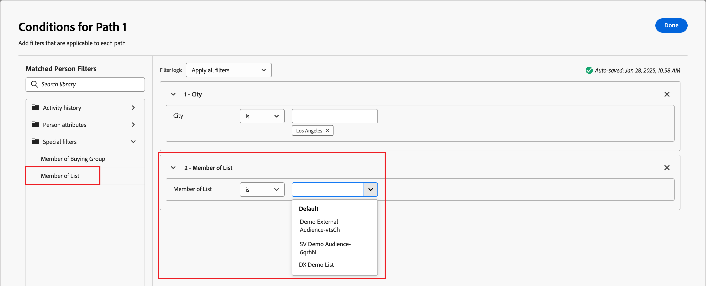

# Pfade aufteilen und zusammenführen

Verwenden Sie Split- und Merge-Path-Knoten auf Ihrer Account-Journey, um Ihre Account-Journey zu orchestrieren. Sie können die Zielgruppe gemäß Bedingungen segmentieren, die Sie definieren, und die Segmente kombinieren, um fortzufahren.

{width="30"} [Video Ansehen Überblicksvideo](#overview-video)

## Pfade aufteilen

hinzufügen einer Knoten &quot; _Pfade_ teilen&quot; können Sie einen oder mehrere segmentierte Pfade auf der Grundlage von Konto- oder Personenattributen definieren.

>[!NOTE]
>
>Es werden maximal 25 Pfade unterstützt.

**Pfade nach Konten** aufteilen: Nach Konten aufgeteilte Pfade können sowohl Aktionen und Ereignisse für Konto als auch für Personen enthalten. Diese Pfade können weiter aufgeteilt werden.

_Wie funktioniert eine Aufteilung der Pfad nach Konten Knoten?_

* Jede Pfad, die Sie hinzufügen, enthält eine End Knoten mit der Möglichkeit, jeder Kante Knoten hinzuzufügen.
* Nach Kontoknoten aufgeteilt können verschachtelt werden. Sie können den Pfad wiederholt nach Konten aufteilen.
* Wertet Pfade von oben nach unten aus. Wenn ein Konto für den ersten und zweiten Pfad übereinstimmt, wird es nur entlang des ersten Pfads fortgesetzt.
* Zwei oder mehr Pfade können mithilfe eines Zusammenführungsknotens kombiniert werden.
* Unterstützt die Definition eines _[!UICONTROL Andere-Konten-Pfad]_ , in dem Sie Aktionen oder Ereignisse für Konten hinzufügen können, die keinem der definierten Segmente/Pfade entsprechen.

{width="700" zoomable="yes"}

**Pfade nach Personen** teilen: Pfade, die nach Personen aufgeteilt sind und nur Aktionen für Personen enthalten können. Diese Pfade können nicht erneut geteilt werden und werden automatisch wieder zusammengeführt.

_Wie funktioniert eine Aufspaltung Pfad von Personen Knoten?_

* Funktioniert innerhalb einer _gruppierten Knoten_ Split-Merge-Kombination. Die geteilten Pfade werden automatisch zusammengeführt, sodass alle Personen in der Zielgruppe zum nächsten Schritt übergehen können, ohne ihren Konto Kontext zu verlieren.
* Nach Personen aufgeteilte Knoten können nicht verschachtelt werden. Sie können keinen aufgeteilten Pfad für Personen auf einem Pfad hinzufügen, der sich in diesem gruppierten Knoten befindet.
* Wertet Pfade von oben nach unten aus. Wenn eine Person für den ersten und zweiten Pfad eine Übereinstimmung findet, fährt sie nur entlang des ersten Pfads fort.
* Unterstützt die Verwendung von _Konto-Personen-Beziehungen_ mit denen Sie Personen nach ihrer Rolle filtern können (z. B. Auftragnehmer oder Vollzeit-Mitarbeiter), wie in den Rollenvorlagen definiert.
* Unterstützt die Definition eines Pfads _[!UICONTROL Andere Personen]_, in dem Sie Aktionen oder Ereignisse für Personen hinzufügen können, die nicht mit einem der definierten Segmente/Pfade übereinstimmen.

{width="700" zoomable="yes"}

### Pfadbedingungen {#path-conditions}

| Knotenkontext | Pfadbedingungen | Beschreibung |
| ------------ | --------------- | ----------- |
| [Konten](#add-a-split-path-by-account-node) | Kontoattribute | Attribute aus dem Konto Profil, einschließlich: <li>Jahresumsatz</li><li>Stadt</li><li>Land</li><li>Mitarbeiterzahl</li><li>Branche</li><li>Name</li><li>SIC-Code</li><li>Land</li> |
| | [!UICONTROL Sonderfilter] > [!UICONTROL Hat Einkaufsgruppe] | Das Konto hat keine Mitglieder von Einkaufsgruppen. Kann auch anhand eines oder mehrerer der folgenden Kriterien bewertet werden: <li>Interesse an der Lösung</li><li>Einkaufsgruppenstatus</li><li>Vollständigkeitsindex</li><li>Interaktionsbewertung</li> |
| | [!UICONTROL Spezielle Filter] > [!UICONTROL hat Opportunity] | Die Konto ist mit einer Opportunity verknüpft oder nicht. Kann auch anhand eines oder mehrerer der folgenden Opportunity-Attribute ausgewertet werden: <li>Betrag<li>Abschlussdatum<li>Beschreibung<li>Erwarteter Umsatz<li>Geschäftsquartal<li>Geschäftsjahr<li>Prognosekategorie<li>Prognosekategoriename<li>Ist geschlossen<li>Wurde gewonnen</li><li>Datum der letzten Aktivität</li><li>Personenquelle<li>Name</li><li>Nächster Schritt</li><li>Wahrscheinlichkeit<li>Menge<li>Phase</li><li>Typ |
| [Personen](#add-a-split-path-by-people-node) > [!UICONTROL Nur Personenattribute] | [!UICONTROL Personenattribute] | Attribute von der Person, die Profil, einschließlich: <li>Stadt</li><li>Land</li><li>Geburtsdatum</li><li>E-Mail-Adresse</li><li>E-Mail-Adresse ungültig</li><li>E-Mail angehalten</li><li>Vorname</li><li>Abgeleitetes Bundesland/abgeleitete Region</li><li>Stellenbezeichnung</li><li>Last name</li><li>Mobiltelefonnummer</li><li>Telefonnummer</li><li>Postleitzahl</li><li>Land</li><li>Abbestellt</li><li>Grund für Abmeldung</li> |
| | [!UICONTROL Aktivitätsverlauf] > [!UICONTROL E-Mail] | Mit der Journey verbundene E-Mail-Aktivitäten: <li>[!UICONTROL Link in E-Mail angeklickt]</li><li>Geöffnete E-Mail</li><li>Bekam E-Mail zugestellt</li><li>Bekam E-Mail zugesendet</li> Diese Bedingungen werden anhand einer ausgewählten E-Mail-Nachricht von früher im Journey ausgewertet. |
| | [!UICONTROL Aktivitätsverlauf] > [!UICONTROL SMS-Nachricht] | Mit der Journey verknüpfte SMS-Aktivitäten: <li>[!UICONTROL Angeklickte verknüpfen in SMS]</li><li>[!UICONTROL SMS gebounct]</li>Diese Bedingungen werden mithilfe einer ausgewählten SMS-Nachricht aus einem früheren Abschnitt der Journey ausgewertet. |
| | [!UICONTROL Aktivitätsverlauf] > [!UICONTROL Datenwert geändert] | Für ein ausgewähltes Personenattribut wurde ein Wert geändert. Zu diesen Änderungstypen gehören: <li>Neuer Wert</li><li>Vorheriger Wert</li><li>Grund</li><li>Quelle</li><li>Datum der Aktivität</li><li>Min. Häufigkeit</li> |
| | [!UICONTROL Aktivitätsverlauf] > [!UICONTROL Hatte einen interessanten Moment] | Interessanter Moment Aktivität, der in der zugehörigen Marketo Engage Instanz definiert ist. Zu den Beschränkungen gehören: <li>Meilenstein</li><li>E-Mail</li><li>Web</li> |
| | [!UICONTROL Sonderfilter] > [!UICONTROL Mitglied der Einkaufsgruppe] | Die Person ist oder ist kein Kauf-Gruppenmitglied, das anhand eines oder mehrerer der folgenden Kriterien bewertet wird: <li>Interesse an der Lösung</li><li>Einkaufsgruppenstatus</li><li>Vollständigkeitsindex</li><li>Interaktionsbewertung</li><li>Role</li> |
| | [!UICONTROL Spezialfilter] > [!UICONTROL Mitglied der Liste] | Die Person ist oder ist nicht Mitglied in einer oder mehreren Marketo Engage-Listen. |
| | [!UICONTROL Spezialfilter] > [!UICONTROL Mitglied des Programms] | Die Person ist Mitglied eines oder mehrerer Marketo Engage Programme oder auch nicht. |
| [Personen](#add-a-split-path-by-people-node) > [!UICONTROL nur Konto-Personenattribute] | Rolle in Konto Attributen | Dieser Person ist ein Rolle in der Konto zugewiesen oder nicht. Optionale Einschränkungen: <li>Rollennamen eingeben</li> |

### Fügen Sie einen aufgeteilten Pfad nach Kontenknoten hinzu

1. Navigieren Sie zur Journey Bearbeiter.

1. Klicken Sie auf das Pluszeichen (+ **** ) auf einer Pfad und wählen Sie &quot;Pfade ]**teilen**[!UICONTROL &quot;.

   {width="300"}

1. Wählen Sie in den Knoteneigenschaften auf der rechten Seite **[!UICONTROL Konten]** für die Aufspaltung aus.

1. Um eine Bedingung zu definieren, die für _[!UICONTROL Pfad 1]_ gilt, klicken Sie auf **[!UICONTROL Bedingung anwenden]**.

   {width="500"}

1. Fügen Sie im Bearbeiter Bedingungen mindestens einen Filter hinzu, um die Aufspaltungs Pfad zu definieren.

   * Ziehen Sie Filterattribute von der linken Navigation und legen Sie sie ab und vervollständigen Sie die Übereinstimmungsdefinition.

   * Nehmen Sie die Feinabstimmung Ihrer Bedingungen vor, indem Sie oben die **[!UICONTROL Filtern Logik]** anwenden. Sie können festlegen, ob alle Attributbedingungen oder eine Bedingung erfüllt werden soll.

     {width="700" zoomable="yes"}

   * Klicken Sie auf **[!UICONTROL Fertig]**.

1. Um weitere Pfade hinzuzufügen, klicken Sie auf **[!UICONTROL Pfad hinzufügen]** und wiederholen Sie die vorherigen Schritte, um die für diesen Pfad geltenden Bedingungen hinzuzufügen.

   Sie können auch jeden Pfad anhand dieser Bedingungen beschriften oder die Standardbeschriftungen verwenden.

1. Ordnen Sie die Pfade bei Bedarf entsprechend der Priorität neu an, die Sie für die Aufspaltung festlegen möchten.

   Die Pfadfilterung wird in der Reihenfolge von oben nach unten bewertet. Jedes Konto fährt auf dem ersten Pfad fort, der übereinstimmt.

   Klicken Sie auf die Pfeile nach oben und unten oben rechts auf jeder Pfadkarte, um sie in der Liste der Pfade nach oben oder unten zu verschieben.

   {width="500" zoomable="yes"}

1. Aktivieren Sie die **[!UICONTROL Option Andere Konten]** , um die Standard Pfad für Konten zu definieren, die nicht mit den definierten Segmenten/Pfaden übereinstimmen.

   Wenn diese Option nicht aktiviert ist, endet das Journey für Konten, die nicht mit einem definierten Segment/Pfad innerhalb der Aufspaltung übereinstimmen.

### Fügen Sie einen Pfad für die Aufspaltung nach Personenknoten hinzu

>[!NOTE]
>
>Wenn Sie Pfade nach Personen aufteilen, wird _Knoten „Aufspaltungspfade schließen_ automatisch eingefügt, um die Aufspaltung zu beenden. Bei einem Pfad, der nach Personen aufgeteilt ist, ist nur _Aktion ausführen_ auf Personenknoten zulässig.

1. Navigieren Sie zum Journey-Editor.

1. Klicken Sie auf das Pluszeichen (+ **** ) auf einer Pfad und wählen Sie &quot;Pfade ]**teilen**[!UICONTROL &quot;.

   {width="300"}

1. Wählen Sie in den Knoten Eigenschaften auf der rechten Seite Personen ]**für die Aufspaltung aus**[!UICONTROL .

1. Festlegen die Attribute, die **[!UICONTROL für Bedingungen]** verwendet wird.

   * Wählen Sie &quot;Attribute **[!UICONTROL für Personen&quot; aus]** , um Bedingungen zu verwenden, die sich auf die Profil und Ereignisse der Person beziehen.
   * Wählen Sie **[!UICONTROL Nur Konto-Personen-Attribute]** aus, um Bedingungen im Zusammenhang mit der Rollenmitgliedschaft der Person in einem Konto zu verwenden.

1. Um eine Bedingung zu definieren, die für _[!UICONTROL Pfad 1]_ gilt, klicken Sie auf **[!UICONTROL Bedingung anwenden]**.

1. Fügen Sie im Bedingungseditor einen oder mehrere Filter hinzu, um den Aufspaltungspfad zu definieren.

   * Ziehen Sie eines der Personenattribute per Drag-and-Drop aus dem linken Navigationsbereich und füllen Sie die Definition der Übereinstimmung aus.

     >[!NOTE]
     >
     >Wenn Sie benutzerdefinierte Personenfelder im Konto-Zielgruppenschema in Experience Platform definiert haben, sind diese Felder auch verfügbar, um als Personenattribute in Bedingungen zu verwenden.

   * Passen Sie Ihre Bedingungen durch Anwendung der **[!UICONTROL Filterlogik]** oben an. Sie wählen, ob alle Attributbedingungen oder eine beliebige Bedingung erfüllt werden sollen.

     {width="700" zoomable="yes"}

   * Klicken Sie auf **[!UICONTROL Fertig]**.

1. Um weitere Pfade hinzuzufügen, klicken Sie auf **[!UICONTROL Pfad hinzufügen]** und wiederholen Sie die vorherigen Schritte, um die für diesen Pfad geltenden Bedingungen hinzuzufügen.

   Sie können auch jeden Pfad anhand dieser Bedingungen beschriften oder die Standardbeschriftungen verwenden.

1. Ordnen Sie die Pfade bei Bedarf entsprechend der Priorität neu an, die Sie für die Aufspaltung festlegen möchten.

   Pfad Filter werden in Top-Down-bestellen ausgewertet. Jede Person fährt mit der ersten übereinstimmenden Pfad fort.

   Klicken Sie auf die Pfeilschaltflächen oben rechts auf jeder Pfad Karte, um sie im Liste der Pfade nach oben oder unten zu verschieben.

   {width="500" zoomable="yes"}

1. Aktivieren Sie die **[!UICONTROL Option Andere Personen]** , um eine Standard Pfad für Personen hinzuzufügen, die nicht mit den definierten Pfaden übereinstimmen.

   Wenn diese Option nicht aktiviert ist, bewegen sich Personen, die nicht mit einem definierten Segment/Pfad übereinstimmen, über die Teilung hinaus und fahren mit dem nächsten Schritt auf der Journey fort.

>[!BEGINSHADEBOX &quot;Marketo Engage List Membership“]

Überprüfen Sie in Marketo Engage _Smart_ Kampagnen) die Programmmitgliedschaft, um sicherzustellen, dass Leads keine doppelten E-Mails erhalten und nicht gleichzeitig Mitglieder mehrerer E-Mail-Streams sind. In Journey Optimizer B2B können Sie die Marketo Engage-Listenmitgliedschaft als Bedingung für Ihren Aufspaltungspfad nach Personen überprüfen, um doppelte Journey-Aktivitäten zu vermeiden.

Um die Listenmitgliedschaft in einer aufgeteilten Bedingung zu verwenden, erweitern Sie **[!UICONTROL Spezielle Filter]** und ziehen Sie die **[!UICONTROL Mitglied der Liste]** Bedingung in den Filterbereich. Vervollständigen Sie die Filterdefinition, um die Zugehörigkeit zu einer oder mehreren Marketo Engage-Listen zu bewerten.

{width="700" zoomable="yes"}

>[!ENDSHADEBOX]

Wenn Sie für jeden Pfad zur Aufteilung Ihrer Zielgruppe auf Personenebene Bedingungen definiert haben, können Sie Aktionen hinzufügen, die Sie für Personen durchführen möchten.

>[!NOTE]
>
>Wenn Sie die Zielgruppe nach Personen aufteilen, können Sie nur Personenaktionen hinzufügen, bis die Pfade geschlossen oder zusammengeführt werden.

## Pfade zusammenführen

Fügen Sie einen Knoten _Zusammenführungspfade_ hinzu, um verschiedene Aufspaltungspfade nach Konto in Ihrem Journey zu kombinieren.

1. Navigieren Sie zum Journey-Editor.

1. Klicken Sie auf das Pluszeichen (+ **** ) auf einer Pfad und wählen Sie &quot;Pfade ]**teilen**[!UICONTROL &quot;.

1. Klicken Sie auf die geteilte Knoten, um ihre Eigenschaften auf der rechten Seite zu öffnen.

1. Klicken Sie auf [!UICONTROL hinzufügen Pfad] , um drei Pfade zu erstellen.

1. Fügen Sie jedem Pfad eine Kombination aus Aktionen und Ereignissen hinzu.

1. Klicken Sie auf das Pluszeichen ( **+** ) für einen dieser Pfade und wählen Sie **[!UICONTROL Zusammenführen]** aus den angezeigten Optionen aus.

   {width="400"}

1. Wählen Sie in den Knoteneigenschaften „Zusammenführungspfade“ die Pfade aus, die zusammengeführt werden sollen.

   {width="600" zoomable="yes"}

   An dieser Stelle werden die Pfade zusammengeführt, sodass Konten aus den ausgewählten Pfaden zu einem einzigen Pfad kombiniert werden, der durch den Journey weiter ausgeführt werden kann.

1. Bei Bedarf können Sie die Zusammenführung von Pfaden aufheben, indem Sie zurück zu den Knoteneigenschaften der Zusammenführungspfade navigieren und das Kontrollkästchen für alle Pfade deaktivieren, die Sie entfernen möchten.

## Übersichtsvideo

>[!VIDEO](https://video.tv.adobe.com/v/3443231/?learn=on)
