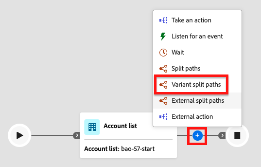

# Pfade für aufgeteilte Varianten

Verwenden Sie einen _Pfade mit Variantenaufteilung_, um Konten oder Personen auf zwei oder mehr Journey-Pfaden basierend auf der von Ihnen definierten prozentualen Zuordnung zu verteilen. Dieser Knoten ist nützlich, wenn Sie unterschiedliche Messaging-, Timing- oder Interaktionsstrategien in allen Segmenten Ihrer Audience testen möchten, ohne bedingte Regeln anzuwenden.

>[!AVAILABILITY]
>
>Der Knoten _Variantenaufspaltungspfade_ für Konto- und Personen-Journey ist für die Auswahl von Kunden als Funktion mit begrenzter Verfügbarkeit verfügbar. Wenden Sie sich an Ihren Adobe-Support-Mitarbeiter, um Zugriff zu erhalten.

## Vergleich nach Journey-Typ {#journey-type-comparison}

Der Knoten „Pfade aufteilen“ für die Variante verwendet je nach Journey-Typ unterschiedliche Zuweisungsalgorithmen. Um für jeden Journey-Typ den richtigen Anwendungsfall zu wählen, ist es wichtig, diesen Unterschied zu verstehen.

| | Konto-Journeys | Personen-Journey |
| - | ---------------- | --------------- |
| **Algorithmus** | Quotenbasierte zufällige Zuweisung | deterministische Hash-Zuweisung |
| **Determinismus** | Nicht deterministisch: Dasselbe Konto kann bei der erneuten Eingabe je nach aktuellem Quotenstatus einem anderen Pfad zugewiesen werden. | Deterministisch : Dieselbe Person wird immer demselben Pfad für eine bestimmte veröffentlichte Journey zugewiesen, unabhängig davon, wie oft sie eintritt oder erneut eintritt. |
| **A/B-Tests** | Nicht geeignet - Pfadzuweisung ist nicht über Wiedereintritte hinweg stabil. | Geeignet - Konsistente Zuweisung pro Person unterstützt kontrollierte Experimente und Attribution. |
| **Verhalten beim erneuten Eintritt** | Jedes Mal, wenn das Konto auf die Journey gelangt, kann es einem anderen Pfad folgen. | Person folgt immer demselben Pfad, der ihr bei der ersten Eingabe zugewiesen wurde. |
| **Verteilungsgenauigkeit** | Innerhalb eines Kontos pro Pfad aufgrund der Quotendurchsetzung. | Konvertiert mit ±2 % der konfigurierten Prozentsätze bei 1.000 oder mehr Journey-Einträgen. |

## Vergleich mit aufgeteilten Pfaden {#compare-split-paths}

Sowohl _[Split-Pfade](./split-merge-paths-nodes.md)_ als _Variant-Split-Pfade_ unterteilen einen Journey in mehrere Verzweigungen (Pfade), sie verwenden jedoch unterschiedliche Mechanismen:

| Aspekt | Pfade aufteilen | Pfade für aufgeteilte Varianten |
| -------- | ----------- | ------------------- |
| **Zuweisungslogik** | _Bedingt, regelbasiert_ - Jede Entität wird anhand definierter Bedingungen ausgewertet und fährt entlang des ersten Pfades fort, mit dem sie übereinstimmt. | _Prozentbasierte Zuweisung_ - Entitäten werden gemäß konfigurierten Prozentsätzen ohne Filterbedingungen auf verschiedene Pfade verteilt. |
| **Determinismus** | _Deterministisch_ - Dieselbe Entität folgt immer demselben Pfad, solange sie denselben Bedingungen entspricht. | _Abhängig vom Journey-Typ_ - Personen-Journey sind deterministisch (dieselbe Person folgt immer demselben Pfad für eine veröffentlichte Journey). Account-Journey sind nicht deterministisch (quotenbasiert). |
| **Pfad für andere Konten/Personen** | _Unterstützt_ - Entitäten, die mit keinem definierten Pfad übereinstimmen, können an einen Standardpfad weitergeleitet werden. | _Nicht zutreffend_ - Jede Entität, die den Knoten erreicht, wird einem Pfad zugewiesen. |
| **Anwendungsfall** | Segment nach bekannten Konto- oder Personenattributen; Bewertung nach Priorität. | Verteilen Sie Entitäten zum Testen von Messaging, Timing oder Taktiken. Personen-Journey: geeignet für A/B-Experimente. Account Journey: Geeignet für die Verteilung nach dem Zufallsprinzip ohne Konsistenz pro Account. |

## Konto-Journeys {#account-journeys}

Für Account-Journey verwendet der Verteilungsalgorithmus [kontingentbasierte zufällige Zuweisung](#account-journeys--quota-based-random-assignment). Dieser Algorithmus ist **_nicht deterministisch_**: Dasselbe Konto kann jedes Mal einem anderen Pfad zugewiesen werden, wenn es auf die Journey gelangt oder erneut eintritt. Die Pfadzuweisung hängt vom aktuellen Kontingent-Status zum Zeitpunkt der Bewertung ab, nicht von einer festen Kontoeigenschaft.

### Aufspaltung nach Konto {#split-by-account}

Wenn ein Konto einen Variantenverteilungs-Pfadknoten erreicht, wertet die Common Language Runtime aus, wie viele Konten bereits während der aktuellen Journey-Instanz jedem Pfad zugewiesen wurden, und leitet das Konto an den Pfad weiter, der am weitesten unter dem konfigurierten Kontingent liegt.

* Jedes Konto ist genau einem Pfad zugewiesen.
* Die Zuweisung erfolgt kontingentbasiert. Der Algorithmus passt die Zuweisungen dynamisch an die konfigurierten Prozentsätze in der Gesamtpopulation an.
* Da der Algorithmus die Anzahl der Kontingente verfolgt, driftet die tatsächliche Verteilung nur um höchstens ein Konto pro Pfad, da die Gesamtwerte nicht gleichmäßig geteilt werden.

### Aufspaltung nach Personen {#split-by-people}

Auf einer Konto-Journey können Sie auch einen Variantenverteilungs-Pfadknoten verwenden, um die _Personen innerhalb von Konten_ nach dem Zufallsprinzip auf prozentuale Pfade zu verteilen. Dieser Aufspaltungstyp ist nützlich, wenn Sie verschiedene Inhalte oder Erlebnisse auf Personenebene testen möchten. Konten bewegen sich weiterhin über die Journey. Die Variantenaufspaltung nach Personenknoten funktioniert mit den folgenden Leitplanken:

* Der Knoten fungiert als _gruppierter Knoten_ wobei es sich um eine Kombination aus Aufspaltung und Zusammenführung handelt. Die aufgeteilten Pfade werden automatisch an einem entsprechenden Zusammenführungsknoten geschlossen, sodass alle Personen fortfahren können, ohne ihren Kontokontext zu verlieren.
* Jede Person im Konto wird basierend auf den konfigurierten Prozentsätzen genau einem Pfad zugewiesen.
* Für Personen gilt derselbe kontingentbasierte Algorithmus, der für Konten verwendet wird. Die Pfadzuweisung ist nicht deterministisch, und dieselbe Person kann beim erneuten Eintritt einem anderen Pfad folgen.
* Innerhalb _[!UICONTROL Pfade werden nur Knoten]_ Aktion ausführen) für Personen unterstützt. Die Pfade können nicht weiter aufgeteilt werden.

>[!BEGINSHADEBOX „Verteilungsverhalten über Personen hinweg“]

Personen innerhalb eines Kontos werden als Batch verarbeitet. Die jedem Pfad zugewiesene Zahl wird als `floor(percentage / 100 × people_in_account)` berechnet, und der **zuletzt konfigurierte Pfad empfängt alle verbleibenden Personen**. Das bedeutet:

* Wenn ein Konto eine ungerade Anzahl von Personen enthält, empfängt der letzte Pfad eine weitere Person als frühere Pfade.
* Bei Konten mit einer einzelnen Person wird diese Person unabhängig von den konfigurierten Prozentsätzen immer dem ersten Pfad zugewiesen.
* Bei Accounts mit sehr wenigen Personen (weniger als 10) kann die Verteilung pro Account deutlich von den konfigurierten Prozentsätzen abweichen. Die Verteilung nähert sich den konfigurierten Verhältnissen an, wenn sie über viele Konten hinweg gemessen wird.

>[!NOTE]
>
>Dieses Rundungsverhalten gilt pro Konto-Batch, nicht für alle Konten auf der Journey. Der letzte Pfad empfängt systematisch etwas mehr Personen als konfiguriert, wenn die Kontogrößen ungerade sind. Dieses Verhalten ist normal.

>[!ENDSHADEBOX]

## Personen-Journey {#person-journeys}

Wenn eine Person einen Varianten-Pfade-Teilungsknoten erreicht, ordnet die Laufzeitumgebung diese einem Pfad zu, der auf einem Hash ihrer ID und der Journey-ID basiert.

* Jede Person ist genau einem Pfad zugewiesen.
* Zuweisung ist deterministisch - dieselbe Person erhält immer dieselbe Pfadzuweisung für eine bestimmte veröffentlichte Journey, unabhängig davon, wie oft sie ein- oder wieder eintritt.
* Der Hash wird nur anhand der Personen-ID und der Journey-ID berechnet. Sie hängt nicht von der Knotenposition, dem Zeitpunkt des Eintritts oder einem Quotenstatus ab. Das bedeutet, dass das erneute Betreten der Journey jedes Mal die gleiche Pfadzuweisung erzeugt.

>[!NOTE]
>
>**Die Aufspaltung der Journey-Variante für Personen eignet sich für A/B-Tests und Experimente.**
>
>Da die Zuweisung deterministisch und über mehrere Wiedereintritte hinweg konsistent ist, unterstützen Variantenaufspaltungspfade in Personen-Journey kontrollierte Experimente, bei denen dieselbe Person konsistent dasselbe Erlebnis erhalten muss. Verwenden Sie die Ansicht [Journey-](./journey-details.md), um die Verteilung über Pfade nach der Live-Schaltung der Journey zu überwachen.

## Verteilungsalgorithmus

Der angewendete Verteilungsalgorithmus hängt vom Journey-Typ ab.

### Account Journeys — Quotenbasierte Zufallszuweisung

Der Knoten für die Variantenaufspaltung in den Konto-Journey verwendet einen **kontingentbasierten Zuweisungsalgorithmus**. Wenn ein Konto den Knoten erreicht, wertet die Laufzeitumgebung aus, wie viele Konten bereits während der aktuellen Journey-Instanz jedem Pfad zugewiesen wurden, und leitet das Konto an den Pfad weiter, der am weitesten unter dem konfigurierten Kontingent liegt.

**Key-Eigenschaft des Algorithmus auf Kontingentbasis:**

* Die Verteilung verfolgt die konfigurierten Prozentsätze auf allen Kontovolumina genau. Da der Algorithmus die Anzahl der Kontingente aktiv beibehält, wird die tatsächliche Verteilung nur um höchstens ein Konto pro Pfad verschoben, da die Gesamtwerte nicht gleichmäßig geteilt werden.

### Personen-Journeys - deterministische Hash-Zuweisung

Der Knoten für die Variantenaufspaltung in Personen-Journey verwendet einen **deterministischen Hash-**). Wenn eine Person den Knoten erreicht, berechnet die Laufzeitumgebung einen Hash-Wert aus der Personen-ID und der Journey-ID und ordnet das Ergebnis dann basierend auf den konfigurierten Prozentbereichen einem Pfad zu. Der Algorithmus wird mithilfe des folgenden Workflows angewendet:

1. Die Laufzeit berechnet einen MurmurHash3-32-Bit-Hash aus einem zusammengesetzten Schlüssel, der die Personen-ID und die Journey-ID kombiniert.
1. Der Hash-Wert wird einer Position in einem Bereich von 10.000 gleich großen Buckets zugeordnet.
1. Die Buckets werden gemäß den konfigurierten Pfad-Prozentsätzen partitioniert. Beispielsweise entsprechen bei Pfaden bei 30 %, 30 % und 40 % die ersten 3.000 Buckets Pfad 1, die nächsten 3.000 Pfad 2 und die restlichen 4.000 Pfad 3.
1. Die Person wird dem Pfad zugewiesen, dessen Bucket-Bereich ihre Hash-Position enthält.

Es gibt zwei wichtige Eigenschaften des deterministischen Hash-Algorithmus:

* **_Konsistenz_** - Dieselbe Person wird immer demselben Bucket für eine bestimmte Journey-ID zugewiesen. Wenn Sie die Journey erneut aufrufen, wird jedes Mal die gleiche Pfadzuweisung vorgenommen.
* **_Statistische Verteilung_** - Die Verteilung konvergiert auf ±2 % der konfigurierten Prozentsätze, wenn mindestens 1.000 Einzelpersonen die Journey betreten haben. Bei kleineren Zielgruppen kann die Anzahl pro Pfad deutlicher von den konfigurierten Verhältnissen abweichen.

## Einschränkungen {#limitations}

Überprüfen Sie diese Einschränkungen, bevor Sie Variantenaufspaltungspfade in Ihren Journey verwenden.

### Einschränkungen bei Account Journey {#account-journey-limitations}

>[!IMPORTANT]
>
>**Pfadzuweisung ist nicht deterministisch.**
>
>Der kontingentbasierte Algorithmus garantiert nicht, dass dasselbe Konto immer demselben Pfad folgt. Wenn ein Konto existiert und die Journey erneut betritt, kann es je nach Kontingent-Status zum Zeitpunkt der erneuten Eingabe einem anderen Pfad zugewiesen werden. Verwenden Sie keine Aufspaltungspfade für Account-Journey-Varianten für Anwendungsfälle, für die eine konsistente Zuweisung pro Account-Pfad über Journey-Instanzen hinweg erforderlich ist.

| Einschränkung | Beschreibung |
| ---------- | ----------- |
| **Nicht geeignet für kontrollierte Experimente** | Da die Pfadzuweisung nicht deterministisch ist, sind Variantenaufspaltungspfade in Account-Journey **nicht geeignet** für A/B-Experimente oder Attributionsszenarien, bei denen ein bestimmtes Account durchgängig dieselbe Behandlung erhalten muss. |
| **Geringfügige Rundungsabweichung** | Wenn die Gesamtzahl der Konten nicht gleichmäßig durch die konfigurierten Prozentsätze teilbar ist, kann die Verteilung um höchstens ein Konto pro Pfad verschoben werden. Dies ist ein erwartetes Rundungsverhalten und kein Fehler. |
| **Pfadzuweisung ist nicht idempotent** | Beim erneuten Eingeben der Journey kann es zu einer unterschiedlichen Pfadzuweisung für dasselbe Konto kommen. |
| **Keine bedingte Filterung** | Im Gegensatz _Aufspaltungspfade_ gelten für Pfade mit Variantenaufspaltung keine Bedingungen. Jedes Konto, das den Knoten erreicht, wird einem Pfad zugewiesen. |

### Einschränkungen beim Journey von Personen {#person-journey-limitations}

| Einschränkung | Beschreibung |
| ---------- | ----------- |
| **Statistische Varianz in kleinem Maßstab** | Die Verteilung konvergiert mit den konfigurierten Prozentsätzen innerhalb von ca. ±2 %, wenn mindestens 1.000 Einzelpersonen die Journey betreten haben. Bei weniger Einträgen können die Werte pro Pfad deutlicher von den konfigurierten Verhältnissen abweichen. Dies ist das erwartete Verhalten der Hash-Verteilung und stellt keinen Fehler dar. |
| **Keine bedingte Filterung** | Im Gegensatz _Aufspaltungspfade_ gelten für Pfade mit Variantenaufspaltung keine Bedingungen. Jede Person, die den Knoten erreicht, wird einem Pfad zugewiesen. |

## Hinzufügen eines Knotens mit aufgeteilten Pfaden für Varianten {#add-variant-split-paths-node}

Die Schritte zum Hinzufügen und Konfigurieren eines Pfades mit Variantenaufspaltung sind für Konto- und Personen-Journeys identisch.

1. Navigieren Sie zur Journey-Karte.

1. Klicken Sie auf _Symbol_ Hinzufügen“ ( **+** ) auf einem Pfad und wählen Sie **[!UICONTROL Variantenaufspaltungspfade]**.

   {width="300" zoomable="no"}

   Auf der Journey-Zuordnung hat der Knoten zwei Standardpfade.

1. (_Nur Konto_) Wählen Sie in den Knoteneigenschaften auf der rechten Seite entweder **[!UICONTROL Konten]** oder **[!UICONTROL Personen]** für die Aufspaltung aus.

   Wenn Sie den Typ _[!UICONTROL Personen]_ verwenden, wird automatisch ein Knoten _Variante-Aufspaltungspfade schließen_ eingefügt, um die gruppierte Aufspaltung zu schließen.

   {width="700" zoomable="yes"}

1. Überprüfen oder aktualisieren Sie die **[!UICONTROL Beschriftung]** für jeden Pfad.

   Pfadbeschriftungen werden als Kantenbeschriftungen auf der Journey-Arbeitsfläche angezeigt und helfen bei der Unterscheidung von Pfaden in Journey-Analysen.

   {width="600" zoomable="yes"}

1. Legen Sie **[!UICONTROL Prozentsatz]** für jeden Pfad fest.

   Werte müssen ganze Zahlen von 1 bis 99 sein.

   {width="500" zoomable="yes"}

   Der Indikator „Laufende Gesamtsumme“ zeigt die Summe aller Pfadprozentsätze an. Der Gesamtwert muss genau 100 % betragen, bevor Sie die Journey veröffentlichen können. Ein Fehlerstatus wird angezeigt, wenn die Gesamtsumme nicht 100 % beträgt.

   {width="500" zoomable="yes"}

   Um die Prozentsätze gleichmäßig auf alle Pfade zu verteilen, klicken Sie auf **[!UICONTROL Gleichmäßig verteilen]**. Das System berechnet die gleichen Anteile und passt jede Rundung an, um sicherzustellen, dass die Summe 100% entspricht.

1. Um zusätzliche Pfade zu definieren, klicken **[!UICONTROL für jeden]** auf „Pfad hinzufügen“.

   Der Knoten unterstützt bis zu 20 Pfade. Wenn Sie weitere Pfade hinzufügen, passen Sie den _[!UICONTROL Prozentsatz]_ so an, dass die Gesamtsumme 100 % beträgt.

   Sie können einen Pfad entfernen, indem Sie auf das Symbol _Löschen_ (  ) auf der Pfadkarte klicken. Ein Pfad kann nur entfernt werden, wenn mindestens zwei Pfade verbleiben.

   Die folgenden Regeln gelten für die Konfiguration von Pfaden für die Variantenaufspaltung. Verletzungen blockieren die Veröffentlichung von Journey.

   | Regel | Anforderung |
   | ---- | ----------- |
   | Mindestpfade | 2 |
   | Maximale Anzahl an Pfaden | 20 |
   | Prozentsatz pro Pfad | Ganze Zahl von 1 bis 99 |
   | Gesamtprozentsatz | Muss genau 100 % entsprechen |
