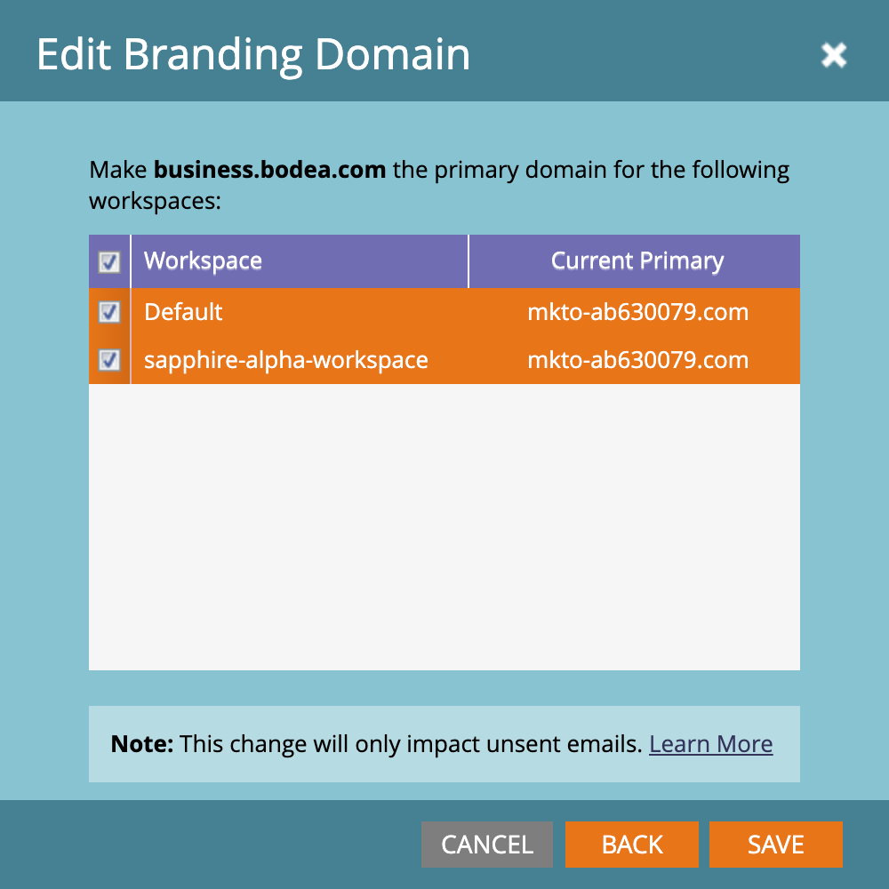
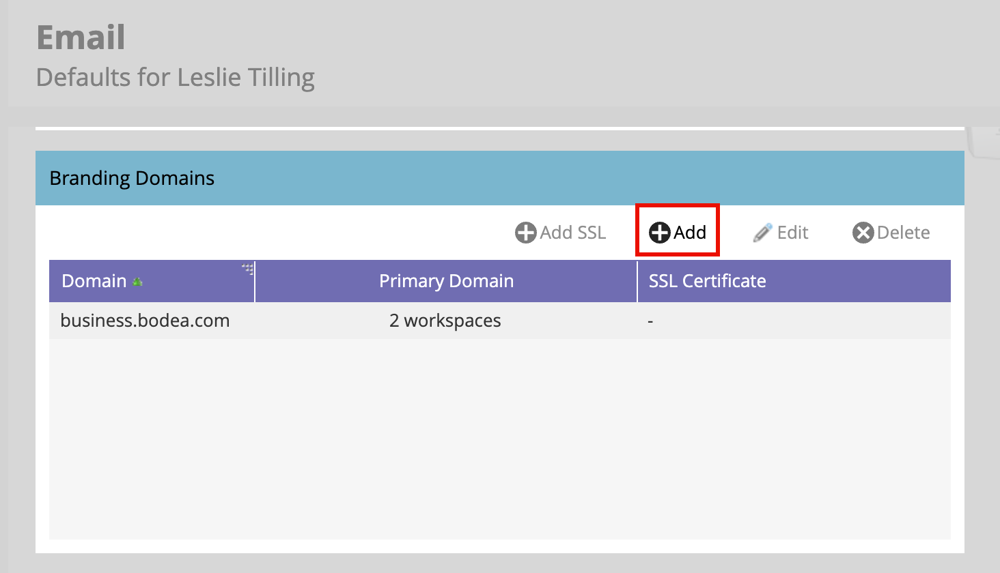
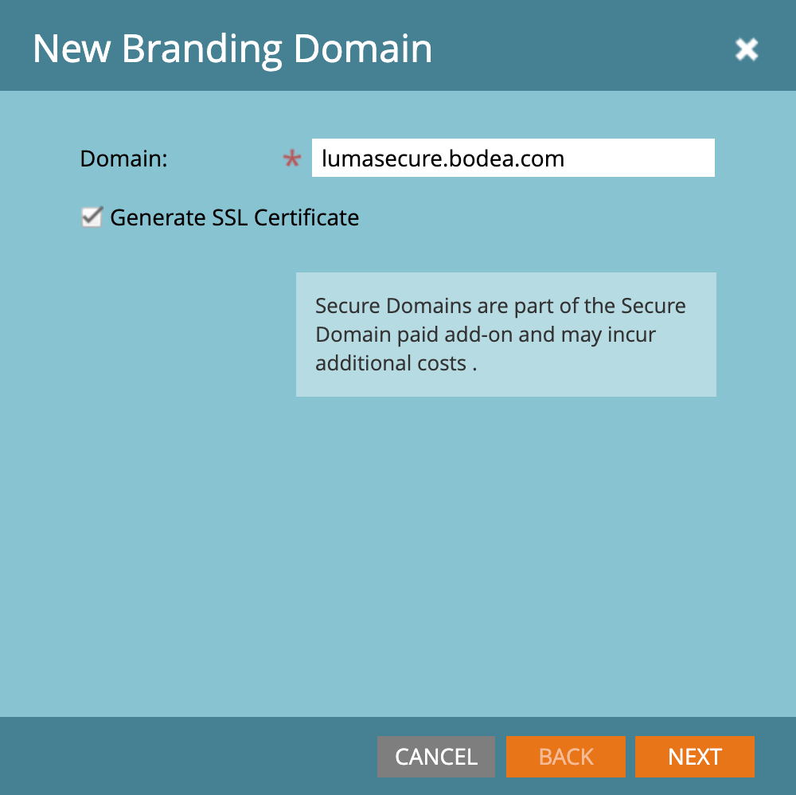
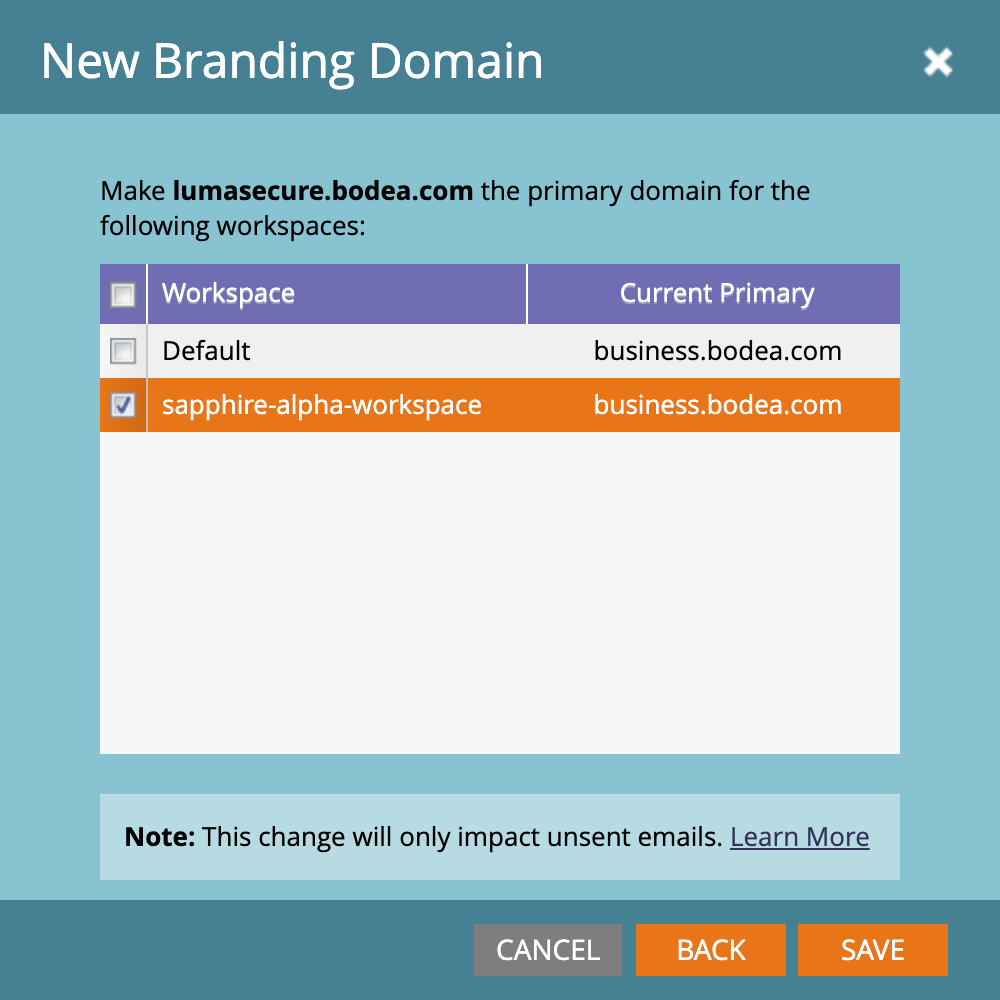
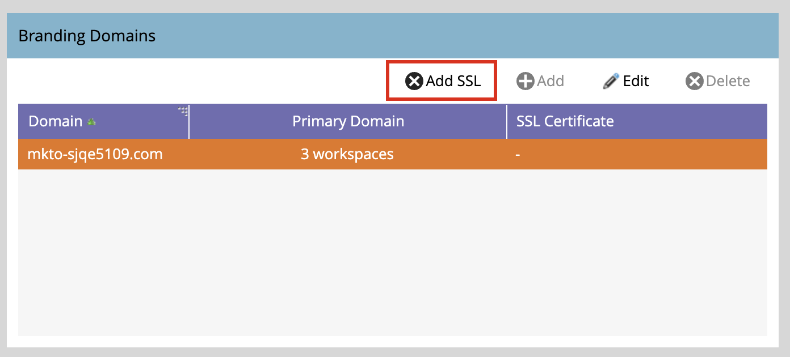
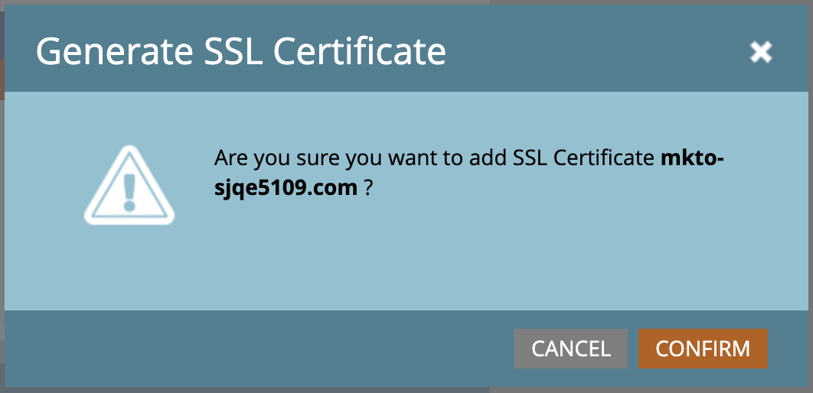

# Konfigurieren von Branding-Domains

Eine Branding-Domain in Marketo Engage ist eine benutzerdefinierte Subdomain (z. B. `links.yourcompany.com`), mit der Links umgeschrieben und E-Mail-Klicks verfolgt werden können, um sicherzustellen, dass sie Ihre Marke widerspiegeln statt einer generischen Domain. Jede Branding-Domain fungiert als Klick-Tracking-Domain, um die Zustellbarkeit und das Vertrauen zu verbessern, indem Ihre E-Mail-Links und Landingpage-Links mit Ihrer Domain abgeglichen werden.

* Es ersetzt generische Links durch Ihr eigenes Branding in E-Mail-Hyperlinks.
* Wenn ein Lead auf einen Link klickt, wird er über diese benutzerdefinierte Domain weitergeleitet, um die Leistungsverfolgung zu ermöglichen, während er E-Mail-Filtern als legitim erscheint.
* Um verschiedene Geschäftsbereiche oder Marken zu unterstützen, können Sie zusätzliche Branding-Domains konfigurieren, wenn Sie mehrere Marken haben.

>[!BEGINSHADEBOX]

**Eindeutige CNAMEs für Tracking-Links**

E-Mail-Tracking-Links müssen neu und für die angehängte Marketo Engage-Instanz eindeutig sein. Sie können das Branding für zurückgegebene Pfade zwischen Ihrer Marketo Engage-Produktionsinstanz und der angeschlossenen Instanz freigeben. Diese Änderung stellt jedoch eine interne Systemänderung dar. Öffnen Sie ein Support-Ticket und geben Sie Ihr Marketo Engage-Präfix (Munchkin ID) und Ihr neues Journey Optimizer B2B Edition-Präfix (Munchkin ID) an, um das freigegebene Domain-Branding für Rückkehrpfade zu beantragen.

>[!ENDSHADEBOX]

>[!PREREQUISITES]
>
>Bevor Sie eine Domain in der Benutzeroberfläche bearbeiten oder hinzufügen, müssen Sie über einen [zugeordneten CNAME zu einer von Adobe bereitgestellten Marketo Engage-Domain](https://experienceleague.adobe.com/de/docs/marketo/using/getting-started/initial-setup/setup-steps#customize-your-landing-page-urls-with-a-cname){target="_blank"} verfügen.
>
>Beim Hinzufügen einer Domain sucht das System nach bereits vorhandenen SSLs, die zuvor manuell erstellt wurden. Wenn diese Validierung auftritt, erstellen Sie Ihre Domain, ohne die SSL-Erstellung auszuwählen, und verbinden Sie sie dann als separates Verfahren.

## Zugriff auf Branding-Domains in Marketo Engage

1. Wechseln Sie zum Bereich **[!UICONTROL Admin]** in Ihrer Marketo Engage-Instanz und wählen Sie **[!UICONTROL E-Mail]** aus.

1. Scrollen Sie nach unten zum Bedienfeld **[!UICONTROL Branding-Domains]** .

   {width="700" zoomable="yes"}

   In der Liste wird die Standard-Domain für die Marketo Engage-Instanz angezeigt.

## Standard-Branding-Domain bearbeiten

Der erste Schritt bei der Arbeit mit Branding-Domains besteht darin, die in Ihrer Marketo Engage-Instanz definierte Standard-Branding-Domain zu bearbeiten.

>[!NOTE]
>
>Sie können keine zusätzliche Branding-Domain definieren, bevor Sie die generische Standard-Domain bearbeitet haben.

1. Wählen Sie im Bedienfeld _[!UICONTROL Branding]_ Domains“ die generische Domain aus und klicken Sie oben **[!UICONTROL Bearbeiten]**.

   {width="500"}

1. Geben _[!UICONTROL im Dialogfeld Branding-Domain bearbeiten]_ den Namen Ihrer Standard-Domain in das Feld **[!UICONTROL Domain]** ein.

   {width="400"}

<!--
1. If you have multiple workspaces defined for your Marketo Engage instance, click **[!UICONTROL Next]**.

   Select each of the workspaces where you want to apply the updated primary domain.

   {width="400"}

-->

1. Klicken Sie **[!UICONTROL Weiter]** und dann **[!UICONTROL Speichern]**.

## Definieren einer zusätzlichen Domain

Um mehrere Marken in Ihrer Journey Optimizer B2B edition-Umgebung zu unterstützen, von denen jede über eigene Marken-Tracking-Links verfügt, können Sie nach der Bearbeitung der Standard-Domain eine weitere Branding-Domain hinzufügen. Beim Hinzufügen einer Domain stehen die folgenden Optionen zur Verfügung:

>* _Primäre Domain festlegen_: Wählen Sie diese als primäre Domain für den Arbeitsbereich aus. Wenn Sie diese Option auswählen, werden alle vorhandenen nicht gesendeten E-Mails auf die standardmäßige primäre Domain festgelegt und alle neu erstellten E-Mails verwenden automatisch diese primäre Domain. Marketer können bei Bedarf eine alternative Branding-Domain auswählen.
>
>* _SSL-Zertifikat generieren_: Erstellen Sie eine Secure Sockets Layer (SSL) mit der Erstellung der Domain. Die erste Tracking-Domain startet eine einmalige Einrichtung der Infrastruktur, die einige Stunden dauern kann. Das System sendet nach Abschluss eine Benachrichtigung.

_Domain hinzufügen :_

1. Klicken Sie _[!UICONTROL Bedienfeld]_ Branding-Domains **[!UICONTROL oben]** „Hinzufügen“.

   {width="500"}

1. Geben Sie im Dialogfeld _[!UICONTROL Neue Branding]_ Domain) im Feld **[!UICONTROL Domain]** den Namen der Branding-Domain ein.

1. (Optional) Aktivieren Sie das Kontrollkästchen **[!UICONTROL SSL-Zertifikat generieren]**, um automatisch ein SSL für die Domain zu generieren.

   {width="400"}

   Bei Bedarf und nach Verfügbarkeit können Sie auch das Kontrollkästchen _Primäre Domain erstellen_ aktivieren.

   >[!NOTE]
   >
   >**_Benutzerdefinierte SSL_**: Wenn Sie eine benutzerdefinierte SSL benötigen, können Sie ein [Support-Ticket](https://experienceleague.adobe.com/de/support){target="_blank"} senden. Aktivieren Sie nicht das Kontrollkästchen für die SSL-Erstellung.

<!-- 
1. If you have multiple workspaces defined for your Marketo Engage instance, click **[!UICONTROL Next]**.

   If needed, select each of the workspaces where you want to apply the new domain as the primary domain.

    {width="400"}
-->

1. Klicken Sie **[!UICONTROL Weiter]** und dann **[!UICONTROL Speichern]**.

## SSLs für bestehende Branding-Domains bearbeiten

Gehen Sie wie folgt vor, um SSL für Ihre bestehenden Domains zu aktivieren:

1. Wählen Sie im Bereich _[!UICONTROL Admin]_ die Option **[!UICONTROL E-Mail]** aus.

1. Wählen Sie im Bedienfeld _[!UICONTROL Branding]_ Domains“ die Zeile Domain aus und klicken Sie auf **[!UICONTROL SSL hinzufügen]**.

   {width="500"}

1. Klicken Sie im Dialogfeld auf &quot;**[!UICONTROL &quot;]**.

   {width="400"}

## Fehlermeldungen

| Fehler | Details |
| ----- | ------- |
| `Domain already exists.` | Eine Domain mit dem gleichen Namen ist bereits vorhanden. |
| `Domain is not mapped to the default domain.` | Die benutzerdefinierte Domain wird nicht korrekt der Standard-Domain zugeordnet. Überprüfen Sie die Einstellungen für die Domain-Zuordnung und stellen Sie sicher, dass die DNS-Konfiguration auf die richtige Standard-Domain verweist. |
| `SSL certificates could not be issued due to unsupported CAA records. Request your IT to update your CAA records.` | Die CAA-Einträge sind nicht aktuell. Für Benutzer, die von Adobe verwaltete SSL-Zertifikate verwenden, müssen CAA-Einträge auf vom Anbieter empfohlene Zertifikate aktualisiert werden. |
| `SSL certificate has already been issued.` | Für diese benutzerdefinierte Domain ist bereits ein SSL-Zertifikat vorhanden. Es sind keine weiteren Maßnahmen erforderlich, es sei denn, das Zertifikat ist abgelaufen oder muss erneut ausgestellt werden. |
| `The default domain was not found. Please contact Support for assistance.` | Beim Suchen der Standard-Domain ist ein Problem aufgetreten. Adobe-Support kontaktieren, um Trigger zu untersuchen. |
| `Unexpected error encountered while creating a domain. Please contact Support for assistance.` | Es ist ein unerwarteter Fehler aufgetreten. Sammeln Sie Protokolle und Fehlerdetails und eskalieren Sie das Problem an den Adobe-Support. |

## Löschen einer Branding-Domain

>[!NOTE]
>
>Wenn Sie die primäre Branding-Domain (in einem oder mehreren Arbeitsbereichen) löschen möchten, wählen Sie zunächst eine andere Branding-Domain als primäre Domain für jeden Arbeitsbereich aus.
>
>Beim Löschen einer Domain **_nicht_** das SSL-Zertifikat gelöscht. Diese Schutzmaßnahme verhindert Benutzerfehler, die dazu führen, dass eine Website ohne SSL-Zertifikate ist. Wenn Sie die SSL-Zertifikate entfernen möchten, wenden Sie sich an den Adobe-Support.

Wählen Sie im Bedienfeld _[!UICONTROL Branding]_ Domains“ die Domain aus und klicken Sie oben **[!UICONTROL Löschen]**.
